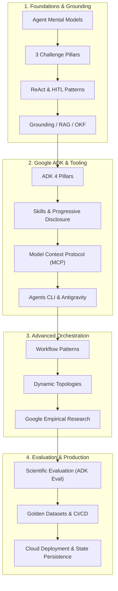

# Elevate — Day 1: Comprehensive Foundations, Architecture & Engineering

> **"You’ve learned how to build agents. Now let’s learn how to engineer them."**
> 
> *Building an agent is a weekend project.*
> *Building one that a team can maintain, extend, and trust in production is an engineering problem.*
> 
> **That distinction is the whole session.**

---

## Day 1 Architecture & Execution Overview

---

## Complete Day 1 Curriculum Index (106 Notes)

### 1. Foundations, Grounding, RAG & Open Knowledge Format (OKF)
* **Agent Foundations & Mental Models**:
  * [Anatomy of a Simple Agent](anatomy_of_a_simple_agent.md): Defining agents with `google.adk` (instructions, models, tools, memory, subagents).
  * [When Are Agents a Good Fit?](when_are_agents_a_good_fit.md): Identifying non-deterministic, multi-step problem spaces.
  * [You Don't Always Need Agents](you_dont_always_need_agents.md): When simpler architectures (LLM, RAG, traditional ML) win.
  * [Common Use Cases: QA vs. Chatbots vs. Agents](common_use_cases_applications.md): The evolutionary spectrum of AI applications.
* **The Three Challenge Pillars & Mitigations**:
  * [Agent Challenges Overview](agent_challenges.md): Predictability, Stability, and Operations.
  * [Mitigating Predictability](mitigating_predictability.md): Reasoning models, grounding, CoT, state management, and guardrails.
  * [Mitigating Stability](mitigating_stability.md): MCP abstractions, explicit tool descriptions, and circuit breakers.
  * [Mitigating Operations](mitigating_operations.md): Verbose dev logging, CI/CD eval datasets, SLOs, and distributed tracing.
* **Design Processes & Core Architectural Patterns**:
  * [The Design Process](the_design_process.md): 4-stage methodology for architectural selection.
  * [ReAct & Human-in-the-Loop Overview](agent_design_patterns_react_hitl.md): High-level comparison.
  * [ReAct Pattern: Architectural Deep Dive](reason_and_act_pattern_deepdive.md): Think-Act-Observe closed-loop mechanics.
  * [Human-in-the-Loop: Architectural Deep Dive](human_in_the_loop_pattern_deepdive.md): External messaging approvals & remediation branches.
* **Grounding, Information Retrieval & Vector Search**:
  * [The Grounding Problem (Hallucinations)](the_grounding_problem_hallucinations.md): Epistemic limits and the LangChain case study.
  * [Augmenting LLMs with Private Data](augmenting_llms_with_private_data.md): Ingesting structured, unstructured, and API assets.
  * [Naive Grounding Solutions](naive_grounding_solutions.md): Pitfalls of full fine-tuning, manual human checks, and static prompt stuffing.
  * [Retrieval-Augmented Generation (RAG)](retrieval_augmented_generation_rag.md): Decoupling knowledge retrieval from parametric generation.
  * [RAG Modified Prompt Template](rag_modified_prompt_template.md): Closed-book prompt engineering and fallback rules.
  * [Classic Information Retrieval (IR)](classic_information_retrieval.md): Indexing pipelines and 2-stage retrieval/ranking.
  * [Embeddings Representation](embeddings_representation.md): Compressing high-dimensional semantics into dense vector spaces.
  * [Vector Search in Gen AI Applications](vector_search_in_genai_applications.md): Sub-10ms Approximate Nearest Neighbor lookup.
  * [RAG Workflow for QA Systems](rag_workflow_qa_system.md): Ingestion, chunking, retrieval, and synthesis.
  * [Google Cloud Vertex AI RAG Architecture](rag_vertex_ai_architecture_example.md): End-to-end reference architecture with Vector Search and Feature Store.
  * [Build Agents with Google Cloud](build_agents_with_google_cloud.md): Platform overview covering Runtimes, Models, Tools, and Operations.
* **Enterprise Knowledge Architecture: Open Knowledge Format (OKF)**:
  * [Agent Does Not Know Your Business](agent_does_not_know_your_business.md): The Weekly Active Users (WAU) plausible falsehood paradox.
  * [Where Knowledge Actually Lives](where_knowledge_actually_lives.md): The 4 fragmented knowledge silos.
  * [Open Knowledge Format (OKF)](open_knowledge_format_okf.md): Single source of truth in Git for humans and agents.
  * [OKF: Bundle as a Directory of Concepts](okf_bundle_directory_of_concepts.md): Path-as-identity and free-form taxonomies.
  * [OKF: Every File Has Two Halves](okf_file_structure_two_halves.md): Frontmatter vs. Body attention cost model.
  * [OKF: Concept Accountability & Trust](agent_concept_accountability.md): Trust-as-a-filter via frontmatter provenance fields.
  * [OKF: Concrete Implementation Example (WAU)](okf_bundle_example_wau.md): Verified concept document and citation metadata.

---

### 2. Google ADK, Skills Architecture, MCP & Antigravity Tooling
* **Engineering Agents & Google ADK Fundamentals**:
  * [Why We Are Here: From Building Agents to Engineering Them](why_we_are_here_engineering_agents.md): Moving from weekend prototypes to engineering discipline.
  * [Why Do We Need ADK?](why_do_we_need_adk.md): Reusability, observability, state management, and maintainability.
  * [First of All: SDK ≠ ADK](sdk_vs_adk.md): Low-level model connectivity vs high-level agentic orchestration.
  * [Google ADK: The 4 Core Architectural Pillars](adk_core_architecture_pillars.md): Tools, State, Workflows, and Skills.
  * [ADK Agent: Complete Anatomical Reference](adk_agent_architecture_overview.md): Models, instructions, input/output tools, memory, and subagents.
* **ADK Tools, State & Workflows**:
  * [ADK Tools & The Decision Space Dilemma](adk_tools.md): Tool capabilities, context inflation risks, and why Skills solve decision space bloat.
  * [ADK State Management & Cross-Step Memory](adk_state.md): Structured state persistence, blackboard coordination, and multi-turn hydration.
  * [ADK Workflows & Execution Coordination](adk_workflows.md): Controlling execution flow, sequencing, and ready-made coordination patterns.
  * [ADK Workflows: Sequential, Parallel, and Hierarchical](adk_workflow_patterns_sequential_parallel_hierarchical.md): Multi-agent topologies, trade-offs, and routing architectures.
  * [ADK Advanced Graph-Based Workflows](adk_advanced_graph_workflows.md): Modeling agents, tools, and deterministic code as graph nodes.
* **Model Context Protocol (MCP) ("USB-C for AI")**:
  * [Model Context Protocol (MCP)](model_context_protocol_mcp.md): Connecting agents to external information and services via open standard protocols.
  * [MCP: Client-Server Execution Flow & Lifecycle](mcp_client_server_execution_flow.md): Tool discovery (`tools/list`), invocation (`tools/call`), and backend execution routing.
  * [MCP: Deployment Topologies (Stdio vs. SSE)](model_context_protocol_deployment.md): Local subprocess IPC vs. distributed streaming remote services.
  * [Google ADK: Plugging MCP into Your Agent](plugging_mcp_into_your_agent.md): Combining native Python functions and MCP toolsets in `LlmAgent`.
  * [Architectural Decision: Local Function or MCP?](local_function_or_mcp.md): Decision framework for in-repo custom functions vs. reusable MCP services.
* **Skills Architecture & Progressive Disclosure**:
  * [Why Do We Need Skills As Well?](why_do_we_need_skills.md): Tools vs Skills and transforming raw functions into reusable expertise.
  * [What is a Skill? (The 5 Foundational Principles)](what_is_a_skill.md): Build once, reuse, keep prompts small, maintain separately, and complete capability bundling.
  * [Skills: Progressive Disclosure & Context Economics](progressive_disclosure_skills.md): L1 Metadata, L2 Instructions, and L3 Resources 3-tier loading model.
  * [Without Skills: The Duplication & Maintenance Anti-Pattern](without_skills_monolithic_duplication.md): The copy-paste prompt trap, token bloat, and configuration drift.
  * [With Skills: Reusable Capabilities & Governance](with_skills_modular_architecture.md): Shared policy, validation, and summary skills for consistent behavior and single-point updates.
  * [Common Skill Patterns](common_skill_patterns.md): Inline, File-Based, External, and Meta Skill architectures.
  * [File-Based Skill Demo & Implementation](adk_file_based_skill_demo.md): Practical directory layout, `SKILL.md` specification, and Python ADK bindings.
* **Developer Tooling: Google Agents CLI**:
  * [Developer Tooling: Without vs. With google-agents-cli](google_agents_cli_without_vs_with.md): Automated scaffolding, boilerplate reduction, and local testing.
  * [Google Agents CLI: Core Commands & Lifecycle](google_agents_cli_commands.md): Setup, scaffold, eval generate/grade, deploy, and publish gemini-enterprise.
  * [Google Agents CLI: Agent Scaffolding Templates](agents_cli_agent_templates.md): Pre-configured architectures for adk, adk_a2a, and agentic_rag.
* **Google Antigravity & Governance Primitives**:
  * [Antigravity UI: The Task List & Observability](antigravity_task_list.md): Real-time autonomous task checklist and execution state observability.
  * [Antigravity Artifacts: The Implementation Plan](antigravity_implementation_plan.md): Pre-execution architectural contract, change specifications, and interactive Proceed gates.
  * [Antigravity Artifacts: The Walkthrough](antigravity_walkthrough.md): Post-task verification evidence, UI captures, and code summary reports.
  * [Antigravity Config & Context Management Primitives](antigravity_config_context_primitives.md): Context files, skills, tools, MCP servers, hooks, and subagents.
  * [Antigravity Customizations: Rules & Governance](antigravity_rules.md): Global directives vs Workspace rules, PEP 8 code styles, and architecture invariants.
  * [When to Use Which: Rules vs. Workflows vs. Skills](when_to_use_which_rules_workflows_skills.md): Conceptual differences, trigger mechanisms, and decision matrix.
  * [Antigravity vs. JetSki: CE Compliance & Demo Boundaries](antigravity_vs_jetski_ce_guidelines.md): Strict separation between customer-facing demos (Antigravity 2.0 / Argolis) and internal productivity (JetSki).
  * [Agent Ecosystem: Internal (JetSki) vs. External (Antigravity) Taxonomy](jetski_to_antigravity_naming_map.md): 1:1 mapping of components across CLI, Hub 2.0, SDK, Cider, and Harness.
  * [Architecture Policy: External vs. Internal Code Sharing](external_vs_internal_code_sharing_policy.md): Data flows across Argolis, GTM GitHub, Customer sharing (go/ce-customer-code-sharing), and Google3.

---

### 3. Multi-Agent Systems & Advanced Orchestration Patterns
* **Multi-Agent Fundamentals & Evolution**:
  * [What is a Multi-Agent System?](what_is_multi_agent_system.md): System of experts, modular architectures, and collaborative specialization.
  * [AI Agents: An Evolution](ai_agents_an_evolution.md): The 5-stage progression from raw LLMs to collaborative multi-agent systems.
  * [Multi-Agent Design Patterns: Workflow vs. Dynamic Patterns](multi_agent_design_patterns.md): Fixed logic pipelines vs. dynamic AI-decided routing topologies.
* **Workflow (Deterministic) Patterns**:
  * [Multi-Agent Workflow: Sequential Pattern](sequential_pattern.md): Chaining specialized subagents in linear pipelines.
  * [Multi-Agent Workflow: Parallel Pattern](parallel_pattern.md): Concurrent fan-out to independent workers and fan-in aggregation.
  * [Multi-Agent Workflow: Loop Pattern](loop_pattern.md): Iterative refinement cycles with quality bars and max iteration limits.
  * [Multi-Agent Workflow: Review and Critique Pattern](review_and_critique_pattern.md): Generator vs Critic verification loops and decoupled evaluation.
  * [Multi-Agent Workflow: Iterative Refinement Pattern](iterative_refinement_pattern.md): Automated prompt enhancement and quality evaluation in a closed loop.
* **Dynamic (AI-Routed) Patterns**:
  * [Multi-Agent Dynamic Pattern: Coordinator Pattern](coordinator_pattern.md): Intent-based AI model orchestration and subagent routing.
  * [Multi-Agent Dynamic Pattern: Hierarchical Task Decomposition Pattern](hierarchical_task_decomposition_pattern.md): Multi-tier domain leads and recursive worker delegation.
  * [Multi-Agent Dynamic Pattern: Swarm Pattern](swarm_pattern.md): Decentralized peer-to-peer handoffs and emergent collaboration.
* **Decision Framework & Empirical Google Research**:
  * [Multi-Agent Architectures: Choosing the Right Pattern](choosing_the_right_pattern.md): Decision framework across task shape, latency tolerance, and cost budget.
  * [Empirical Agent Engineering: More Agents ≠ Automatically Better](more_agents_not_automatically_better.md): Controlled study testing 180 agent configurations across enterprise tasks.
  * [Multi-Agent Wins and Losses: Three Governing Principles](multi_agent_wins_and_loses.md): Alignment (+81%), Sequential Penalty (-39 to -70%), and Tool Bottleneck (16+).
  * [System Reliability: Architecture is a Safety Feature](architecture_is_a_safety_feature.md): Error amplification metrics (17.2x independent vs. 4.4x centralized) and validation bottlenecks.
* **Google ADK Multi-Agent Implementation**:
  * [Google ADK: Your Conductor's Baton](adk_your_conductors_baton.md): Flexible, modular orchestration across models, tools, state, and agents.
  * [Google ADK: Multi-Agent Systems Code Reference](adk_multi_agent_systems.md): Python code primitives for Sequential, Parallel, Loop, and Coordinator agents.

---

### 4. Agent Evaluation, Testing & Golden Datasets (ADK Eval & CI/CD)
* **The Evaluation Landscape & Scientific Maturity**:
  * [Agentic Development Lifecycle: Evaluation & Testing](agent_evaluation_lifecycle.md): 4-stage lifecycle (Design, Develop, Test, Deploy), golden benchmarks, and automated scorecards.
  * [GenAI & Agent Evaluation: The Evaluation Landscape](the_evaluation_landscape.md): Output quality, operational metrics, cost efficiency, and 4 deployment readiness classifications.
  * [Evaluation Maturity: The Path to Scientific Evaluation](the_path_to_scientific_evaluation.md): The 3-tier evolution from Anecdotal vibes to Empirical datasets and Scientific rigor.
* **The 3-Step Evaluation Strategy Funnel**:
  * [Evaluation Strategy: How We Determine Success in Evaluation](how_we_determine_success_in_evaluation.md): 3-step translation funnel from Business KPIs to Technical AI Rubrics and deployment gates.
  * [Evaluation Strategy: Step 1 — Identify and Map KPIs](evaluation_step_1_identify_and_map_kpis.md): Aligning business goals, AI objectives, and rubric considerations without vanity metrics.
  * [Evaluation Strategy: Step 2 — Establish Metrics & Create Rubrics](evaluation_step_2_establish_metrics_and_rubrics.md): Operational definitions, high sensitivity, and creative specificity.
  * [Evaluation Rubrics: Enterprise Support Chatbot Reference](better_evaluation_rubric_support_chatbot.md): 4-dimensional 1-3-5 anchored scoring for accuracy, completeness, conciseness, and empathy.
  * [Evaluation Strategy: Step 3 — Choose a Technique](evaluation_step_3_choose_a_technique.md): Deterministic hard gates, human-based calibration, and model-based auto-raters.
* **Trajectory vs Response & Golden Datasets**:
  * [Agent Evaluation: Trajectory vs. Response Evaluation](trajectory_vs_response.md): Evaluating tool execution paths vs final grounded text, and catching lucky hallucinations.
  * [Agent Evaluation: The Golden Dataset](the_golden_dataset.md): 3-part tuple structure (Query -> Trajectory -> Response) and CI/CD regression detection.
  * [Agent Evaluation: Setting the Bar (Thresholds & Criteria)](setting_the_bar.md): Quantitative criteria configuration (trajectory >= 0.8, response >= 0.5) for automated CI/CD pass/fail gates.
  * [Google ADK: Anatomy of an Eval Case](anatomy_of_an_eval_case.md): Schema structure across eval_id, session_input, user_content, intermediate_data tool_uses, and final_response.
  * [Agent Evaluation: Three Kinds of Test Cases](three_kinds_of_test_cases.md): Categorizing test cases into Single-Tool, Context-Extraction, and Action/Trajectory suites.
* **Google ADK Eval & CI/CD Automation**:
  * [Google ADK: What Is ADK Eval?](what_is_adk_eval.md): Built-in framework for automated testing across Capture, Score, and Automate.
  * [Google ADK: Running Agent Evaluations (CLI & CI/CD)](adk_run_evaluation.md): Executing automated evaluations via uv run adk eval with dataset, config thresholds, and detailed results.
  * [Google ADK: Evaluations in CI/CD with pytest](evaluations_in_cicd_with_pytest.md): Running async agent evaluations inside pytest with AgentEvaluator.evaluate and test reporting.

---

### 5. Production Deployment, State Management & Cloud Infrastructure
* **Google Cloud Deployment Targets & Architecture**:
  * [Google ADK: Where Can It Live? (Deployment Targets)](where_can_it_live_adk_deployment_targets.md): Multi-target deployment across Agent Runtime, Cloud Run, and GKE with zero code changes.
  * [Google Cloud: The Agent Deployment Stack](deploying_on_google_cloud.md): 5-layer hierarchy across Model, Agent Code, Libraries, Container/Artifact Registry, and Platform compute.
  * [Google ADK: Three Targets, One Decision (Deployment Trade-Offs)](three_targets_one_decision.md): Evaluating Agent Runtime vs Cloud Run vs GKE trade-offs and selection heuristics.
* **State Management, Memory Architecture & Container Resilience**:
  * [Agent Resilience: A Restart Must Not Erase Memory](a_restart_must_not_erase_memory.md): Decoupling state from ephemeral containers to ensure Day 1 to Day 14 context survival.
  * [Google ADK: Where State Lives (Agent Runtime vs. Cloud Run)](where_state_lives.md): Managed VertexAiSessionService vs externalized Firestore/Postgres backends.
  * [Google ADK: Memory Architecture (Events, State, and Artifacts)](adk_memories.md): The multi-tiered memory model across temporal event streams, working state key-values, and artifacts.
* **Operational Trade-Offs: Cold Starts, Billing & Unified CLI**:
  * [ADK Deployment: The Other Two Axes (Cold Start & Billing)](the_other_two_axes_cold_start_and_billing.md): Sub-second cold starts vs scale-to-zero economics in Agent Runtime vs Cloud Run.
  * [Google ADK: The Agent Doesn't Change (Same Code, Any Target)](the_agent_doesnt_change.md): Decoupling pure Python business logic from hosting infrastructure.
  * [Google ADK: One Command Per Target (CLI Deployments)](one_command_per_target.md): Streamlined deployment commands for Agent Runtime, Cloud Run, and agents-cli CI/CD pipelines.

---

## Daily Navigation
* [Repository Root Hub](../../README.md)
* [Master Elevate Curriculum](../README.md)
* [Day 2 Notes](../Day_2/README.md)
* [Day 3 Notes](../Day_3/README.md)
* [Day 4 Notes](../Day_4/README.md)
* [Day 5 Notes](../Day_5/README.md)
