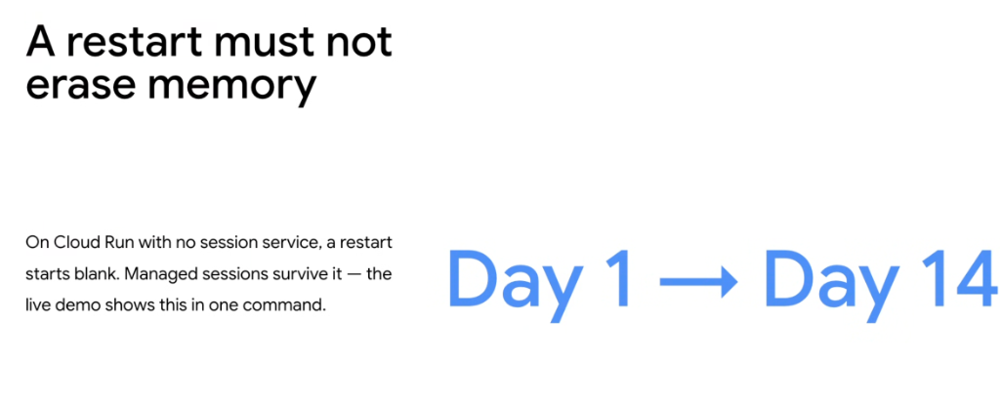

# Agent Resilience: A Restart Must Not Erase Memory



## Overview

In production cloud environments, compute instances are inherently ephemeral: containers scale to zero when idle, restart during deployments, crash under OOM conditions, and migrate across cluster nodes.

If an autonomous agent stores conversation history and working context in local process memory (RAM), any restart causes **instant conversational amnesia**. A user who configured preferences on **Day 1** will find the agent starting completely blank when they return on **Day 14**.

> **"On Cloud Run with no session service, a restart starts blank. Managed sessions survive it — the live demo shows this in one command."**

---

## Ephemeral Amnesia vs. Persistent Session Architecture

```mermaid
graph TD
    subgraph ❌ Anti-Pattern: In-Memory State (Amnesia)
        U1["👤 User on Day 1<br/><i>'My name is Alice, prefer email receipts'</i>"] --> CR1["📦 Cloud Run Container 1<br/><i>(State stored in Python RAM dict)</i>"]
        CR1 --> Idle["💤 10 mins idle → Scale to Zero / Restart"]
        Idle --> CR2["📦 Cloud Run Container 2<br/><i>(Fresh RAM: State is LOST)</i>"]
        U2["👤 User on Day 14<br/><i>'Send my receipt'</i>"] --> CR2
        CR2 --> Fail["❌ 'Who are you? What is your email?'<br/><i>(Total Context Amnesia)</i>"]
    end

    subgraph ✅ Production Pattern: Managed Externalized Sessions
        U3["👤 User on Day 1"] --> CR3["📦 Ephemeral Agent Container"]
        CR3 -->|Write State| DB[("🗄️ Managed Session Store<br/><i>(Firestore / Agent Runtime / SQL)</i>")]
        DB --> Persist["🔒 Persistent across restarts, days & deployments"]
        Persist --> CR4["📦 New Agent Container (Day 14)"]
        U4["👤 User on Day 14"] --> CR4
        CR4 -->|Hydrate Context| DB
        CR4 --> Pass["✅ 'Sending your receipt to Alice via email as requested.'"]
    end
```

---

## The Two Horizons of Agent State

Production agents must decouple two distinct state lifecycles from container compute:

```mermaid
graph LR
    subgraph 1. Session State (Short-Term Working Memory)
        S1["💬 Dialogue History"]
        S2["🛠️ Active Tool Variables"]
        S3["⏳ Current Multi-Turn Flow"]
    end

    subgraph 2. Long-Term Memory (Durable Semantic State)
        M1["👤 User Profiles & Preferences"]
        M2["📚 Historical Ticket Resolutions"]
        M3["🧠 Semantic Vector Memory"]
    end

    S1 & S2 & S3 --> SessionStore["🗄️ Session Service (Fast Key-Value / Document)"]
    M1 & M2 & M3 --> LongTermStore["🔍 Vector DB / Enterprise Graph"]
```

### 1. Short-Term Session State (Turn-to-Turn)
* **Scope**: The active conversation thread, intermediate tool execution parameters, and uncommitted transaction state.
* **Lifespan**: Hours to days.
* **Storage**: In-memory caching with persistent write-through to Cloud Firestore, Memorystore for Valkey, or Agent Runtime Managed State.

### 2. Long-Term Persistent Memory (Day 1 $\rightarrow$ Day 14+)
* **Scope**: User preferences, authenticated roles, recurring problems, past transaction IDs, and cross-session knowledge.
* **Lifespan**: Months to years.
* **Storage**: Distributed transactional databases (Cloud SQL, AlloyDB, Firestore) and vector embeddings (Vertex AI Vector Search).

---

## The "Live Demo" Resilience Validation Test

A robust agent deployment can prove its state durability in a single verification test:

```bash
# Step 1: User interacts on Day 1
curl -X POST https://agent-endpoint.a.run.app/chat \
  -H "Content-Type: application/json" \
  -d '{
    "session_id": "session_alice_99",
    "message": "My preferred shipping carrier is FedEx Overnight."
  }'
# Output: "Noted! I will use FedEx Overnight for future shipments."

# Step 2: Force complete container termination (simulate crash / redeployment)
gcloud run services update customer-service-agent \
  --region=us-central1 \
  --update-env-vars="FORCE_RESTART=true"

# Step 3: User returns on Day 14 to complete purchase
curl -X POST https://agent-endpoint.a.run.app/chat \
  -H "Content-Type: application/json" \
  -d '{
    "session_id": "session_alice_99",
    "message": "Ship order ORD-5501."
  }'
# Output: "Order ORD-5501 has been dispatched via FedEx Overnight as requested."
```

---

## Google ADK Implementation: Configuring Persistent Sessions

```python
from google.adk import Agent
from google.adk.sessions import FirestoreSessionService

# 1. Initialize persistent session backend
session_service = FirestoreSessionService(
    project_id="my-gcp-project",
    collection_name="agent_sessions",
    ttl_days=30,  # Retain session context for 30 days
)

# 2. Bind agent to persistent session manager
agent = Agent(
    name="customer_support_agent",
    model="gemini-2.5-pro",
    session_service=session_service,
    instruction="""
    You are an enterprise support assistant.
    Always inspect user session history for established preferences before asking questions.
    """,
)
```

---

## Session Backend Comparison Matrix

| Session Backend | Target Platform | Latency | Durability | Multi-Region Active-Active | DevOps Overhead |
| :--- | :--- | :--- | :--- | :--- | :--- |
| **Agent Runtime Built-in** | Agent Runtime | $< 15\text{ms}$ | **High (Managed)** | Built-in | **Zero (Turnkey)** |
| **Cloud Firestore** | Cloud Run / GKE | $< 25\text{ms}$ | **Maximum (Multi-Region)** | Yes | Very Low (Serverless NoSQL) |
| **Memorystore for Valkey/Redis** | Cloud Run / GKE | **$< 2\text{ms}$** | Medium (In-Memory + RDB) | VPC Peered | Low (Managed Instance) |
| **Cloud SQL / AlloyDB** | Cloud Run / GKE | $< 10\text{ms}$ | **Maximum (ACID)** | Read Replicas | Medium (Managed Relational) |

---

## Production Resilience Invariants

1. **Stateless Compute, Stateful Data**: Never store state in local variables, filesystem temp directories, or process memory.
2. **Deterministic Session Keys**: Always key sessions by deterministic user identifiers (e.g. `user_id` or `workspace_id + thread_id`) rather than ephemeral connection sockets.
3. **Automate Restart Testing in CI/CD**: Include an automated chaos test in your test suite that restarts the agent container between conversation turns and asserts that state is fully recovered.
