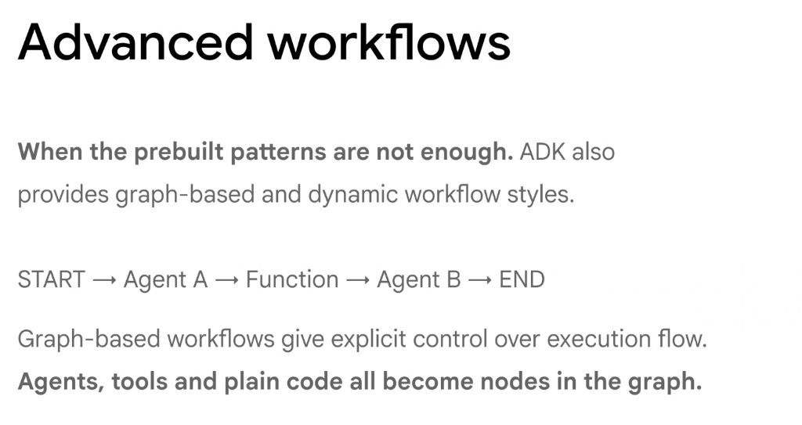
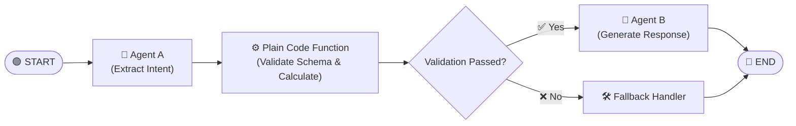

# Google ADK: Advanced Graph-Based & Dynamic Workflows

## Overview

When standard pre-built patterns (sequential pipelines or basic hierarchical routing) are insufficient for complex enterprise logic, the **Google Agent Development Kit (ADK)** supports **Graph-Based and Dynamic Workflows**.

Graph workflows provide explicit, deterministic control over execution flow by modeling **agents, external tools, and plain Python code as first-class nodes in a directed graph**.

> **"Agents, tools, and plain code all become nodes in the graph."**

---

## The Canonical Hybrid Graph Flow

* **Core Flow**: `START → Agent A → Function → Agent B → END`
* **Hybrid Interleaving**: Rather than relying purely on LLM reasoning for every step, deterministic business calculations or validation checks are executed by plain code functions directly within the workflow.

---

## Why Graph-Based Workflows Win in Production

### 1. Unified Node Abstraction
* In ADK graphs, any executable unit can be a **Node**:
  * **LLM Agents**: Cognitive reasoning and text generation.
  * **Tools / APIs**: External system mutations and retrievals.
  * **Plain Code Functions**: Deterministic data transformations, regex parsing, cryptographic hashing, and arithmetic calculations.

### 2. Explicit Conditional Routing & Loops
* Developers define **Conditional Edges** based on shared state variables:
  * Route to `Agent B` if `risk_score < 0.2`.
  * Loop back to `Agent A` if unit tests fail.
  * Escalate to a Human-in-the-Loop review if `amount > $10,000`.

### 3. Elimination of Non-Deterministic Scaffolding
* Complex logic (e.g. data schema validation, date math, tax calculations) should never be entrusted to an LLM's probabilistic next-token prediction.
* Inserting a deterministic **Function Node** guarantees 100% precision while saving LLM tokens and inference latency.

---

## Graph Primitives in ADK

| Primitive | Description | Example Implementation |
| :--- | :--- | :--- |
| **`Node`** | Any callable execution unit (Agent, Tool, or Function) | `workflow.add_node("enrich_data", enrich_fn)` |
| **`Edge`** | Unconditional directional flow between two nodes | `workflow.add_edge("agent_a", "validate_schema")` |
| **`Conditional Edge`** | State-dependent branching logic | `workflow.add_conditional_edges("validate_schema", route_fn)` |
| **`StateGraph`** | The compiled execution state machine | `app = workflow.compile(checkpointer=MemorySaver())` |

---

## Standard Patterns vs. Advanced Graph Workflows

| Dimension | Pre-Built Standard Patterns | Advanced Graph Workflows |
| :--- | :--- | :--- |
| **Flow Control** | Rigid or supervisor-driven | Custom directed acyclic graphs (DAGs) and cyclic state loops |
| **Node Types** | Primarily LLM-to-LLM | Hybrid: LLMs, deterministic code, APIs, and rule engines |
| **Error Handling** | Generic retry loops | Precision fallback sub-graphs and custom retry routing |
| **Use Case Complexity** | Standard research & triage | Complex multi-stage enterprise business processes |
