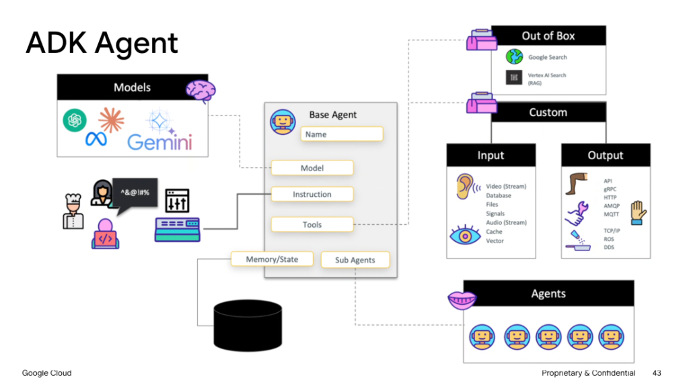
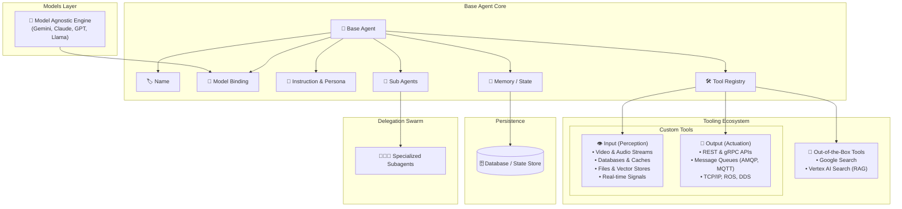

# Google ADK Agent: Complete Anatomical Reference

## Overview

In the Google Agent Development Kit (ADK), the **Base Agent** serves as the central orchestration unit. It binds foundational reasoning models with declarative instructions, pluggable input/output tools, persistent state backends, and multi-agent delegation swarms.

---

## Architectural Topology

---

## The 6 Core Elements of an ADK Agent

### 1. Name
* **Role**: Unique identifier for agent discovery, routing, and inter-agent communication.

### 2. Model Binding
* **Role**: Pluggable foundation model interface.
* **Flexibility**: Native support for Google Gemini (Flash, Pro) as well as third-party model providers.

### 3. Instruction & Persona
* **Role**: The foundational system prompt defining the agent's identity, operational boundaries, tone, formatting rules, and refusal criteria.

### 4. Pluggable Tool Registry
* **Out-of-the-Box (OOB) Tools**:
  * **Google Search**: Live web grounding.
  * **Vertex AI Search**: Managed enterprise document retrieval and RAG.
* **Custom Input Tools (Sensors & Data Ingestion)**:
  * Multimodal live streams (video, audio).
  * Storage engines (SQL databases, Redis/Valkey caches, Cloud Storage files, vector indices).
  * IoT telemetry and operational signals.
* **Custom Output Tools (Actuators & Transports)**:
  * Network APIs: REST, HTTP, gRPC.
  * Event Brokers: RabbitMQ (AMQP), MQTT, Pub/Sub.
  * Low-level protocols: Raw TCP/IP, Robotics Operating System (ROS), Data Distribution Service (DDS).

### 5. Memory / State Layer
* **Role**: Connected directly to persistent databases (e.g. Cloud SQL, Spanner, Firestore).
* **Function**: Hydrates conversation history across restarts and records structured execution checkpoints.

### 6. Subagent Delegation
* **Role**: Allows the primary agent to spawn, delegate tasks to, and supervise specialized subagents (e.g. specialized coder, reviewer, data analyst).

---

## Agent Configuration Matrix

| Field | Configuration Role | Supported Integrations |
| :--- | :--- | :--- |
| `name` | Identity & Addressing | `str` identifier (e.g., `"customer_support_root"`) |
| `model` | Core Cognitive Reasoning | Gemini 2.0 Flash/Pro, multi-model providers |
| `instruction` | Persona & Safety Guardrails | Markdown system prompt with step-by-step guidance |
| `tools` | Environmental Perception & Mutation | Google Search, Vertex RAG, APIs, gRPC, MQTT, ROS |
| `memory` | Session Hydration & Checkpoints | Cloud SQL, Firestore, Redis, Bigtable |
| `subagents` | Hierarchical Swarm Orchestration | List of downstream `Agent` instances |
