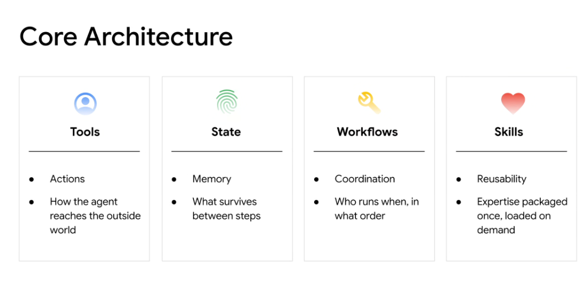
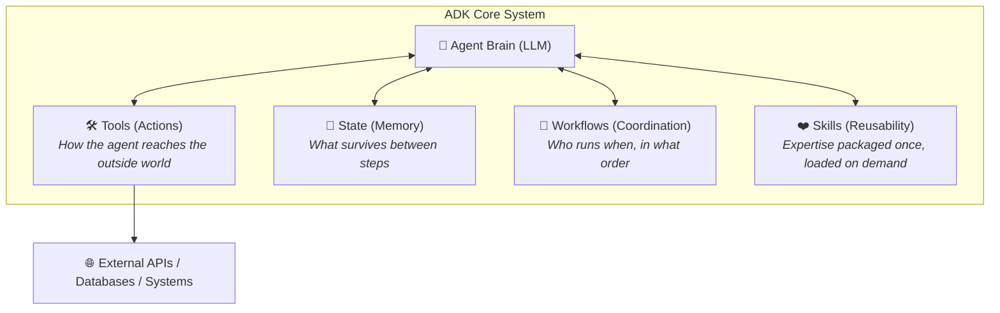

# Google ADK: The 4 Core Architectural Pillars

## Overview

The **Google Agent Development Kit (ADK)** organizes agentic software engineering around four foundational primitives: **Tools**, **State**, **Workflows**, and **Skills**. Together, these pillars provide the structure required to build reliable, modular, and production-ready agents.

---

## Architectural Interaction Model

---

## The 4 Pillars Detailed

### 1. Tools (Actions)
* **Core Role**: **How the agent reaches the outside world.**
* **Functionality**:
  * Gives the model agency to observe and mutate external systems.
  * Connects to REST/gRPC endpoints, SQL databases, shell execution environments, and Model Context Protocol (MCP) servers.
  * Handles parameter schema validation, execution timeouts, and error catching.

### 2. State (Memory)
* **Core Role**: **What survives between steps and sessions.**
* **Functionality**:
  * Manages short-term working scratchpads, multi-turn conversation context, and long-term memory stores.
  * Enforces deterministic session hydration, snapshot checkpointing, and resume-on-failure recovery.
  * Decouples ephemeral LLM turns from persistent system state.

### 3. Workflows (Coordination)
* **Core Role**: **Who runs when, in what order.**
* **Functionality**:
  * Coordinates multi-agent topologies (hierarchical supervisors, parallel workers, sequential pipelines).
  * Executes loop controls (ReAct loops, Plan-and-Execute trees).
  * Enforces deterministic business boundaries and Human-in-the-Loop (HITL) approval gates.

### 4. Skills (Reusability)
* **Core Role**: **Expertise packaged once, loaded on demand.**
* **Functionality**:
  * Modular capability packages bundling instructions (`SKILL.md`), scripts, domain rules, and specialized toolsets.
  * Dynamically loaded into agent contexts only when relevant tasks are detected, conserving active token windows.
  * Easily shared and reused across different agents and engineering teams.

---

## Pillar Summary Matrix

| Pillar | Keyword | Core Responsibility | Key Technologies / Primitives |
| :--- | :--- | :--- | :--- |
| **Tools** | *Actions* | External system execution & data fetching | APIs, MCP servers, SDK bindings, CLI tools |
| **State** | *Memory* | Information persistence across turns | Session caches, vector memory, database state stores |
| **Workflows** | *Coordination* | Execution ordering & agent swarming | ReAct loops, state machines, HITL review gates |
| **Skills** | *Reusability* | Modular, on-demand domain expertise | `SKILL.md` bundles, specialized scripts, domain rules |
