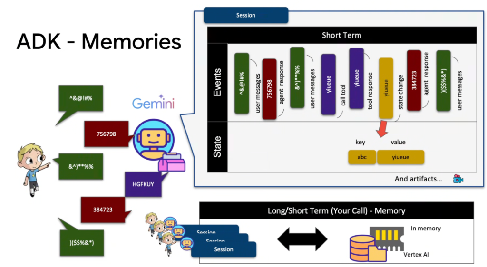

# Google ADK: Memory Architecture (Events, State, and Artifacts)



## Overview

In the Google Agent Development Kit (ADK), memory is not a monolithic string of raw text. Instead, ADK structures agent memory into a multi-tiered architecture composed of **Events**, **Key-Value State**, **Artifacts**, and **Cross-Session Long-Term Memory**.

> **"Events log what happened; State tracks structured working variables; Artifacts store heavy multi-modal assets; Memory Services bridge multi-session intelligence."**

---

## The Complete ADK Memory Architecture

```mermaid
graph TD
    User["👤 User Interaction"] --> Bot["🤖 Gemini ADK Agent"]

    subgraph Tier 1: Short-Term Session Scope
        subgraph Events (Append-Only Log)
            E1["💬 user_message"] --> E2["🤖 agent_response"]
            E2 --> E3["💬 user_message"]
            E3 --> E4["🛠️ call_tool"]
            E4 --> E5["📦 tool_response"]
            E5 --> E6["⚡ state_change"]
            E6 --> E7["🤖 agent_response"]
        end

        subgraph State (Key-Value Working Store)
            K1["🔑 Key: <code>order_id</code>"] --> V1["📦 Value: <code>ORD-102</code>"]
            K2["🔑 Key: <code>refund_status</code>"] --> V2["📦 Value: <code>approved</code>"]
        end

        subgraph Artifacts (Heavy / Multi-Modal Storage)
            Art1["🖼️ Generated UI Mockups"]
            Art2["📄 Invoices & PDFs"]
            Art3["🎥 Rendered Media"]
        end

        E5 -.->|Tool Output Mutates| K1 & K2
    end

    subgraph Tier 2: Long-Term Memory Service
        Sess1["📁 Session 1"] & Sess2["📁 Session 2"] & Sess3["📁 Session 3"] --> MemEngine[("🧠 Long/Short-Term Memory Backend<br/><i>In-Memory RAM / Vertex AI Memory Service</i>")]
    end
```

---

## Deep Breakdown of the 4 Memory Primitives

### 1. Events (The Temporal Log)
* **What It Is**: An immutable, append-only chronological log of every interaction inside a session.
* **Event Types**:
  * `user_message`: Inbound user prompt.
  * `agent_response`: Outbound text generated by the agent.
  * `call_tool`: The tool invocation request including function name and JSON arguments.
  * `tool_response`: The data payload returned by the executed tool.
  * `state_change`: Explicit mutation event recording state updates.
* **Role**: Provides complete auditability, supports exact session replay, and feeds directly into **Trajectory Evaluation**.

---

### 2. State (Structured Key-Value Working Memory)
* **What It Is**: A mutable key-value dictionary attached to the active session (`session.state`).
* **How It Works**:
  * When tools execute (e.g. `lookup_account`), relevant fields are extracted and written to `session.state["account_id"] = "CUST-99"`.
  * Preserves structured variables across conversation turns without requiring the LLM to re-extract them from raw text history.
  * Injected directly into agent prompt templates and tool arguments.

---

### 3. Artifacts (Multi-Modal & Heavy Storage)
* **What It Is**: Externalized storage for large binary payloads, rendered media, code files, and PDFs.
* **Why It Matters**: Prevents context window exhaustion. Instead of stuffing a 5MB PDF or base64 image into prompt tokens, the agent creates an **Artifact** and passes its lightweight URI handle.

---

### 4. Long/Short-Term Memory (Multi-Session Bridge)
* **What It Is**: Cross-session knowledge persistence linking past interactions (`Session 1`, `Session 2`, `Session 3`) to a single user or organization.
* **Hosting Options**:
  * **In-Memory**: Ephemeral testing storage (fast, local to Python process).
  * **Vertex AI Memory Service**: Distributed vector indexing and semantic retrieval across historical sessions.

---

## ADK Python Implementation: Interacting with Memory

```python
from google.adk import Agent, Session
from google.adk.tools import FunctionTool

def issue_refund(order_id: str, amount: float, session: Session) -> dict:
    # 1. Execute transactional logic
    refund_ref = f"REF-{order_id}-OK"
    
    # 2. Mutate structured Session State directly
    session.state["last_refund_id"] = refund_ref
    session.state["refund_amount"] = amount
    
    # 3. Create an Artifact (e.g. PDF receipt)
    session.create_artifact(
        name=f"receipt_{order_id}.pdf",
        mime_type="application/pdf",
        data=b"%PDF-1.4...",
    )
    
    return {"status": "success", "refund_id": refund_ref}

# Inspecting Session Memory
def inspect_session(session: Session):
    # View raw event stream
    for event in session.events:
        print(f"[{event.type}] {event.content}")
        
    # Read working state
    print(f"Active Refund: {session.state.get('last_refund_id')}")
```

---

## Memory Primitives Comparison Matrix

| Memory Primitive | Data Structure | Scope | Mutation Model | Primary Architectural Role |
| :--- | :--- | :--- | :--- | :--- |
| **Events** | Append-Only Stream | Single Session | Immutable | Audit log, trajectory evaluation, chat history. |
| **State** | Key-Value Dict | Single Session | Mutable | Typed variables, extracted entities, active status. |
| **Artifacts** | Binary / File Store | Single Session | Persistent Objects | Heavy assets (PDFs, images, code files). |
| **Long-Term Memory** | Vector / Graph DB | Multi-Session | Semantic Indexed | Cross-session context, user preferences, historical recall. |

---

## Production Memory Best Practices

1. **Mutate State from Tool Responses**: Rather than relying on the LLM to remember IDs in conversation text, have tools explicitly write structured IDs into `session.state`.
2. **Offload Large Payloads to Artifacts**: Always store documents, images, and large tables as Artifacts rather than stuffing raw contents into prompt tokens.
3. **Use Vertex AI Memory Service for Cross-Session Continuity**: Seamlessly recall past customer resolutions across weeks of inactive sessions without ballooning individual prompt contexts.
