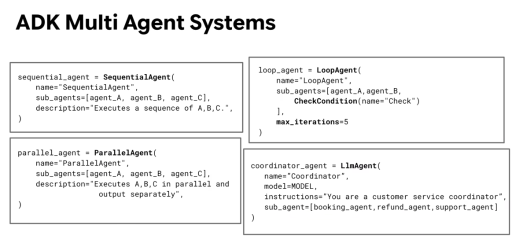

# Google ADK: Multi-Agent Systems Code Reference



## Overview

The **Google Agent Development Kit (ADK)** provides first-class, pythonic primitives for composing complex multi-agent architectures. Whether constructing deterministic workflow pipelines or runtime AI-driven swarms, ADK abstracts execution mechanics into four core classes: **`SequentialAgent`**, **`ParallelAgent`**, **`LoopAgent`**, and **`LlmAgent`** (Dynamic Coordinator).

> **"Four core primitives for assembling production multi-agent architectures in Python: Sequential, Parallel, Loop, and Coordinator."**

---

## The 4 Core Multi-Agent Primitives

```mermaid
graph TD
    ADK_MAS["🤖 ADK Multi-Agent Primitives"]

    subgraph 🟢 Workflow Primitives (Fixed Logic)
        S["1️⃣ SequentialAgent<br/><i>Linear pipeline: A → B → C</i>"]
        P["2️⃣ ParallelAgent<br/><i>Concurrent fan-out: A ∥ B ∥ C</i>"]
        L["3️⃣ LoopAgent<br/><i>Iterative refinement + CheckCondition</i>"]
    end

    subgraph 🔵 Dynamic Primitives (AI Routing)
        C["4️⃣ LlmAgent (Coordinator)<br/><i>Runtime subagent triage & synthesis</i>"]
    end

    ADK_MAS --> S & P & L
    ADK_MAS --> C
```

---

## Code Reference & Implementation Syntax

### 1. `SequentialAgent` (Linear Pipeline)
Executes a fixed sequence of specialized subagents in order, where each stage consumes and refines state from prior stages.

```python
from google.adk.agents import SequentialAgent

sequential_agent = SequentialAgent(
    name="SequentialAgent",
    sub_agents=[agent_A, agent_B, agent_C],
    description="Executes a sequence of A,B,C.",
)
```
* **Execution Flow**: `agent_A` $\rightarrow$ `agent_B` $\rightarrow$ `agent_C`.
* **State Behavior**: Outputs from `agent_A` become accessible in shared session state for `agent_B` and `agent_C`.
* **Best For**: Multi-stage data processing (Extract $\rightarrow$ Transform $\rightarrow$ Load), code generation pipelines (Spec $\rightarrow$ Code $\rightarrow$ Verify).

---

### 2. `ParallelAgent` (Concurrent Fan-Out)
Dispatches a request to multiple subagents simultaneously, executing them concurrently using asynchronous runtimes (`asyncio`).

```python
from google.adk.agents import ParallelAgent

parallel_agent = ParallelAgent(
    name="ParallelAgent",
    sub_agents=[agent_A, agent_B, agent_C],
    description="Executes A,B,C in parallel and output separately",
)
```
* **Execution Flow**: `agent_A` $\parallel$ `agent_B` $\parallel$ `agent_C`.
* **Latency Profile**: Total execution duration is bounded by the slowest subagent ($\max(T_A, T_B, T_C)$).
* **Best For**: Multi-perspective audits (Security + Legal + Cost concurrently), sharded batch data extraction.

---

### 3. `LoopAgent` (Iterative Refinement & Quality Gate)
Repeats an execution sequence across subagents until a condition check evaluates to `True` or a maximum iteration ceiling is reached.

```python
from google.adk.agents import LoopAgent
from google.adk.conditions import CheckCondition

loop_agent = LoopAgent(
    name="LoopAgent",
    sub_agents=[
        agent_A, 
        agent_B, 
        CheckCondition(name="Check")
    ],
    max_iterations=5,
)
```
* **Execution Flow**: `[agent_A → agent_B → CheckCondition] × N` (while `CheckCondition == False` and $N < 5$).
* **Safety Invariant**: The `max_iterations=5` argument is a mandatory circuit breaker preventing infinite loops and runaway billing.
* **Best For**: Test-Driven Development (TDD) code patching, iterative prompt optimization, schema validation loops.

---

### 4. `LlmAgent` as Dynamic Coordinator
Uses frontier LLM reasoning at runtime to interpret unstructured user intent, select the most appropriate subagent, parameterize sub-calls, and synthesize responses.

```python
from google.adk.agents import LlmAgent

coordinator_agent = LlmAgent(
    name="Coordinator",
    model=MODEL,
    instructions="You are a customer service coordinator",
    sub_agents=[booking_agent, refund_agent, support_agent],
)
```
* **Execution Flow**: User $\rightarrow$ Coordinator LLM $\rightarrow$ Dynamic Dispatch $\rightarrow$ Subagent Execution $\rightarrow$ Coordinator Synthesis $\rightarrow$ User.
* **Decision-Space Scoping**: The coordinator sees only high-level subagent descriptions; each subagent encapsulates its own domain tools.
* **Best For**: Enterprise triage gateways, customer support concierges, multi-service assistants.

---

## Primitive Comparison Matrix

| Primitive | Routing Authority | Execution Topology | State Propagation | Mandatory Guardrails |
| :--- | :--- | :--- | :--- | :--- |
| **`SequentialAgent`** | Code / Deterministic | Linear Serial ($A \rightarrow B \rightarrow C$) | Sequential state accumulation | Stage timeout |
| **`ParallelAgent`** | Code / Deterministic | Concurrent Fan-Out ($A \parallel B \parallel C$) | Independent outputs collected | Concurrency semaphore |
| **`LoopAgent`** | Code / Condition | Closed-Loop Feedback | Cumulative state diffs | `max_iterations` ceiling |
| **`LlmAgent` (Coord)** | AI Model Reasoning | Dynamic Dispatch / Router | Hub-and-Spoke handoff | Fallback default route |

---

## Composite Enterprise Architecture Example

In production systems, these four primitives are combined into modular, layered hierarchies:

```python
from google.adk.agents import LlmAgent, SequentialAgent, ParallelAgent, LoopAgent
from google.adk.conditions import CheckCondition

# 1. Parallel Audit Section
audit_swarm = ParallelAgent(
    name="compliance_audit_swarm",
    sub_agents=[security_agent, legal_agent, finance_agent],
)

# 2. Iterative Refinement Section
code_refinement_loop = LoopAgent(
    name="tdd_code_refinement",
    sub_agents=[coder_agent, test_runner_agent, CheckCondition(name="TestsPass")],
    max_iterations=4,
)

# 3. Deterministic Delivery Pipeline
delivery_pipeline = SequentialAgent(
    name="delivery_pipeline",
    sub_agents=[code_refinement_loop, audit_swarm, packaging_agent],
)

# 4. Top-Level Enterprise Gateway Coordinator
enterprise_gateway = LlmAgent(
    name="enterprise_gateway",
    model="gemini-2.5-pro",
    instructions="Triage customer requests and orchestrate specialized delivery pipelines.",
    sub_agents=[delivery_pipeline, general_faq_agent],
)
```
