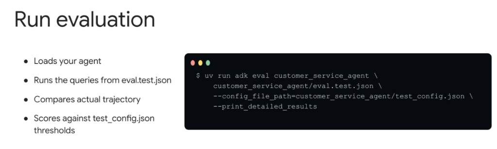
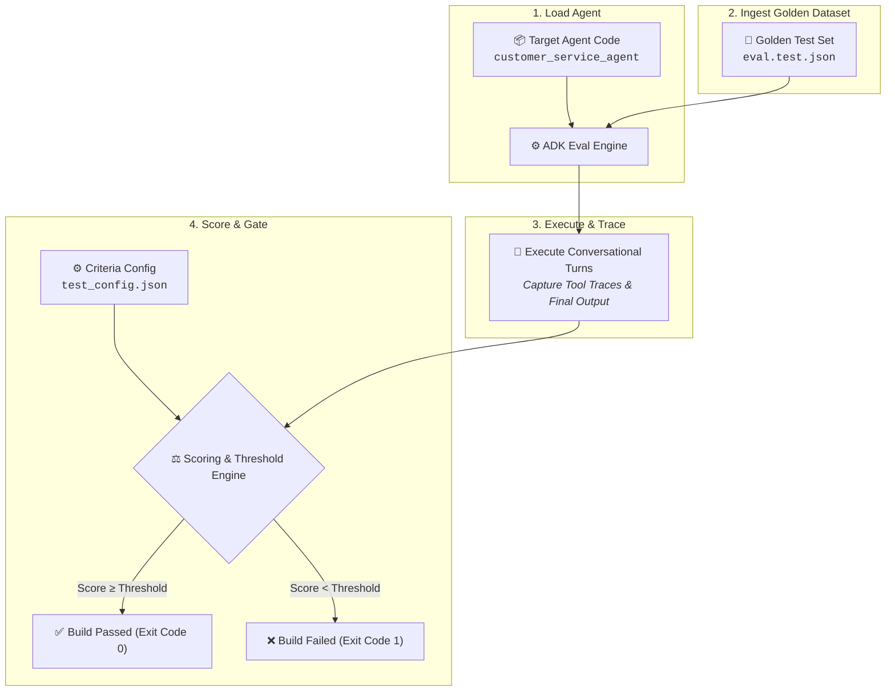

# Google ADK: Running Agent Evaluations (CLI & CI/CD)



## Overview

Executing agent evaluations in Google ADK is streamlined through the `adk eval` CLI command. The evaluation runner orchestrates the complete testing lifecycle: loading the candidate agent, executing golden benchmark queries, comparing intermediate tool execution trajectories, and grading responses against configured criteria thresholds.

> **"1. Loads your agent → 2. Runs queries from eval.test.json → 3. Compares actual trajectory → 4. Scores against test_config.json thresholds."**

---

## The 4-Step Evaluation Runtime Lifecycle



---

## The Primary CLI Command

```bash
uv run adk eval customer_service_agent \
    customer_service_agent/eval.test.json \
    --config_file_path=customer_service_agent/test_config.json \
    --print_detailed_results
```

### Breakdown of Command Arguments

| Parameter / Flag | Type | Description |
| :--- | :--- | :--- |
| `customer_service_agent` | Positional | Path to the directory or Python module containing the agent definition. |
| `customer_service_agent/eval.test.json` | Positional | Path to the golden evaluation dataset containing test queries, expected trajectories, and expected responses. |
| `--config_file_path` | Flag (`str`) | Path to the JSON/YAML configuration file specifying evaluation criteria and threshold cutoffs. |
| `--print_detailed_results` | Flag (`bool`) | Prints step-by-step diagnostic breakdown per test case (tool diffs, score breakdowns, latencies). |
| `--output_file_path` *(optional)* | Flag (`str`) | Exports structured evaluation report to JSON/HTML for CI/CD artifact archiving. |
| `--test_ids` *(optional)* | Flag (`list[str]`) | Executes a filtered subset of test cases (e.g. `--test_ids=refund_request,product_check`). |

---

## Directory Structure of an ADK Evaluation Project

In an enterprise ADK repository, evaluation files live alongside the agent implementation:

```
customer_service_agent/
├── __init__.py
├── agent.py               # Main agent definition & tool registry
├── tools.py               # Custom tools and MCP integrations
├── eval.test.json         # Golden dataset (queries, expected trajectories, responses)
└── test_config.json       # Metric definitions and pass/fail thresholds
```

---

## Example Evaluation Files

### 1. `test_config.json` (Criteria & Thresholds)
```json
{
  "criteria": {
    "tool_trajectory_avg_score": 0.8,
    "response_match_score": 0.5
  }
}
```

### 2. `eval.test.json` (Golden Test Cases)
```json
[
  {
    "eval_id": "refund_request",
    "session_input": {
      "user_id": "eval_user_3"
    },
    "conversation": [
      {
        "user_content": {
          "parts": [
            {
              "text": "I want a refund for order ORD-102. It was damaged."
            }
          ]
        },
        "intermediate_data": {
          "tool_uses": [
            {
              "name": "issue_refund",
              "args": {
                "order_id": "ORD-102",
                "reason": "damaged"
              }
            }
          ]
        },
        "final_response": {
          "parts": [
            {
              "text": "Your refund for ORD-102 has been processed."
            }
          ]
        }
      }
    ]
  }
]
```

---

## Sample Detailed Console Output

When running with `--print_detailed_results`, ADK prints actionable diagnostic output:

```text
============================== ADK EVALUATION REPORT ==============================
Agent: customer_service_agent
Dataset: customer_service_agent/eval.test.json (10 test cases)
Config: customer_service_agent/test_config.json

[PASS] TC-001: product_info_check
  - Tool Trajectory: 1.00 / 0.80 (PASSED)
  - Response Match:  0.82 / 0.50 (PASSED)

[PASS] TC-002: refund_request
  - Tool Trajectory: 1.00 / 0.80 (PASSED)
    - Expected: issue_refund(order_id='ORD-102', reason='damaged')
    - Actual:   issue_refund(order_id='ORD-102', reason='damaged')
  - Response Match:  0.64 / 0.50 (PASSED)

-----------------------------------------------------------------------------------
Final Summary:
  Total Cases: 10
  Passed:      10 (100.0%)
  Mean Trajectory Score: 0.94 (Threshold: 0.80) -> PASS
  Mean Response Score:   0.71 (Threshold: 0.50) -> PASS
================================== STATUS: PASSED ==================================
```

---

## CI/CD Pipeline Integration

Embed `adk eval` directly into GitHub Actions, Cloud Build, or GitLab CI:

```yaml
# .github/workflows/agent_eval.yml
name: Agent CI/CD Evaluation Gate
on: [pull_request]

jobs:
  evaluate_agent:
    runs-on: ubuntu-latest
    steps:
      - uses: actions/checkout@v4
      - name: Set up Python & uv
        uses: astral-sh/setup-uv@v2
      - name: Run ADK Evaluation Suite
        run: |
          uv run adk eval customer_service_agent \
            customer_service_agent/eval.test.json \
            --config_file_path=customer_service_agent/test_config.json \
            --print_detailed_results
```

---

## Production Best Practices

1. **Use `uv` for Deterministic Execution**: Running `uv run adk eval` guarantees frozen virtual environments and fast execution speeds across developer workstations and CI runners.
2. **Always Enable Detailed Results Locally**: Use `--print_detailed_results` during development to inspect tool argument diffs and understand why an evaluation failed.
3. **Automate Pre-Merge Gating**: Wire `adk eval` into PR checks so regressions in prompt engineering or tool definitions fail the build before reaching production.
