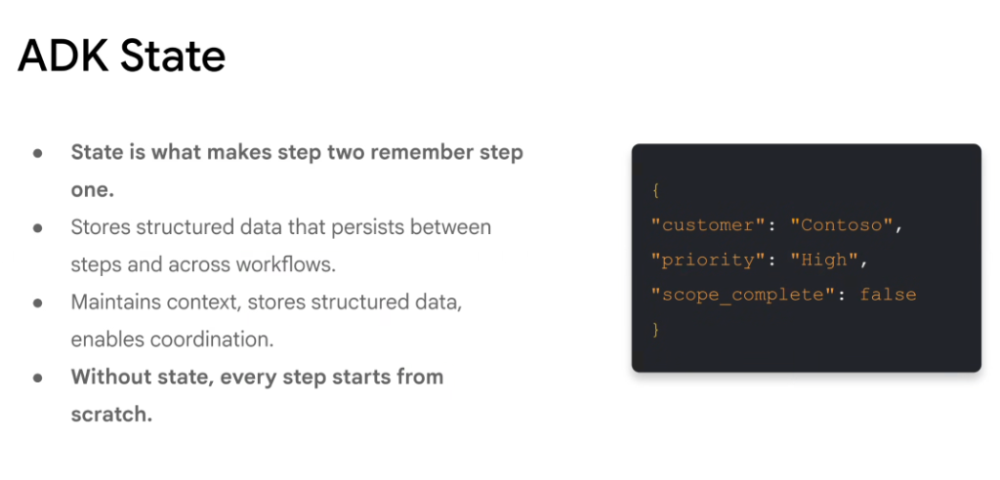
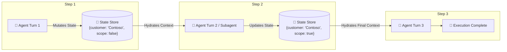

# Google ADK: State Management & Cross-Step Memory



## Overview

In the Google Agent Development Kit (ADK), **State** is the persistent data layer that bridges individual reasoning turns and multi-agent workflow stages. It decouples the ephemeral LLM generation turn from the persistent operational context.

> **"State is what makes step two remember step one. Without state, every step starts from scratch."**

---

## The Structured State Object

Instead of forcing agents to parse prior conversational text to recall essential parameters, ADK maintains typed, structured JSON state:

```json
{
  "customer": "Contoso",
  "priority": "High",
  "scope_complete": false,
  "account_id": "acc_89412",
  "pending_approvals": ["delete_staging_cluster"],
  "retry_count": 0
}
```

---

## State Transition & Coordination Model



---

## The Three Core Pillars of ADK State

### 1. Maintains Context Across Turns
* Prevents the agent from asking the user repetitive clarifying questions.
* Retains discovered entity IDs, SQL query results, and API tokens across multi-step investigations.

### 2. Stores Structured Data (The Blackboard Pattern)
* Provides a deterministic key-value blackboard where different tools and subagents can publish and subscribe to intermediate outputs.
* Eliminates fuzzy, error-prone string regex parsing from raw chat history.

### 3. Enables Multi-Agent Coordination
* Allows a supervisor agent to assign tasks to subagents by passing a shared state pointer.
* Subagents write their specialized outputs into the shared state object, allowing subsequent workers to seamlessly pick up where prior agents finished.

---

## Levels of State in ADK

| State Tier | Lifetime | Backing Store | Typical Data Stored |
| :--- | :--- | :--- | :--- |
| **Turn / Scratchpad State** | Single LLM invocation | In-memory RAM | Immediate Chain-of-Thought reasoning steps, raw tool outputs |
| **Session State** | Multi-turn user interaction | Redis / Cloud SQL / Firestore | Active user preferences, current cart/ticket ID, workflow step flags |
| **Long-Term Memory (LTM)** | Cross-session / Permanent | Vector Search / Spanner / AlloyDB | Learned user habits, organizational policies, historical incident notes |

---

## Why Production Agents Require Explicit State

1. **Fault Recovery**: If an API call crashes mid-execution, the agent can reload the last state checkpoint and resume without restarting from step zero.
2. **Deterministic Governance**: Security guardrails can inspect state properties (e.g. `is_admin == true`, `risk_score < 0.5`) before approving downstream tool executions.
3. **Token Efficiency**: Instead of injecting 50,000 tokens of past chat logs, the agent injects a concise 100-token structured JSON state object.
