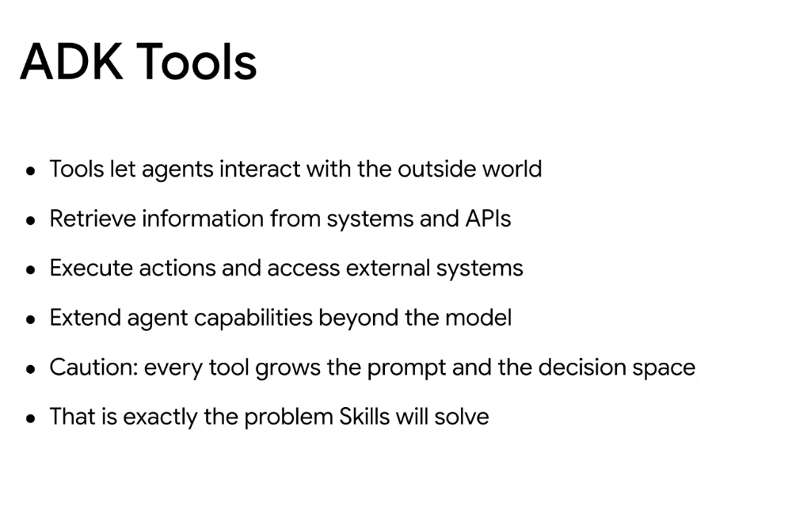
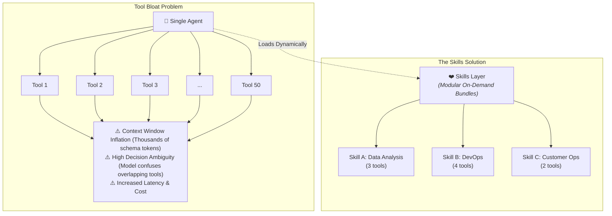

# Google ADK: Tools & The Decision Space Dilemma

## Overview

In the Google Agent Development Kit (ADK), **Tools** are the primary mechanism through which an agent perceives and acts upon the outside world. They allow models to retrieve dynamic external context, execute transactions, and interact with distributed systems.

---

## Core Capabilities of Tools

1. **Perception & Retrieval**: Query external databases, search engines, APIs, and file repositories for real-time information.
2. **Action & Actuation**: Execute state-changing operations (e.g., triggering workflows, dispatching emails, deploying containers, writing database records).
3. **Capability Extension**: Extends the agent's problem-solving horizon far beyond the static parameters of the foundation model.

---

## The Caution: The Tool Bloat & Decision Space Dilemma

While tools provide necessary capabilities, naively attaching dozens of tools to a single agent introduces severe architectural challenges:

### The Key Risks:
* **Prompt Bloat**: Every tool definition requires a comprehensive JSON schema, docstrings, and parameter types, consuming hundreds or thousands of prompt tokens on every turn.
* **Decision Space Confusion**: As the number of available tools grows, the model's probability of selecting the wrong tool or hallucinating parameters increases exponentially.

---

## The Bridge to Skills

> **"Caution: every tool grows the prompt and the decision space. That is exactly the problem Skills will solve."**

Rather than loading every tool permanently into an agent's root prompt, the architecture organizes tools into **Skills**—reusable, domain-specific packages that are dynamically loaded into the agent's working context only when the task explicitly requires them.

---

## Tools vs. Skills Architecture Matrix

| Dimension | Raw Tools Layer | Modular Skills Layer |
| :--- | :--- | :--- |
| **Token Impact** | Fixed high overhead (all schemas permanently in prompt) | Minimal baseline (only active skill tools loaded) |
| **Decision Complexity** | Flat, high-dimensional search space ($O(N)$ tools) | Hierarchical routing (select Skill $
\rightarrow$ select Tool) |
| **Reusability** | Bespoke function mappings per agent | Shareable, portable capability packages (`SKILL.md`) |
| **Failure Recovery** | High risk of tool confusion and malformed arguments | Tightly scoped prompts with domain-specific guardrails |
