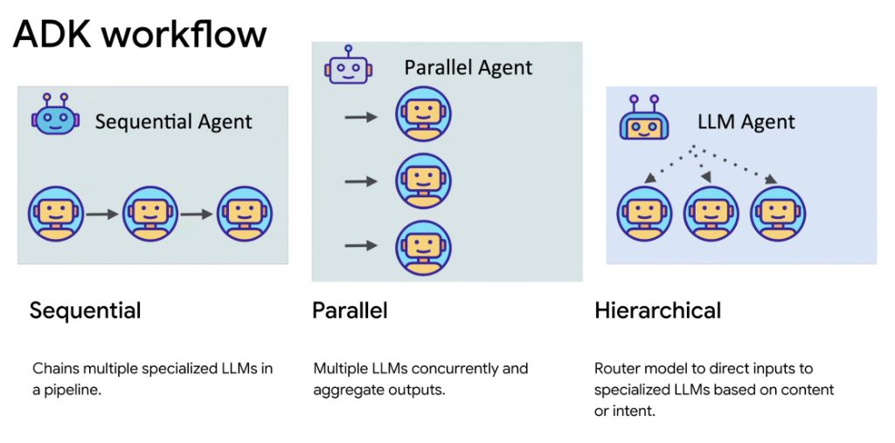
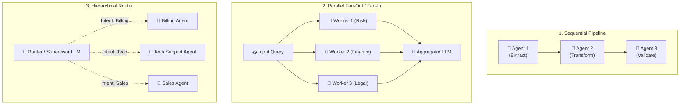

# ADK Workflows: Sequential, Parallel, and Hierarchical Patterns

## Overview

In the Google Agent Development Kit (ADK), multi-agent coordination is categorized into three foundational topological patterns: **Sequential**, **Parallel**, and **Hierarchical**. Choosing the proper workflow pattern directly optimizes latency, token efficiency, and task success rates.

---

## The Three Multi-Agent Topologies

---

## Detailed Pattern Breakdown

### 1. Sequential Pattern
* **Definition**: Chains multiple specialized LLMs in a linear pipeline.
* **Mechanism**: The output of Agent $N$ becomes the direct input or augmented context for Agent $N+1$.
* **Key Strengths**:
  * Step-by-step refinement and deterministic gating.
  * Easy to isolate faults to a specific pipeline stage.
* **Ideal Use Cases**:
  * Code Generation: *Specification Agent $
\rightarrow$ Code Implementer $
\rightarrow$ Security Reviewer $
\rightarrow$ Test Runner*.
  * Content Publishing: *Research Agent $
\rightarrow$ Draft Writer $
\rightarrow$ Editor / Style Checker*.

### 2. Parallel Pattern
* **Definition**: Executes multiple LLMs concurrently and aggregates their collective outputs.
* **Mechanism**: A single query or task is fanned out to multiple independent workers running simultaneously, whose results are merged by an aggregator model or voting ensemble.
* **Key Strengths**:
  * Minimizes overall end-to-end latency via parallel execution.
  * Facilitates multi-perspective synthesis and consensus voting.
* **Ideal Use Cases**:
  * Multi-source compliance evaluation (Legal + Security + Financial audit simultaneously).
  * Competitive research analyzing 5 competitor websites in parallel.
  * Ensemble verification and majority-vote decision making.

### 3. Hierarchical Pattern
* **Definition**: Uses a central Router/Supervisor model to direct inputs to specialized domain LLMs based on content, category, or user intent.
* **Mechanism**: The top-level supervisor classifies the user's goal, determines which specialized subordinate agent has the necessary tools, and delegates the subtask.
* **Key Strengths**:
  * Keeps individual subagent prompts and tool registries small and focused.
  * Eliminates decision-space bloat by presenting only relevant tools to the active specialist.
* **Ideal Use Cases**:
  * Enterprise customer support routing across Billing, Authentication, and Cloud Infrastructure.
  * Multi-functional assistants routing between Calendar, Jira, and GitHub agents.

---

## Topology Comparison Matrix

| Pattern | Execution Order | Latency Profile | Token Overhead | Ideal Problem Space |
| :--- | :--- | :--- | :--- | :--- |
| **Sequential** | Serial ($A 
\rightarrow B 
\rightarrow C$) | Cumulative sum of all stages | Moderate (context passed sequentially) | Multi-stage refinement & dependent transformations |
| **Parallel** | Concurrent ($\max(\text{stage latency})$) | Lowest (bounded by slowest worker) | Higher (simultaneous prompt evaluations) | Multi-angle analysis, consensus voting, batch processing |
| **Hierarchical** | Delegated routing ($S 
\rightarrow W_k$) | Low to Moderate ($1 \text{ routing} + 1 \text{ execution}$) | Optimized (subagent receives only relevant tools) | Broad multi-domain systems & enterprise triage |
