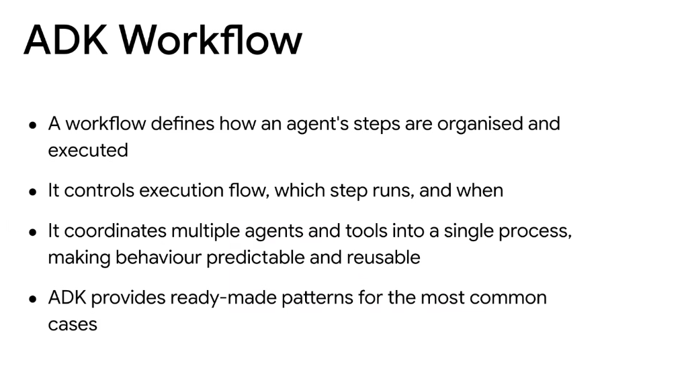
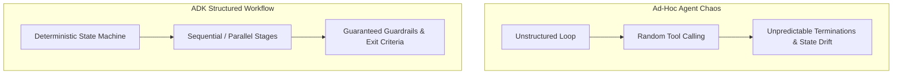
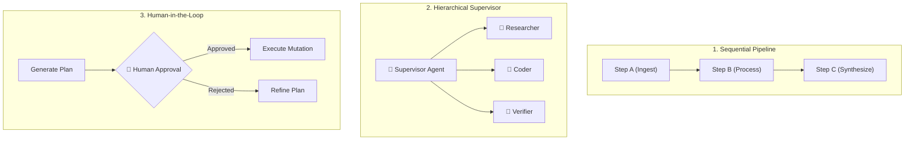

# Google ADK: Workflows & Execution Coordination

## Overview

In the Google Agent Development Kit (ADK), a **Workflow** defines the formal execution topology that organizes how an agent's steps, tools, and subagents are sequenced, coordinated, and governed.

> **"A workflow controls execution flow, which step runs, and when—coordinating multiple agents and tools into a single process, making behaviour predictable and reusable."**

---

## The Value of Workflow Abstractions

---

## The 5 Core ADK Workflow Patterns

### 1. Sequential Pipeline
* **Flow**: $A 
\rightarrow B 
\rightarrow C$
* **Best For**: Multi-stage data transformations, ETL, document summarization chains where each step depends directly on the output of the prior step.

### 2. Hierarchical Routing & Supervisor
* **Flow**: Central Router / Supervisor $
\rightarrow$ Specialized Subagents $
\rightarrow$ Aggregator.
* **Best For**: Complex multi-domain tasks (e.g. software engineering requiring an architect, coder, reviewer, and tester).

### 3. Iterative ReAct Loop
* **Flow**: `Think → Act → Observe → Repeat`
* **Best For**: Open-ended research, troubleshooting, and dynamic problem spaces where next steps depend on runtime tool responses.

### 4. Human-in-the-Loop (HITL) Gate
* **Flow**: Agent Proposal $
\rightarrow$ Asynchronous Review Gate $
\rightarrow$ Approved Execution.
* **Best For**: High-stakes operations (financial transactions, production deployments, database drops).

### 5. Parallel Fan-Out / Fan-In
* **Flow**: Single Dispatcher $
\rightarrow$ Concurrent Worker Swarm ($W_1, W_2, \dots, W_n$) $
\rightarrow$ Reducer / Synthesizer.
* **Best For**: High-throughput document processing, multi-source scraping, and independent parallel verifications.

---

## Workflow Pattern Selection Matrix

| Workflow Pattern | Execution Flow | Autonomy Level | Primary Engineering Value |
| :--- | :--- | :--- | :--- |
| **Sequential** | Strict linear sequence ($A 
\rightarrow B 
\rightarrow C$) | Low / Deterministic | High predictability and low token overhead |
| **Hierarchical** | Supervisor delegates to specialized workers | High | Separates concerns across domain experts |
| **Iterative (ReAct)** | Closed-loop feedback cycle | High | Dynamic error recovery and adaptive exploration |
| **Human Gate (HITL)** | Pauses at critical mutation steps | Supervised | Guarantees compliance, safety, and audit trails |
| **Parallel Fan-Out** | Concurrent multi-agent execution | Moderate | Minimizes latency across independent tasks |
