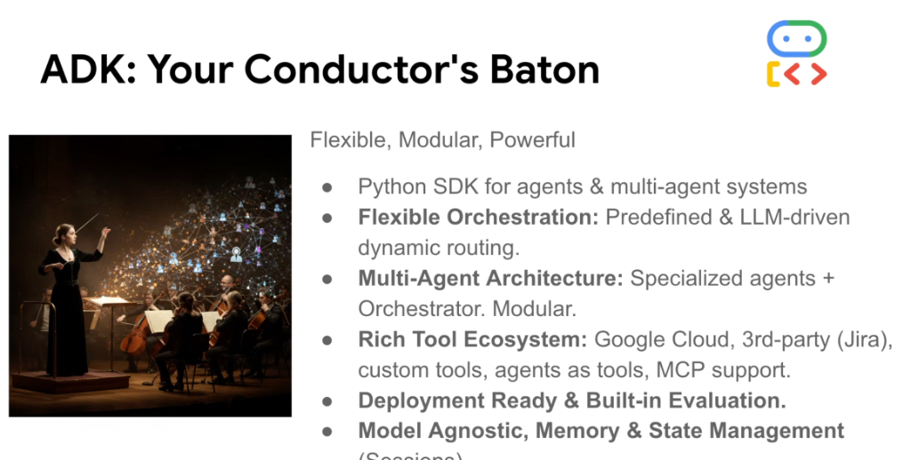
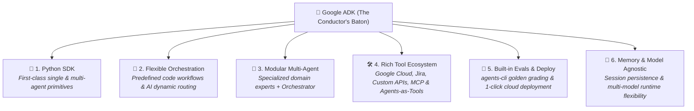
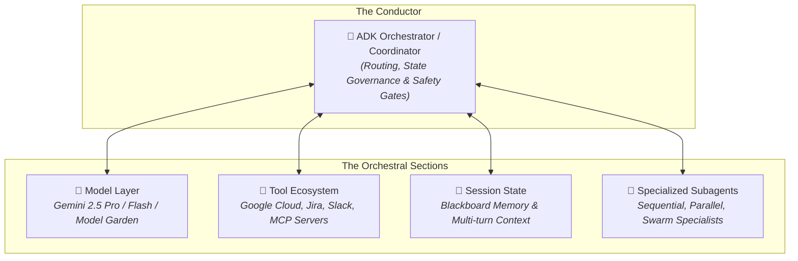

# Google ADK: Your Conductor's Baton



## Overview

Just as a master conductor synchronizes diverse orchestral sections—violins, brass, woodwinds, and percussion—into a harmonious symphony, the **Google Agent Development Kit (ADK)** empowers engineers to orchestrate specialized models, tools, memory stores, and subagents into a unified, high-performance system.

> **"Flexible, Modular, Powerful: The complete Python framework for engineering, evaluating, and deploying production-grade single and multi-agent systems."**

---

## The 6 Pillars of the ADK Ecosystem



---

## Architectural Interaction Model



---

## Deep Breakdown of Key Capabilities

### 1. Python SDK for Agents & Multi-Agent Systems
* **Ergonomic & Type-Safe**: Native Pydantic integration, structured outputs, async execution (`asyncio`), and clean object-oriented hierarchies.
* **Core Primitives**: First-class classes for `Agent`, `LlmAgent`, `SequentialAgent`, `ParallelAgent`, `LoopAgent`, and custom workflow graphs.

### 2. Flexible Orchestration
* **Workflow Patterns (Fixed Code Routing)**: Strict deterministic execution for pipelines requiring guaranteed repeatability (Sequential, Parallel, Loop, Review/Critique, Iterative Refinement).
* **Dynamic Patterns (AI-Decided Routing)**: Runtime reasoning enabling models to triage, recursively decompose, or hand off control (Coordinator, Hierarchical Decomposition, Swarm).

### 3. Modular Multi-Agent Architecture
* **System of Experts**: Break monolithic prompts into isolated specialists with scoped instructions.
* **Independent Scalability**: Scale high-traffic, lightweight subagents on cost-effective models while reserving frontier reasoning models for complex synthesis.

### 4. Rich & Extensible Tool Ecosystem
* **Google Cloud Native**: Direct bindings for BigQuery, Cloud Spanner, Cloud SQL, Vertex AI Vector Search, and GCS.
* **3rd-Party Enterprise SaaS**: Out-of-the-box support for Jira, GitHub, Slack, ServiceNow, and Google Workspace.
* **Model Context Protocol (MCP)**: Seamlessly connects to any local or remote MCP server (`stdio` / `sse`).
* **"Agents as Tools" Primitive**: Wrap an entire sub-agent into an executable tool callable by parent models.

### 5. Deployment Ready & Built-in Evaluation
* **Developer CLI (`google-agents-cli`)**: Instant project scaffolding (`agents-cli scaffold create`), automated golden dataset generation, and local testing harnesses.
* **Rigorous CI/CD Evals (`agents-cli eval grade`)**: Benchmark agent accuracy, tool selection fidelity, and regression safety in automated build pipelines.
* **Production Targets**: 1-click containerized deployment to **Cloud Run**, **Vertex AI Agent Engine**, or **GKE**.

### 6. Model-Agnostic with Session State Management
* **Model Flexibility**: Seamlessly switch between Gemini 2.5 Pro, Gemini 2.5 Flash, or open-source weights hosted on Vertex AI Model Garden.
* **Session Persistence**: Structured multi-turn state machines, blackboard coordination, checkpointing, and resume-on-failure recovery.

---

## Google ADK Complete Orchestration Example

```python
from google.adk.agents import LlmAgent, SequentialAgent
from google.adk.tools import Tool
from google.adk.mcp import McpClientSession
from pydantic import BaseModel, Field

# 1. Structured Schema Definition
class IncidentReport(BaseModel):
    root_cause: str = Field(description="Identified root cause")
    severity: str = Field(enum=["SEV1", "SEV2", "SEV3"])
    action_items: list[str]

# 2. Tool Binding (Google Cloud + MCP)
mcp_session = McpClientSession.from_stdio_command("npx", ["-y", "@modelcontextprotocol/server-jira"])

# 3. Specialized Diagnostic Agent
diagnostics_agent = LlmAgent(
    name="telemetry_diagnostics",
    model="gemini-2.5-flash",
    instruction="Query Cloud Logging and trace metrics to pinpoint error spikes.",
    tools=[query_cloud_logging_tool, query_monarch_metrics_tool],
    output_key="diagnostic_traces",
)

# 4. Specialized Remediation & Ticketing Agent
remediation_agent = LlmAgent(
    name="remediation_specialist",
    model="gemini-2.5-pro",
    instruction="Analyze diagnostic traces in state, determine root cause, and draft Jira ticket.",
    tools=mcp_session.list_tools(),
    output_schema=IncidentReport,
    output_key="final_incident_report",
)

# 5. Top-Level Sequential Pipeline Orchestrator
incident_conductor = SequentialAgent(
    name="sre_incident_conductor",
    subagents=[diagnostics_agent, remediation_agent],
)
```

---

## ADK Feature & Architecture Summary Matrix

| Dimension | Legacy Scripting / Raw SDK | Google ADK Discipline |
| :--- | :--- | :--- |
| **Agent Orchestration** | Fragile while-loops & bespoke prompt glue | Deterministic Workflow & Dynamic AI patterns |
| **Tool Integration** | Hardcoded custom API wrappers | Native GCP bindings, MCP servers & Agents-as-Tools |
| **Multi-Agent Scale** | Uncontrolled context bloat & prompt drift | Scoped specialist subagents with structured handoffs |
| **Evaluation & Quality** | Manual eyeball testing in terminal | Automated CI/CD eval grading (`agents-cli eval grade`) |
| **State & Memory** | Ephemeral in-memory variables | Multi-turn persistent blackboard session state |
| **Production Path** | Raw script on local machine | 1-click deploy to Cloud Run / Vertex AI Agent Engine |
