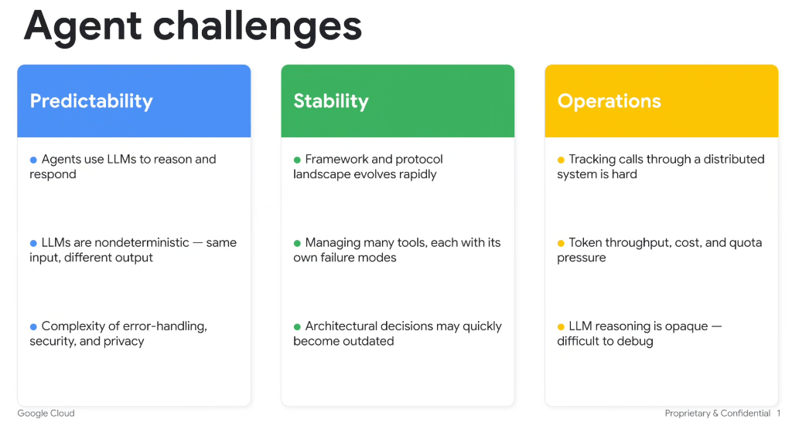

# Agent Challenges

## Overview

Building and running AI agents introduces challenges across three primary engineering pillars: **Predictability**, **Stability**, and **Operations**.

---

## The Three Challenge Pillars

### 1. Predictability (Cognitive & Behavioral Dynamics)
* **LLM-Driven Reasoning**: Agents rely on LLMs to interpret instructions, reason over states, and formulate responses.
* **Non-Determinism**: The same prompt or input state can yield different tool sequences and outputs across executions.
* **Error-Handling, Security & Privacy**: Handling edge cases, prompt injection, data exfiltration risks, and guardrail enforcement becomes substantially more complex in multi-step agent loops.

### 2. Stability (Ecosystem & Tool Lifecycle)
* **Rapidly Evolving Landscape**: Frameworks, standards, and agent protocols are continuously changing.
* **Heterogeneous Tool Failures**: Orchestrating dozens of tools where each API/tool has distinct schemas, error modes, timeouts, and rate limits.
* **Architecture Deprecation**: Decisions made for today's models and protocols may quickly become obsolete as capabilities shift from external scaffolding into model weights.

### 3. Operations (Observability, Cost & Performance)
* **Distributed Tracing**: Tracking execution flow, multi-hop subagent delegations, and tool roundtrips across distributed systems is challenging.
* **Cost, Quota & Token Pressure**: High token consumption from iterative loop iterations, context accumulation, and quota limits on provider APIs.
* **Opaque Reasoning & Debuggability**: When an agent fails or takes a wrong turn, debugging the model's latent reasoning and tool selection can be difficult.

---

## Summary Matrix

| Pillar | Core Challenge | Key Engineering Implication |
| :--- | :--- | :--- |
| **Predictability** | Non-determinism & fuzzy outputs | Requires structured output parsing, strict verification gates, and defensive fallbacks. |
| **Stability** | Tool fragility & framework churn | Demands loose coupling, standardized tool protocols (e.g. MCP), and resilient retry strategies. |
| **Operations** | Distributed tracing & opaque reasoning | Requires end-to-end tracing (OpenTelemetry/GenAI instrumentation), token budgeting, and step-level logging. |
