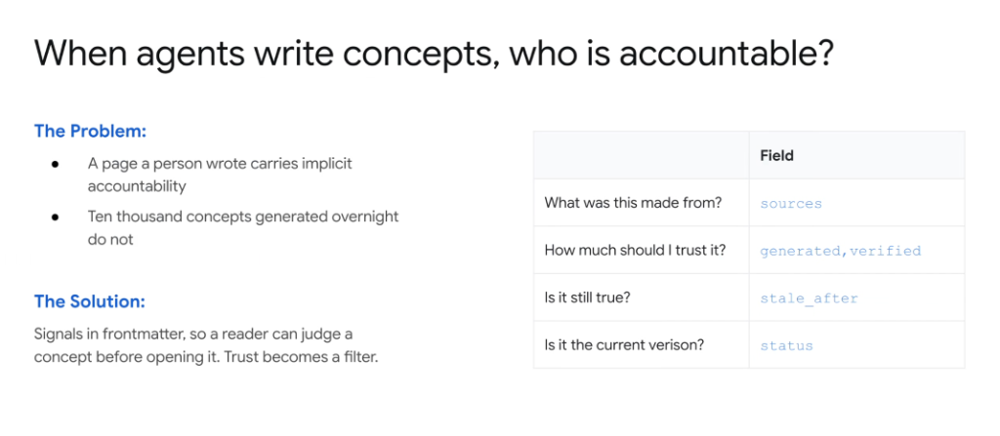
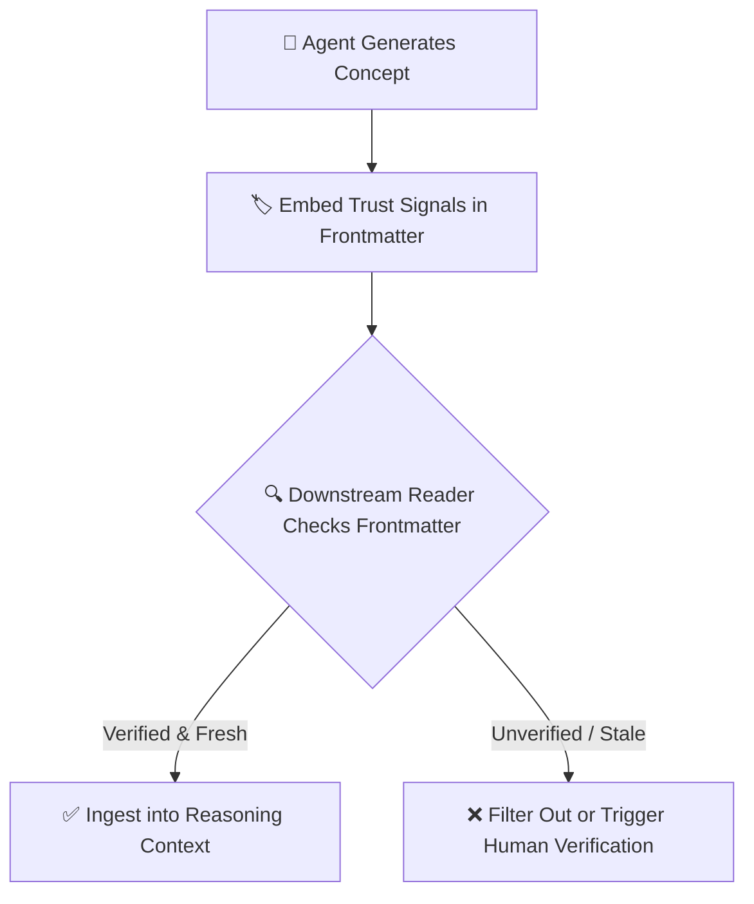

# Concept Accountability: When Agents Write Concepts, Who Is Accountable?



## Overview

When a human engineer authors a document, it carries implicit accountability, organizational ownership, and domain credibility. However, when autonomous agents generate tens of thousands of concepts overnight, trust must be made explicit and programmatic.

> **"Signals in frontmatter, so a reader can judge a concept before opening it. Trust becomes a filter."**

---

## The Core Accountability Problem

* **Human Authorship**: A human author provides a clear contact point, reputational stake, and implicit review.
* **Mass Agent Generation**: Agents can rapidly generate 10,000+ concept pages overnight. Without structured provenance, downstream agents and humans cannot distinguish verified facts from synthetic hallucinations or stale inferences.

---

## The Solution: Trust as a Frontmatter Filter

By embedding explicit trust, provenance, and freshness signals directly in the document's YAML frontmatter, consumers (both humans and downstream LLMs) can evaluate reliability **before opening or ingesting the full document body**.



---

## Frontmatter Trust & Provenance Fields

```yaml
---
title: Net Revenue Calculation
type: Metric
status: stable
sources:
  - https://github.com/org/dbt-models/models/marts/fct_orders.sql
  - https://wiki.corp.internal/finance/revenue-recog-asc606.md
generated: true
verified: human_signed_off
author: "agent:sql-catalog-extractor-v2"
verifier: "user:sacramentoj@google.com"
stale_after: "2026-12-31"
---
```

---

## The Four Essential Provenance Dimensions

| Core Question | Frontmatter Field | Purpose & Semantics |
| :--- | :--- | :--- |
| **What was this made from?** | `sources` | Explicit array of upstream URIs, commit hashes, or database tables used to synthesize the concept. |
| **How much should I trust it?** | `generated`, `verified` | Distinguishes raw LLM drafts (`unverified`) from human-reviewed or unit-tested concepts (`verified: true`). |
| **Is it still true?** | `stale_after` | Expiration date/timestamp triggering automatic re-verification or warning banners. |
| **Is it the current version?** | `status` | Maturity lifecycle (`draft`, `review`, `stable`, `deprecated`). |

---

## Enterprise Benefits

1. **Deterministic Quality Gates**: Autonomous agents can set minimum confidence thresholds (e.g. `WHERE verified == true AND status == 'stable'`) before generating production code or SQL queries.
2. **Automated Refresh Pipelines**: CI/CD jobs query `stale_after` dates to automatically trigger re-verification agents.
3. **Transparent Lineage**: Every claim in the document body can be traced back to its primary source in the `sources` field.
