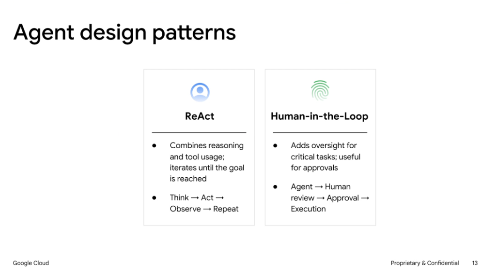
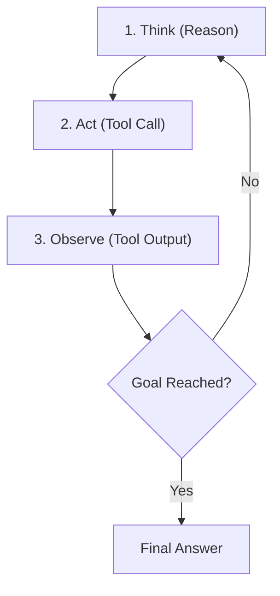
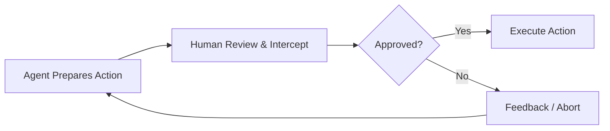

# Agent Design Patterns: ReAct & Human-in-the-Loop

## Overview

Core architectural patterns govern how autonomous agents process goals, invoke external tools, and incorporate oversight. Two foundational patterns are **ReAct** and **Human-in-the-Loop (HITL)**.

---

## 1. ReAct (Reason + Act)

Combines dynamic chain-of-thought reasoning with tool execution in an iterative feedback loop until the termination condition or goal is reached.

### Execution Loop

* **Formula**: `Think → Act → Observe → Repeat`
* **Best For**:
  * Multi-step research and exploratory troubleshooting.
  * Workflows where the next tool call depends on the output of previous tools.
* **Key Benefit**: Enables dynamic error recovery and self-correction during execution.

---

## 2. Human-in-the-Loop (HITL)

Introduces explicit human verification and authorization checkpoints before executing sensitive, destructive, or costly actions.

### Execution Flow

* **Formula**: `Agent → Human Review → Approval → Execution`
* **Best For**:
  * High-stakes operations (financial transactions, deleting resources, deploying to production).
  * High-ambiguity decisions requiring human alignment before proceeding.
* **Key Benefit**: Combines agentic automation speed with human safety guarantees and compliance governance.

---

## Comparative Pattern Summary

| Pattern | Control Model | Latency Profile | Primary Risk / Cost | Ideal Use Case |
| :--- | :--- | :--- | :--- | :--- |
| **ReAct** | Fully autonomous loop | Variable (multi-turn tool calls) | Runaway loops / token consumption | Complex research, investigations, automated debugging |
| **Human-in-the-Loop (HITL)** | Semi-autonomous with gates | Blocked on human review | User friction / delayed execution | Destructive mutations, production deployments, financial operations |
