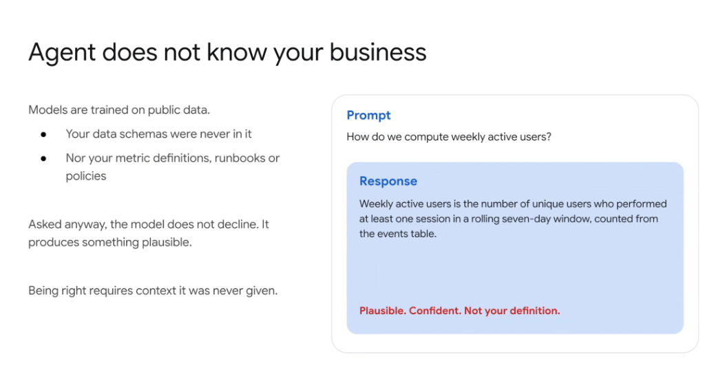

# Agent Does Not Know Your Business



## Overview

Foundational AI models are trained exclusively on public corpora. Consequently, they possess zero innate knowledge of an organization's private data schemas, proprietary metric definitions, operational runbooks, or internal governance policies.

---

## The "Plausible Answer" Trap

When asked an internal business question without injected context, **the model does not decline**. Instead, it generates a response that sounds authoritative and fluent—yet is entirely detached from the organization's actual business logic.

> **"Being right requires context it was never given."**

---

## Case Study: Computing Weekly Active Users (WAU)

### The User Prompt
```text
How do we compute weekly active users?
```

### The LLM Generation
> *"Weekly active users is the number of unique users who performed at least one session in a rolling seven-day window, counted from the events table."*

### The Reality
> ⚠️ **Plausible. Confident. Not your definition.**

* **Why this is dangerous**: 
  * The formula sounds standard and logically sound.
  * In reality, your enterprise might define active users based on authenticated transactional events, excluding internal test accounts, filtering out free tier pings, or aggregating by calendar week rather than a rolling window.
  * Relying on generic ungrounded logic produces skewed operational metrics and flawed executive reporting.

---

## The Knowledge Gap

| Proprietary Asset | Public Model Knowledge | Enterprise Reality |
| :--- | :--- | :--- |
| **Data Schemas** | Generic SQL/table patterns | Custom column names, shard keys, foreign keys |
| **Metric Definitions** | Standard industry textbook formulas | Custom business exclusions, revenue rules, churn filters |
| **Runbooks & SOPs** | Generic IT troubleshooting steps | Exact internal endpoints, credentials, escalation paths |
| **Organizational Policies** | General compliance best practices | Specific legal constraints, SLAs, internal approval gates |

---

## Architectural Solution: Grounding Before Generation

To eliminate plausible falsehoods:
1. **Never allow zero-context generation** for domain-specific metrics or internal workflows.
2. **Inject authoritative metadata**: Pass data dictionaries, dbt model docs, or enterprise metrics repos directly into the prompt context via RAG or tool lookups.
3. **Enforce fallback refusal**: Instruct agents to explicitly state when an internal metric or schema is missing rather than guessing.
