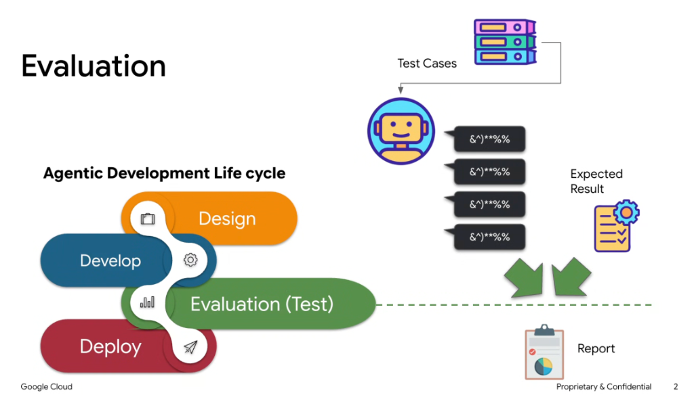
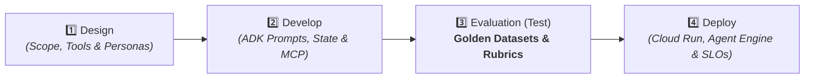
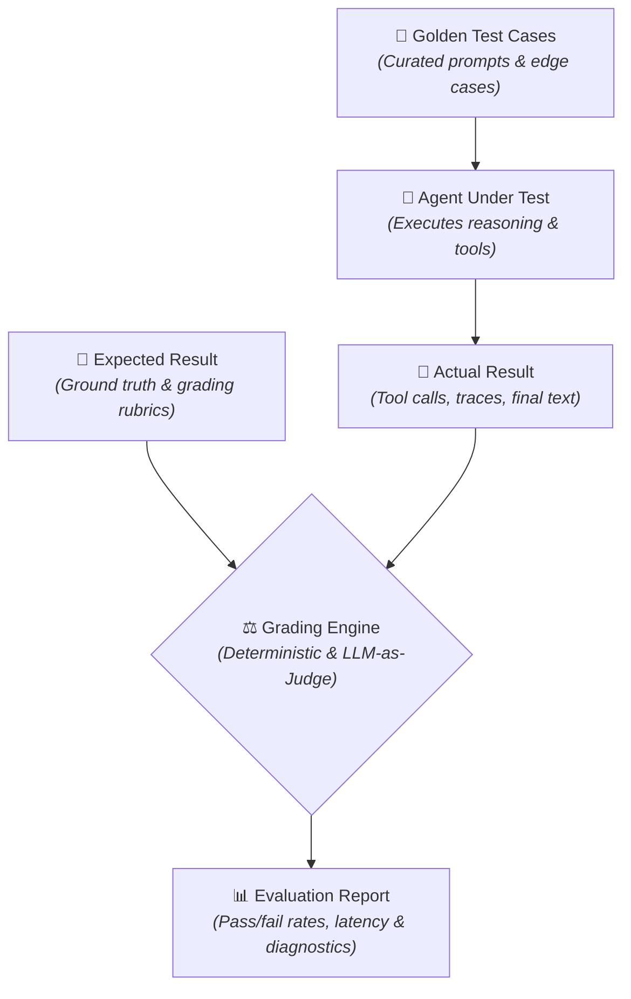
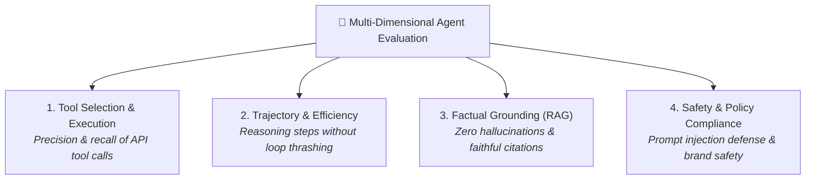
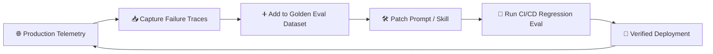

# Agentic Development Lifecycle: Evaluation & Testing



## Overview

In professional agent engineering, **Evaluation (Testing)** is the critical bridge connecting development to production deployment. Unlike traditional software where unit tests assert binary deterministic logic, agent evaluation requires systematic assessment of non-deterministic model reasoning, tool selection accuracy, trajectory efficiency, and factual grounding.

> **"The Agentic Development Lifecycle: Design → Develop → Evaluation (Test) → Deploy. Rigorous evaluation transforms prototype agents into production-grade systems."**

---

## The 4 Stages of the Agentic Development Lifecycle



1. **Design**: Define use-case boundaries, persona instructions, required tool capabilities, and memory architectures.
2. **Develop**: Build agent logic, register tools and MCP servers, configure state persistence, and compose multi-agent workflows using Google ADK.
3. **Evaluation (Test)**: Run curated golden test cases, compare actual execution traces and outputs against ground truth, and generate comprehensive quality scorecards.
4. **Deploy**: Package containerized agents, deploy to production targets (Cloud Run, Vertex AI Agent Engine), and configure distributed OpenTelemetry tracing.

---

## The Evaluation Pipeline Architecture



### Step-by-Step Evaluation Flow:
1. **Ingest Test Cases**: Feed a diverse suite of test inputs (standard queries, edge cases, adversarial prompts, multi-turn dialogues) into the agent harness.
2. **Execute Agent Traces**: The agent processes prompts, invokes tools, navigates reasoning loops, and generates responses.
3. **Compare Against Expected Results**:
   * **Deterministic Matchers**: Validate tool schemas, SQL query validity, status codes, and exact string/regex matches.
   * **Semantic & LLM Judges**: Grade response accuracy, factual grounding, tone, and safety rubrics on a calibrated 1–5 scale.
4. **Generate Evaluation Report**: Produce structured metrics detailing accuracy pass rates, tool selection precision/recall, token costs, latency percentiles (P50/P95), and failure diagnostics.

---

## The 4 Dimensions of Agent Evaluation



### 1. Tool Selection & Execution
* **Tool Call Precision**: Did the agent call only the appropriate tools without invoking unnecessary APIs?
* **Argument Validity**: Were tool arguments strictly compliant with the expected JSON/Pydantic schemas?

### 2. Trajectory & Reasoning Efficiency
* **Step Count**: Did the agent achieve the goal in the minimal necessary steps?
* **Loop Thrashing**: Did the agent get stuck in repetitive ping-pong or retry loops?

### 3. Factual Grounding & Faithfulness
* **Citation Accuracy**: Are all claims in the final response backed by retrieved documents?
* **Negative Constraint Adherence**: Did the agent respect explicit instructions (e.g. *"Do not disclose internal pricing"* )?

### 4. Safety, Red-Teaming & Compliance
* **Jailbreak Defense**: Does the agent resist adversarial system prompt extraction and goal manipulation?
* **Toxicity & Policy Alignment**: Are responses compliant with enterprise data governance and safety filters?

---

## Google Agents CLI Evaluation Workflow

The Google ADK tooling suite integrates evaluation natively via `google-agents-cli`:

```bash
# 1. Generate synthetic golden eval dataset from documentation
agents-cli eval generate --num-samples=50 --output=eval_dataset.json

# 2. Execute automated evaluation suite against local or deployed agent
agents-cli eval grade \
  --agent-dir=./my_agent \
  --dataset=eval_dataset.json \
  --rubric=strict_grounding \
  --output=eval_report.json

# 3. View executive summary in terminal
agents-cli eval summary --report=eval_report.json
```

---

## Evaluation Metric Scorecard

| Dimension | Key Metric | Target Production SLO | Measurement Tool |
| :--- | :--- | :--- | :--- |
| **Tool Accuracy** | Tool Call Precision / Recall | $\ge 98\%$ | Schema validator & matcher |
| **Grounding** | Faithfulness / Hallucination Rate | $\le 1\%$ hallucination | Vertex AI AutoSxS / Ragas |
| **Trajectory** | Average Turns to Resolution | $\le 3.5$ turns | OpenTelemetry trace span count |
| **Latency** | End-to-End P95 Latency | $\le 4.0\text{s}$ | Distributed tracing telemetry |
| **Safety** | Adversarial Jailbreak Resistance | $100\%$ pass on safety suite | Automated Red-Teaming harness |

---

## The Quality Flywheel



1. **Continuous Capture**: Production edge-case failures and user downvotes are logged to BigQuery.
2. **Dataset Enrichment**: Failure traces are converted into permanent regression test cases in the golden eval dataset.
3. **Iterative Patching**: Engineers refine prompts, tool schemas, or skills.
4. **CI/CD Quality Gate**: PRs cannot merge unless the evaluation test suite passes with zero regressions.
