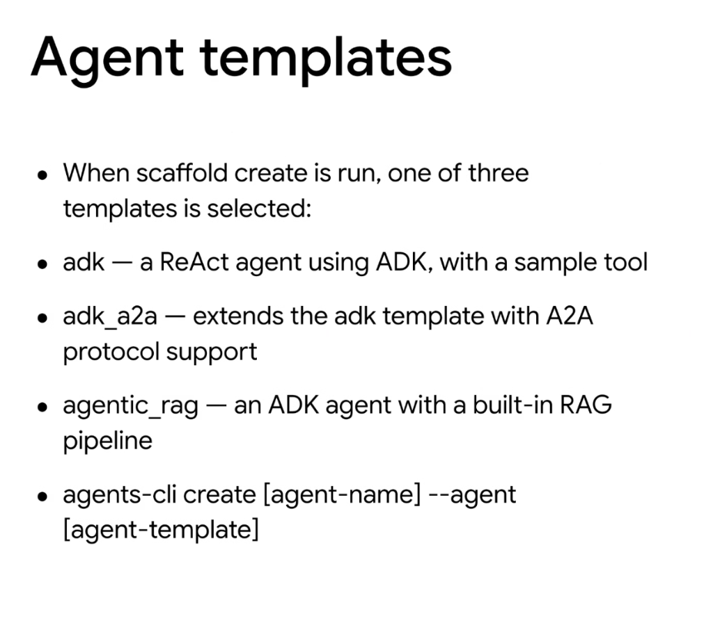
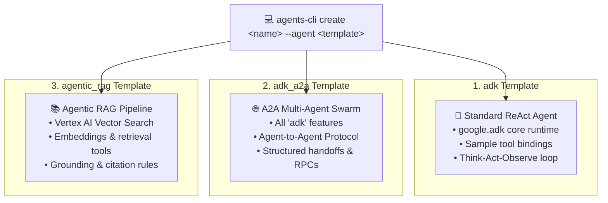

# Google Agents CLI: Agent Scaffolding Templates



## Overview

When initializing a new agent project using `agents-cli`, developers can select from three specialized foundation templates: **`adk`**, **`adk_a2a`**, and **`agentic_rag`**. Each template provides a pre-configured architecture tailored to specific operational patterns.

```bash
agents-cli create [agent-name] --agent [agent-template]
```

---

## The Three Foundation Templates



---

## Deep Breakdown of Each Template

### 1. `adk` — Standard ReAct Agent
* **Description**: The baseline foundational template for building standalone intelligent agents with Google ADK.
* **Included Components**:
  * Declarative `Agent` configuration (`name`, `model`, `instruction`).
  * Sample function tool implementation with schema validation.
  * Standard ReAct execution loop (`Think → Act → Observe`).
* **Best For**: General-purpose task automation, single-agent assistants, and API orchestrators.

### 2. `adk_a2a` — Agent-to-Agent Communication Protocol
* **Description**: Extends the `adk` template with Google's **A2A (Agent-to-Agent)** networking protocol support.
* **Included Components**:
  * Agent discovery and registration endpoints.
  * Standardized message envelope for inter-agent delegation and handoffs.
  * State synchronization across distributed multi-agent swarms.
* **Best For**: Multi-agent collaborative architectures (e.g. Supervisor delegating to specialized Researcher, Coder, and Verifier agents).

### 3. `agentic_rag` — Agent with Built-In RAG Pipeline
* **Description**: An ADK agent pre-wired with an end-to-end Retrieval-Augmented Generation pipeline.
* **Included Components**:
  * Pre-configured embeddings generator and Vector Search client bindings.
  * Dynamic retrieval tool (`retrieve_knowledge_chunks`).
  * Strict closed-book prompt templates, source citation formatting, and anti-hallucination guardrails.
* **Best For**: Enterprise document Q&A, internal knowledge base assistants, and grounded technical research agents.

---

## Template Comparison Matrix

| Template Name | Primary Architecture | Key Pre-Built Capabilities | Target Use Case |
| :--- | :--- | :--- | :--- |
| **`adk`** | Single ReAct Loop | Tool calling, state persistence, error boundaries | General automation & API wrappers |
| **`adk_a2a`** | Multi-Agent Swarm | Inter-agent messaging, RPCs, task delegation | Distributed multi-agent systems |
| **`agentic_rag`** | Grounded Retrieval | Vector search, embeddings API, citation grounding | Enterprise document search & Q&A |

---

## Example CLI Usage

```bash
# 1. Create a standard task automation agent
agents-cli create devops-bot --agent adk

# 2. Create a collaborative swarm agent with A2A protocol
agents-cli create cluster-supervisor --agent adk_a2a

# 3. Create a knowledge retrieval assistant with RAG
agents-cli create policy-advisor --agent agentic_rag
```
