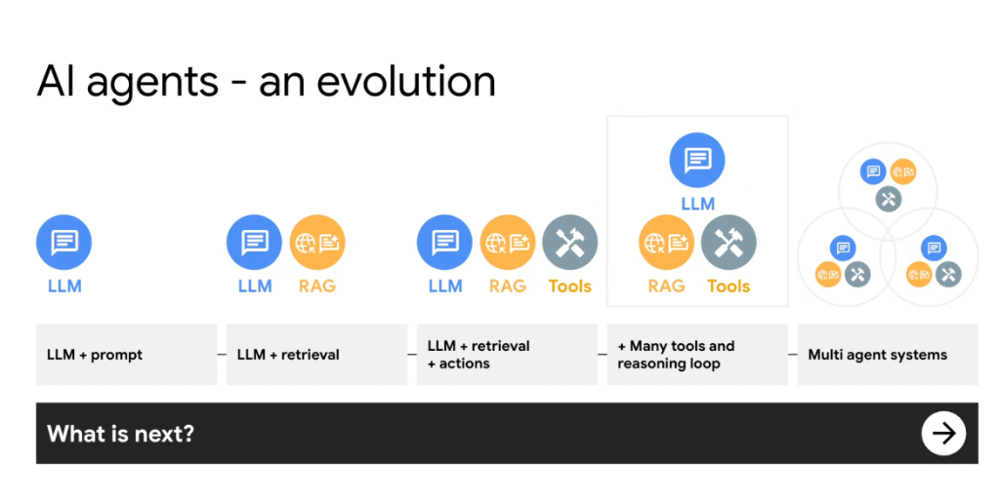
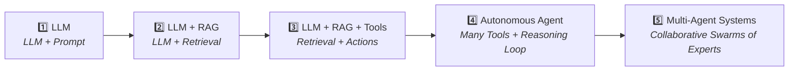
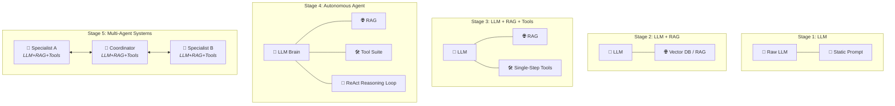
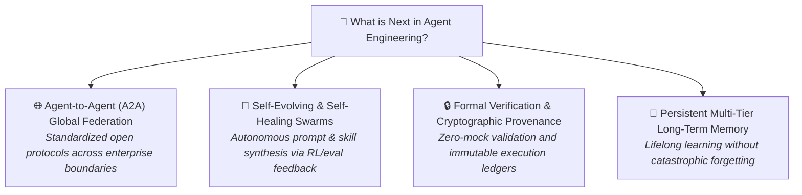

# AI Agents: An Evolution

## Overview

The evolution of artificial intelligence systems has progressed rapidly from basic parametric text prediction to autonomous, collaborative swarms of domain specialists. Understanding this progression is essential for selecting the appropriate architectural complexity for any given enterprise use case.

> **"From raw prompt completions to grounded knowledge, actionable tools, closed-loop reasoning, and finally distributed multi-agent systems."**

---

## The 5 Stages of Agentic Evolution

---

## Detailed Breakdown of the Evolutionary Stages

---

### Stage 1: LLM (LLM + Prompt)
* **Architecture**: Direct user prompt sent to a frozen foundation model (e.g., standard text completion or zero-shot chat).
* **Key Characteristics**:
  * Operates exclusively on static parametric knowledge learned during training.
  * No access to real-time, private, or external information.
  * Completely stateless across requests; single input prompt in, single text completion out.
* **Limitations**: High hallucination risk, no awareness of recent events, unable to perform actions or verify facts.
* **Typical Use Case**: Creative copywriting, code syntax translation, generalized summarization.

---

### Stage 2: LLM + RAG (LLM + Retrieval)
* **Architecture**: Augmenting the user query with dynamically retrieved context from external knowledge stores (Vector Databases, Enterprise Search, Knowledge Graphs).
* **Key Characteristics**:
  * Decouples domain knowledge from model weights via closed-book prompting.
  * Grounds outputs in private enterprise corpora (PDFs, wikis, tickets, databases).
  * Generates factual responses with exact citations and provenance.
* **Limitations**: Read-only architecture. The model can explain and synthesize data, but cannot execute transactions, invoke APIs, or change external state.
* **Typical Use Case**: Enterprise knowledge bases, policy Q&A bots, technical documentation search.

---

### Stage 3: LLM + RAG + Tools (LLM + Retrieval + Actions)
* **Architecture**: Combining knowledge grounding with structured function calling / tool invocation (REST APIs, SQL queries, calculator).
* **Key Characteristics**:
  * The model outputs structured schema arguments (e.g., JSON) to trigger external actions.
  * Transitions the system from informational retrieval to operational execution.
  * Single-turn or shallow linear action execution (Fetch $\rightarrow$ Act $\rightarrow$ Report).
* **Limitations**: Lacks autonomous multi-step planning and dynamic self-correction. If a tool returns an unexpected error, the pipeline usually halts.
* **Typical Use Case**: Basic customer support bots that can check order status or reset user passwords.

---

### Stage 4: Autonomous Agents (Many Tools + Reasoning Loop)
* **Architecture**: Integrating comprehensive tool registries with iterative reasoning loops (e.g., ReAct, Plan-and-Solve, Reflection, Tree-of-Thoughts).
* **Key Characteristics**:
  * **Dynamic Closed-Loop Execution**: `Think → Act → Observe → Reflect → Iterate`.
  * Evaluates intermediate tool outputs, catches exceptions, backtracks, and adapts its plan dynamically.
  * Manages short-term scratchpad memory, multi-step state, and execution guardrails.
* **Limitations**: "God Model" bottleneck. Packing too many tools and instructions into a single prompt causes decision-space confusion, context window bloat, and fragile maintenance.
* **Typical Use Case**: Automated root-cause troubleshooting, end-to-end data pipeline diagnostics, autonomous code generation and testing.

---

### Stage 5: Multi-Agent Systems (Collaborative Swarms of Experts)
* **Architecture**: Decomposing complex problem spaces into a network of specialized, autonomous agents (System of Experts) coordinating over standard protocols.
* **Key Characteristics**:
  * **System of Experts**: Each agent possesses a narrow persona, dedicated prompt, focused reasoning loop, and strictly scoped tools.
  * **Modular Microservice Architecture**: Agents scale, test, and deploy independently across different teams and CI/CD pipelines.
  * **Topological Flexibility**: Hierarchical supervisor-worker trees, parallel fan-out/fan-in workers, or peer-to-peer Agent-to-Agent (A2A) meshes.
  * Eliminates decision-space bloat and context congestion by distributing workload.
* **Typical Use Case**: Enterprise software engineering swarms (Architect + Coder + Verifier + Security Reviewer), complex financial risk audits, multimodal trip planning.

---

## Evolutionary Comparison Matrix

| Architectural Stage | Knowledge Grounding | Action Capability | Reasoning Depth | Autonomy Level | Primary Failure Mode |
| :--- | :--- | :--- | :--- | :--- | :--- |
| **1. LLM** | Parametric weights only | None (Text only) | Zero-shot / Few-shot | Minimal | Factual hallucination |
| **2. LLM + RAG** | External dynamic search | Read-only | Retrieval-grounded | Low | Retrieval miss / Irrelevant chunking |
| **3. LLM + RAG + Tools** | External dynamic search | Single-step API calls | Linear execution | Moderate | Schema mismatch / Unhandled API error |
| **4. Autonomous Agent** | Dynamic search + Memory | Multi-step tool suite | Closed-loop ReAct | High | Decision-space bloat / Infinite loop |
| **5. Multi-Agent System** | Partitioned domain corpora | Distributed tool mesh | Multi-perspective collaborative | Very High | Coordination overhead / State drift |

---

## What is Next? The Future Horizon

* **A2A Open Protocols**: Standardized open agent communication protocols enabling cross-vendor, cross-cloud agent collaboration (like HTTP did for the web).
* **Self-Improving Agents**: Agents that continuously evaluate their own performance in CI/CD, synthesize new skills dynamically, and patch their own prompts.
* **Formally Verified Autonomy**: Cryptographic execution ledgers, strict Human-in-the-Loop gating, and zero-mock verification pipelines ensuring guaranteed enterprise safety.
* **Long-Term Memory Architectures**: Unified episodic, semantic, and procedural memory systems enabling agents to retain institutional knowledge indefinitely.
