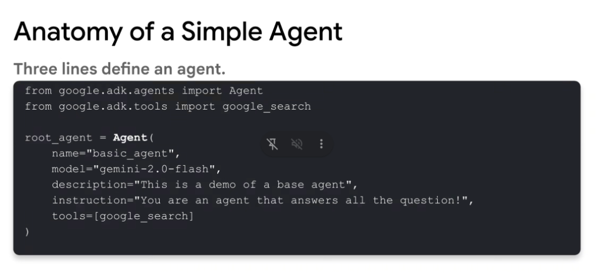

# Anatomy of a Simple Agent

> Three lines define an agent.



## Python Definition

```python
from google.adk.agents import Agent
from google.adk.tools import google_search

root_agent = Agent(
    name="basic_agent",
    model="gemini-2.0-flash",
    description="This is a demo of a base agent",
    instruction="You are an agent that answers all the question!",
    tools=[google_search]
)
```

---

## Key Components

| Parameter | Type | Description |
| :--- | :--- | :--- |
| `name` | `str` | Unique identifier for the agent (e.g., `"basic_agent"`). |
| `model` | `str` | Underlying Gemini model powering reasoning and generation (e.g., `"gemini-2.0-flash"`). |
| `description` | `str` | High-level summary of the agent's role and purpose. |
| `instruction` | `str` | System prompt defining agent persona, scope, constraints, and behavior. |
| `tools` | `List[Tool]` | List of enabled tool capabilities (e.g., `google_search`). |
