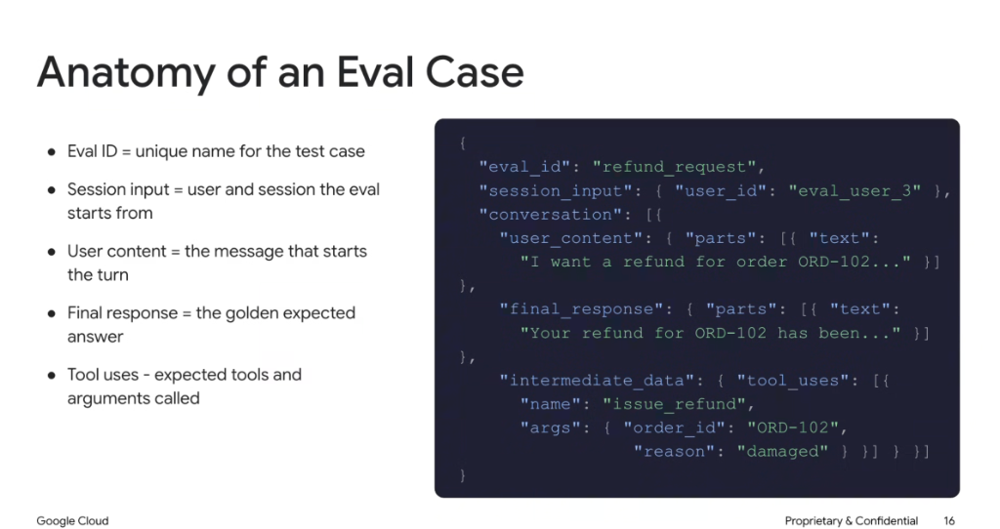
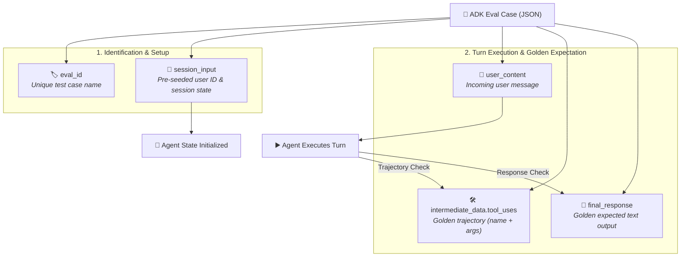

# Google ADK: Anatomy of an Eval Case



## Overview

In the Google Agent Development Kit (ADK), an **Eval Case** is the atomic building block of automated testing. It defines the complete test harness contract for a single test scenario: establishing the initial session state, the incoming user prompt, the expected intermediate tool trajectory, and the golden final response.

> **"Anatomy of an Eval Case: Structuring deterministic test cases across eval_id, session_input, user_content, intermediate_data tool_uses, and final_response."**

---

## Structural Anatomy & Execution Flow



---

## Deep Breakdown of Schema Fields

### 1. `eval_id` (Unique Test Identifier)
* **Definition**: Unique alphanumeric string naming the test case.
* **Role**: Used for CI/CD reporting, filtering specific test runs (`agents-cli eval grade --test-id=refund_request`), and tracking regressions across git commits.
* **Example**: `"refund_request"`

### 2. `session_input` (Initial Context & Memory)
* **Definition**: Key-value metadata passed to initialize the agent session before conversation turns begin.
* **Role**: Injects authenticated user credentials, account permissions, or pre-existing state into the agent's working memory without requiring manual conversational priming.
* **Example**: `{"user_id": "eval_user_3"}`

### 3. `user_content` (Turn Input)
* **Definition**: The prompt message that triggers the turn, wrapped in Gemini standard Content/Parts schema.
* **Role**: Simulates the exact customer inquiry or API trigger.
* **Example**: `{"parts": [{"text": "I want a refund for order ORD-102 because it arrived damaged."}]}`

### 4. `intermediate_data.tool_uses` (Expected Trajectory)
* **Definition**: Array of expected tool invocations containing the exact `name` and structured JSON `args`.
* **Role**: Serves as the ground truth for **Trajectory Evaluation**. If the agent skips the tool, calls a different tool, or passes incorrect parameters, the trajectory check fails.
* **Example**:
  ```json
  "intermediate_data": {
    "tool_uses": [
      {
        "name": "issue_refund",
        "args": {
          "order_id": "ORD-102",
          "reason": "damaged"
        }
      }
    ]
  }
  ```

### 5. `final_response` (Expected Ground-Truth Answer)
* **Definition**: The ideal final generated text returned to the user, formatted with Gemini Content/Parts.
* **Role**: Serves as the ground truth for **Response Evaluation** (lexical word overlap, entity recall, and rubric grading).
* **Example**: `{"parts": [{"text": "Your refund for ORD-102 has been processed successfully. You will receive $49.99 in 3–5 business days."}]}`

---

## Complete ADK Eval Case Specification

```json
{
  "eval_id": "refund_request",
  "session_input": {
    "user_id": "eval_user_3",
    "tier": "enterprise",
    "locale": "en_US"
  },
  "conversation": [
    {
      "user_content": {
        "parts": [
          {
            "text": "I want a refund for order ORD-102. It was damaged when it arrived."
          }
        ]
      },
      "intermediate_data": {
        "tool_uses": [
          {
            "name": "issue_refund",
            "args": {
              "order_id": "ORD-102",
              "reason": "damaged"
            }
          }
        ]
      },
      "final_response": {
        "parts": [
          {
            "text": "Your refund for ORD-102 has been processed. A credit of $49.99 has been issued to your original payment method."
          }
        ]
      }
    }
  ]
}
```

---

## Multi-Turn Eval Case Example

ADK Eval cases natively support multi-turn conversational workflows within the `conversation` array:

```json
{
  "eval_id": "multi_turn_address_change",
  "session_input": { "user_id": "user_891" },
  "conversation": [
    {
      "user_content": { "parts": [{ "text": "Can I change my delivery address?" }] },
      "intermediate_data": { "tool_uses": [{ "name": "lookup_pending_orders", "args": { "user_id": "user_891" } }] },
      "final_response": { "parts": [{ "text": "I found pending order ORD-404. What is your new address?" }] }
    },
    {
      "user_content": { "parts": [{ "text": "Please update it to 100 Main St, Austin TX." }] },
      "intermediate_data": { "tool_uses": [{ "name": "update_shipping_address", "args": { "order_id": "ORD-404", "address": "100 Main St, Austin TX" } }] },
      "final_response": { "parts": [{ "text": "Your shipping address for order ORD-404 has been updated to 100 Main St, Austin TX." }] }
    }
  ]
}
```

---

## Schema Field Reference Summary

| Field | Location | Type | Required | Description |
| :--- | :--- | :--- | :--- | :--- |
| `eval_id` | Root | `string` | **Yes** | Unique identifier for the test scenario. |
| `session_input` | Root | `object` | Optional | Initial session context (user IDs, auth claims, session vars). |
| `conversation` | Root | `array[object]` | **Yes** | Sequential list of conversational turns. |
| `user_content` | `conversation[i]` | `object` | **Yes** | Incoming prompt message (Gemini Content format). |
| `intermediate_data` | `conversation[i]` | `object` | Optional | Trajectory definition containing `tool_uses`. |
| `tool_uses` | `intermediate_data` | `array[object]` | Optional | List of expected tools (`name`, `args`). |
| `final_response` | `conversation[i]` | `object` | **Yes** | Golden ground-truth response (Gemini Content format). |
