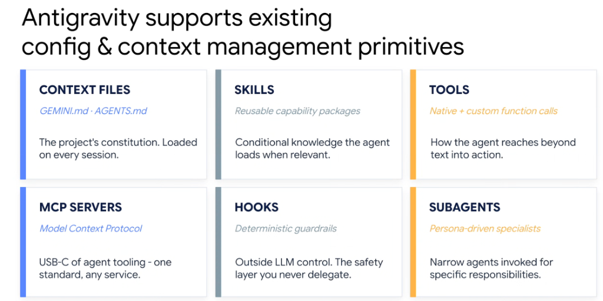
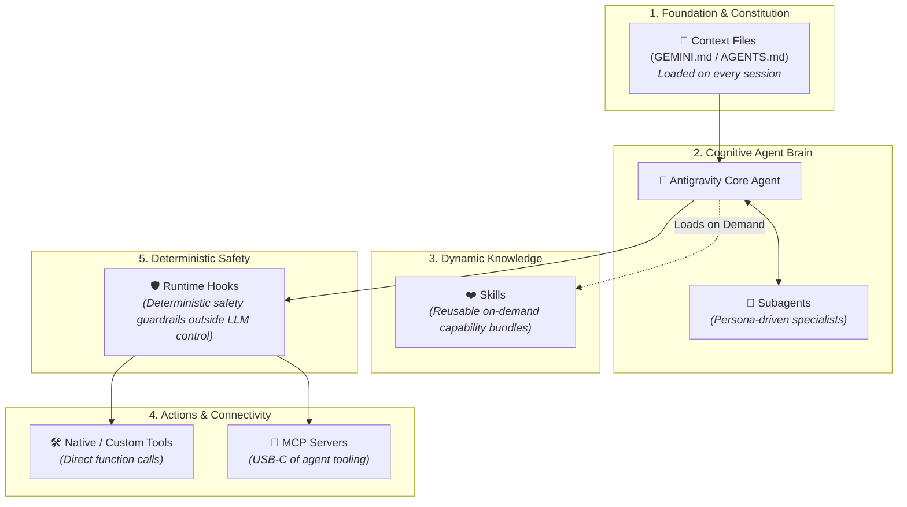

# Google Antigravity: Config & Context Management Primitives

## Overview

**Google Antigravity** integrates six foundational primitives for configuration, context management, and deterministic governance. Together, these primitives separate project-level constitutions, dynamic skills, external actions, security guardrails, and multi-agent delegation into a clean, layered architecture.

---

## Architectural Interaction Map

---

## The 6 Primitives Detailed

### 1. Context Files (`GEMINI.md` · `AGENTS.md`)
* **Role**: **The Project's Constitution.**
* **Lifecycle**: Ingested automatically into the agent's context on every session start.
* **Contents**: Repository guidelines, architectural invariants, coding conventions, and non-negotiable team directives.

### 2. Skills (Reusable Capability Packages)
* **Role**: **Conditional knowledge loaded only when relevant.**
* **Lifecycle**: Uses progressive disclosure (L1 discovery $
\rightarrow$ L2 instructions $
\rightarrow$ L3 assets) to conserve token budgets and prevent prompt bloat.
* **Contents**: Domain operational instructions (`SKILL.md`), helper scripts, schemas, and few-shot exemplars.

### 3. Tools (Native + Custom Function Calls)
* **Role**: **How the agent reaches beyond text into action.**
* **Lifecycle**: Executed programmatically during the agent's ReAct reasoning loop.
* **Contents**: File system mutations, bash commands, database queries, and REST/gRPC API calls.

### 4. MCP Servers (Model Context Protocol)
* **Role**: **The "USB-C" of agent tooling—one standard, any service.**
* **Lifecycle**: Open protocol bridging agents to external ecosystems (GitHub, Buganizer, Stitch, Slack, Cloud Databases) without custom bespoke wrappers.
* **Contents**: Standardized JSON-RPC protocol defining tool schemas, prompts, and resources.

### 5. Hooks (Deterministic Guardrails)
* **Role**: **The safety layer you never delegate to the LLM.**
* **Lifecycle**: Evaluated deterministically in native code *before* or *after* tool executions, completely outside LLM control.
* **Contents**: PII sanitizers, command allowlists, file-path perimeters, secret leak detectors, and mandatory security blocking rules.

### 6. Subagents (Persona-Driven Specialists)
* **Role**: **Narrow agents invoked for specific responsibilities.**
* **Lifecycle**: Spawned dynamically by the root agent with isolated context windows to prevent token contamination.
* **Examples**: `architect` (deep codebase exploration), `implementer` (TDD code generation), `verifier` (QA & regression testing), `reviewer` (compliance).

---

## Primitives Comparison Matrix

| Primitive | Loading Behavior | Control Domain | Primary Purpose |
| :--- | :--- | :--- | :--- |
| **Context Files** | Always loaded at session start | Static / Declarative | Global project rules & repository constitution |
| **Skills** | Dynamic on-demand loading | Modular Knowledge | Reusable domain procedures & execution scripts |
| **Tools** | Invoked during reasoning turn | Execution / Actions | Reaching outside the model into live systems |
| **MCP Servers** | Standardized service bridge | Interoperability | Connecting to external SaaS and enterprise platforms |
| **Hooks** | Intercepts pre/post execution | Hard Deterministic Code | Absolute security boundaries & non-delegable safety |
| **Subagents** | Spawned for discrete tasks | Multi-Agent Swarms | Focused execution with isolated context windows |
