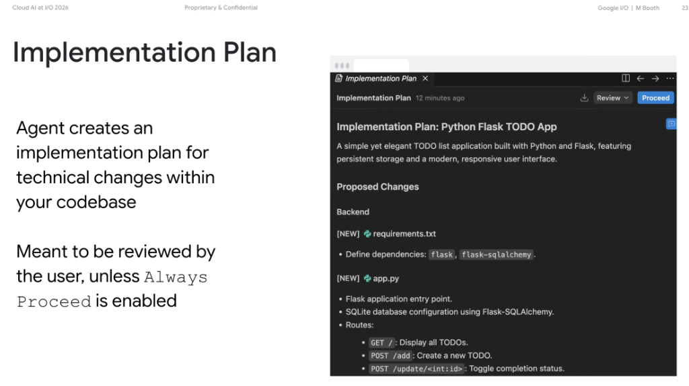
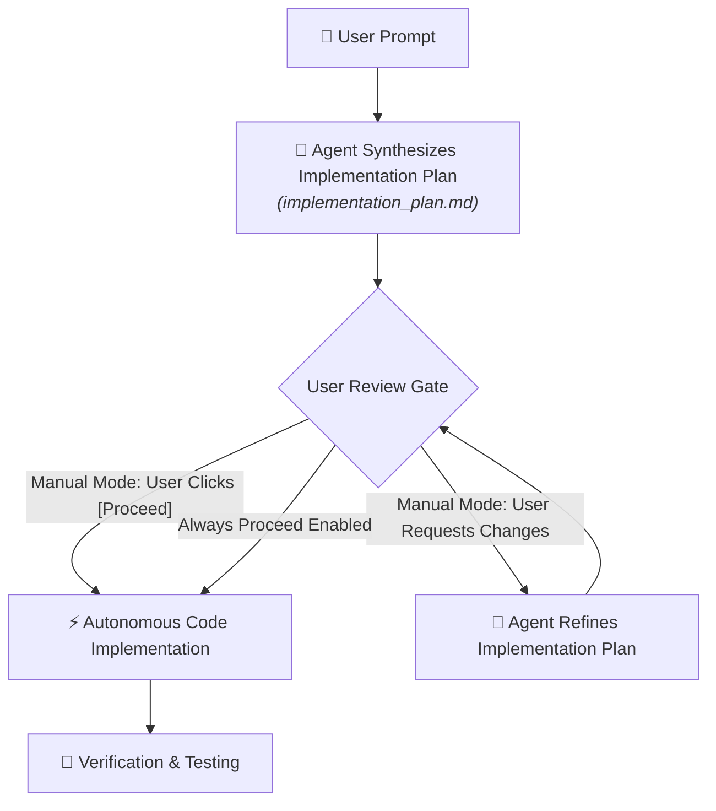

# Antigravity Artifacts: The Implementation Plan & Review Gates



## Overview

In **Google Antigravity**, before an agent modifies code or creates project files, it authors a structured **Implementation Plan** (`implementation_plan.md`). This artifact acts as an explicit architectural contract between the agent and the developer.

> **"The agent creates an implementation plan for technical changes within your codebase.**  
> **Meant to be reviewed by the user, unless `Always Proceed` is enabled."**

---

## The Interactive Plan Review Flow



---

## Key Architectural Principles

### 1. Pre-Execution Architectural Contract
* Prevents runaway mutations and unaligned code edits.
* Establishes clear file-level intentions before code is written or dependencies installed.

### 2. Interactive Human-in-the-Loop Gate
* **The Review UI**: Rendered directly in the IDE with an interactive `[Proceed]` and `[Review ▾]` dropdown.
* **Collaboration**: Developers can review proposed models, routes, and libraries, suggesting alterations before any file is touched on disk.
* **`Always Proceed` Setting**: Power users can toggle `Always Proceed` to allow the agent to execute autonomously without pausing for approval gates on low-risk tasks.

### 3. Structured Change Specification
* Systematically categorizes all proposed file mutations:
  * **`[NEW]`**: Newly created files (e.g. `requirements.txt`, `app.py`, `templates/index.html`).
  * **`[MODIFY]`**: In-place edits, additions, and refactors.
  * **`[DELETE]`**: Deprecated files scheduled for removal.
* Clearly maps API routes, database schemas, and external library requirements.

---

## Anatomy of a Canonical Implementation Plan

```markdown
# Implementation Plan: Python Flask TODO App

A simple yet elegant TODO list application built with Python and Flask, 
featuring persistent storage and a modern, responsive user interface.

## Proposed Changes

### Backend
#### [NEW] requirements.txt
- Define dependencies: `flask`, `flask-sqlalchemy`.

#### [NEW] app.py
- Flask application entry point.
- SQLite database configuration using Flask-SQLAlchemy.
- Routes:
  - `GET /`: Display all TODOs.
  - `POST /add`: Create a new TODO.
  - `POST /update/<int:id>`: Toggle completion status.
  - `POST /delete/<int:id>`: Remove a TODO item.

### Frontend
#### [NEW] templates/index.html
- Responsive HTML5 UI structure with clean task checkboxes.

### Verification Plan
- Launch local test server via `python3 app.py`.
- Execute automated curl requests against CRUD routes.
```

---

## Implementation Plan Feature Matrix

| Feature | Developer Value | Safety / Governance Value |
| :--- | :--- | :--- |
| **File-Level Diff Preview** | Clear visibility into codebase changes | Prevents accidental file overwrites |
| **Interactive `[Proceed]` Button** | Seamless one-click authorization | Guarantees human oversight before mutations |
| **`Always Proceed` Toggle** | Maximizes developer velocity for routine tasks | User-controlled autonomy dial |
| **Verification Strategy** | Outlines concrete test steps upfront | Ensures RED-GREEN test-driven discipline |
