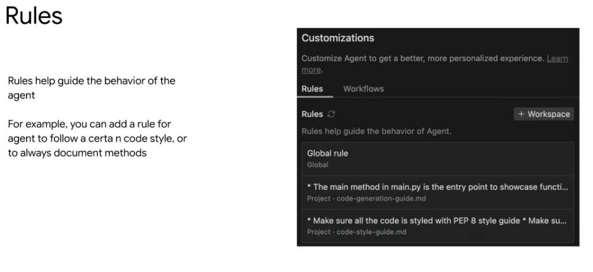
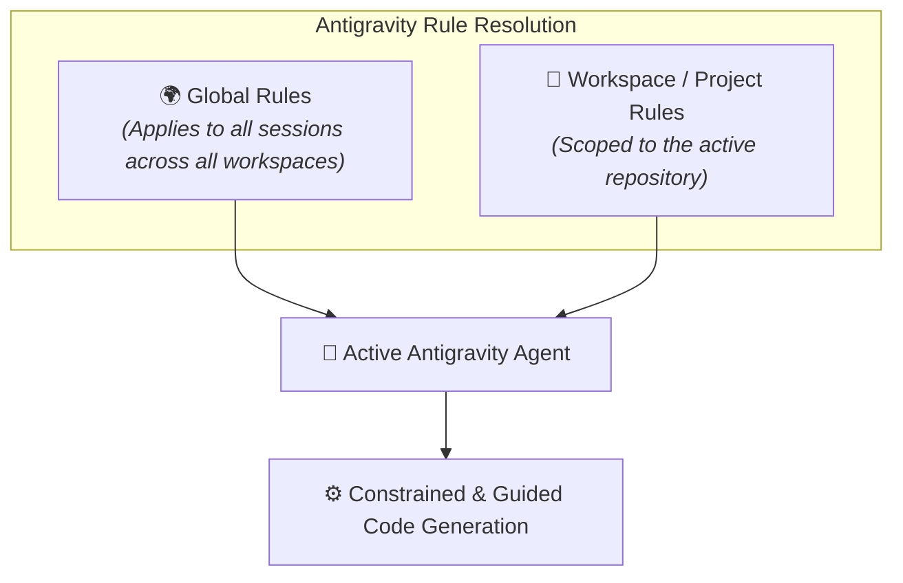

# Antigravity Customizations: Rules & Behavioral Governance



## Overview

In **Google Antigravity**, **Rules** provide persistent behavioral directives and coding standards that guide the agent across all interactions. They allow developers and teams to customize agent behavior without having to repeat instructions in every individual prompt.

> **"Rules help guide the behavior of the agent.**  
> **For example, you can add a rule for the agent to follow a certain code style, or to always document methods."**

---

## The Rule Hierarchy



---

## Core Scopes of Rules

### 1. Global Rules
* **Scope**: Evaluated across every project, conversation, and subagent invocation on the developer's machine.
* **Storage**: User configuration directory (`~/.gemini/config/rules/` or `~/.gemini/config/_agents/rules/`).
* **Ideal For**:
  * Global operational directives (e.g. Cloudtop SSH execution rules, Zero-Mock ground-truth policies, Slack read-only mode).
  * Personal developer preferences and communication styles.

### 2. Workspace / Project Rules
* **Scope**: Activated strictly when working inside a specific workspace repository.
* **Storage**: Local project configuration directory or `.gemini/rules/` within the repository.
* **Managed via**: The Antigravity Customizations panel (`+ Workspace` button).
* **Ideal For**:
  * Project-specific code style guides (e.g. PEP 8 Python formatting, Google TypeScript style).
  * Architecture invariants (e.g. `main.py` entrypoint conventions, layered backend architecture).
  * API design constraints and test coverage rules.

---

## Canonical Rule Examples from the UI

### 1. Code Style Guide (`Project · code-style-guide.md`)
```markdown
# Code Style Guide
* Make sure all Python code is formatted according to the PEP 8 style guide.
* Every public class and function must include Google-style docstrings.
* Maintain type annotations across all function signatures.
```

### 2. Architecture & Code Generation (`Project · code-generation-guide.md`)
```markdown
# Code Generation Guide
* The `main()` method in `main.py` is the canonical entry point to showcase functionality.
* Decouple database persistence logic from API route handlers.
* Never use raw hardcoded SQL; always leverage SQLAlchemy query builders.
```

---

## Rules Feature Matrix

| Scope | Lifetime | Configuration Location | Primary Purpose |
| :--- | :--- | :--- | :--- |
| **Global Rules** | Permanent across all projects | `~/.gemini/config/rules/` | Enterprise compliance, machine routing, and personal standards |
| **Workspace Rules** | Active while inside project workspace | `<repo>/.gemini/rules/` | Project architecture, style guides, and testing invariants |
| **Conditional Rules** | Triggered only when conditions match | Rules with file/tool trigger filters | Context-sensitive operational guidelines |
