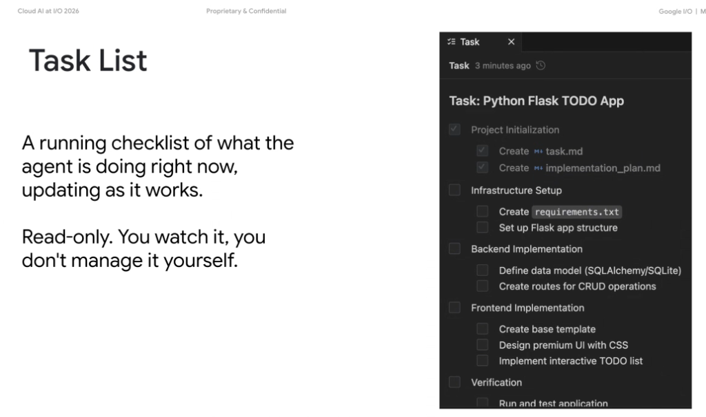
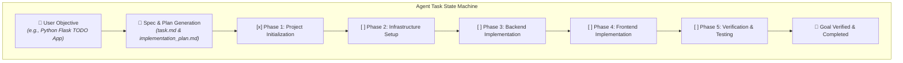

# Antigravity UI: The Task List & Live Agent Observability

## Overview

In **Google Antigravity** and advanced agentic developer environments, the **Task List** serves as the primary real-time execution dashboard. It gives developers immediate, transparent visibility into the agent's internal planning tree and active execution status as it works autonomously.

> **"A running checklist of what the agent is doing right now, updating as it works.**  
> **Read-only. You watch it, you don't manage it yourself."**

---

## The Task Lifecycle & Execution Flow

---

## Key Architectural Principles

### 1. Live State Observability (Zero Black-Box Execution)
* Eliminates opaque waiting periods during long multi-minute autonomous coding workflows.
* Real-time indicators update as the agent switches between research, file generation, tool execution, and verification.

### 2. Autonomous Task Management (Read-Only to the User)
* The agent autonomously initializes, re-evaluates, checks off, and refines tasks based on runtime feedback and tool outputs.
* The user monitors progress without needing to manually micro-manage task state transitions.

### 3. Hierarchical Decomposition & Checkpointing
* High-level user requests are systematically broken down into distinct sequential phases:
  * **Phase 1: Project Initialization**: Generating specifications (`task.md`) and implementation roadmaps (`implementation_plan.md`).
  * **Phase 2: Infrastructure Setup**: Generating package dependencies (`requirements.txt`) and directory skeletons.
  * **Phase 3: Backend Implementation**: Defining database models (SQLAlchemy, SQLite) and CRUD routes.
  * **Phase 4: Frontend Implementation**: Crafting HTML templates and responsive UI CSS styling.
  * **Phase 5: Verification**: Executing unit tests, compile checks, and syntax audits before completion.

---

## Task List UI Reference Structure

| Phase | Subtasks Tracked | Primary Artifact / Action |
| :--- | :--- | :--- |
| **Project Initialization** | • `Create task.md` • `Create implementation_plan.md` | Roadmap and technical spec generation |
| **Infrastructure Setup** | • `Create requirements.txt` • `Set up Flask app structure` | Environment and directory scaffolding |
| **Backend Implementation** | • `Define data model` • `Create routes for CRUD operations` | API endpoints and database schema |
| **Frontend Implementation** | • `Create base template` • `Design premium UI` • `Implement interactive list` | Client interface and CSS styling |
| **Verification** | • `Run and test application` | Automated verification before completion |
