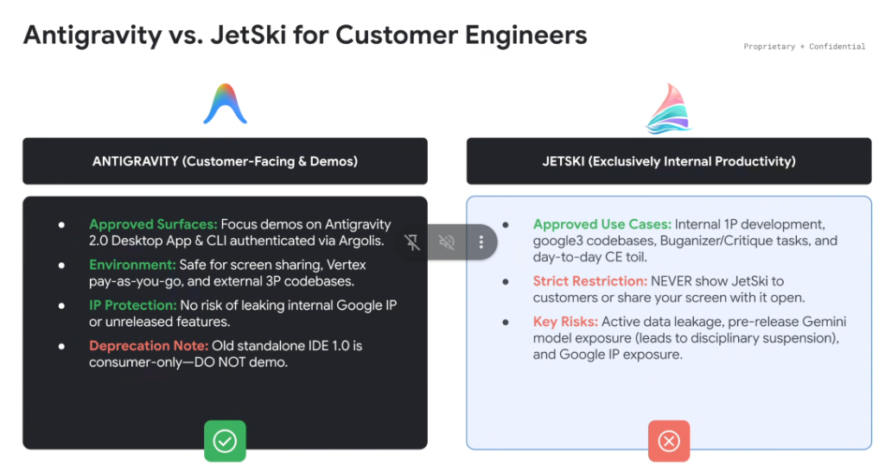
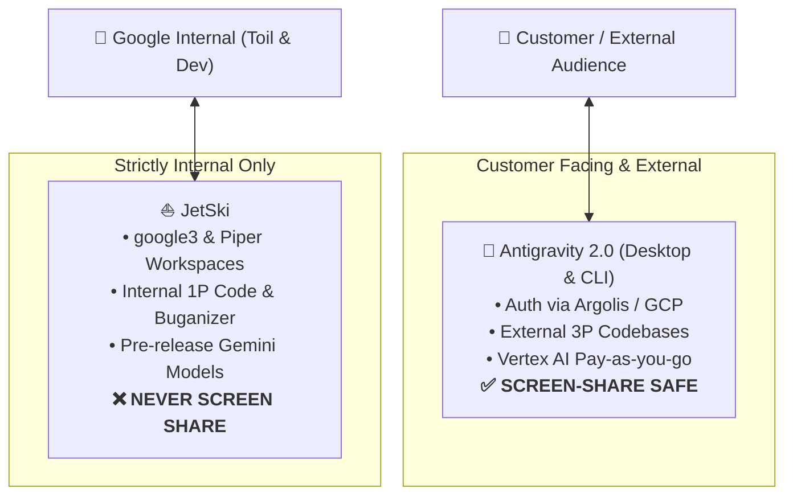

# Antigravity vs. JetSki: CE Compliance & Demo Boundaries

## Overview

For Google **Customer Engineers (CEs)**, maintaining strict operational hygiene between **customer-facing demonstration environments** and **internal Google productivity tools** is mandatory. This policy establishes the hard boundary between **Antigravity** and **JetSki**.

---

## The Operational Boundary

---

## 1. Antigravity (Customer-Facing & Demos) ✅

Antigravity is Google's official, externalized agentic developer platform built for customer demonstrations, external developer workflows, and enterprise engagements.

* **Approved Surfaces**:
  * **Antigravity 2.0 Desktop App** and **Antigravity CLI (`agy`)**.
  * Authenticated using **Argolis** demo environments or enterprise Google Cloud projects.
* **Operational Environment**:
  * Safe for live screen sharing, recorded customer demos, and hackathons.
  * Uses public Vertex AI / Google Cloud pay-as-you-go backend endpoints.
  * Targets external third-party (3P) codebases (GitHub, GitLab, local filesystems).
* **Intellectual Property Protection**:
  * Clean, externalized interface with zero risk of leaking Google-internal infrastructure or internal terminology.
* **Deprecation Notice**:
  * The old standalone **IDE 1.0** is consumer-only—**DO NOT DEMO**.

---

## 2. JetSki (Exclusively Internal Google Productivity) ❌

JetSki is Google's confidential, internal-only AI coding environment engineered for Googler productivity and monorepo automation.

* **Approved Use Cases**:
  * Internal first-party (1P) Google software engineering.
  * Interacting with `google3` codebases, Piper/CitC workspaces, and Fig clients.
  * Automating internal toil: Buganizer triage, Critique CL authoring/reviews, Moma queries, and internal service stubs.
* **Strict Prohibitions**:
  * **NEVER show JetSki to customers under any circumstances.**
  * **NEVER share your screen while JetSki is open or running.**
* **Severe Compliance Risks**:
  * **Pre-release Model Exposure**: JetSki runs unreleased experimental Gemini models and features; exposing them leads to **immediate disciplinary suspension**.
  * **Active Data Leakage**: Can inadvertently expose internal Google endpoints, confidential project codenames, or employee PII.
  * **Google IP Exposure**: Exposes internal monorepo tooling and proprietary architectural patterns.

---

## Comparison & Compliance Matrix

| Dimension | Antigravity 2.0 (Desktop & CLI) | JetSki (Internal Tool) |
| :--- | :--- | :--- |
| **Audience** | External Customers, Partners, Public Demos | Internal Googlers Only |
| **Screen Sharing** | **✅ APPROVED & SAFE** | **❌ STRICTLY PROHIBITED** |
| **Authentication** | Argolis / Customer GCP Project / Vertex AI | Google Corporate SSO / Corp credentials |
| **Target Codebases** | 3P Codebases (GitHub, Open Source, Local repos) | 1P Google Monorepo (`google3`, CitC, Piper) |
| **Tooling & Integrations** | Public MCP Servers, local bash, standard dev tools | Buganizer, Critique, Moma, internal Stubby APIs |
| **Models** | Public GA / Preview Gemini Enterprise models | Pre-release / Internal experimental models |
| **Compliance Violation** | Safe when using Argolis | **Disciplinary suspension & security escalation** |
