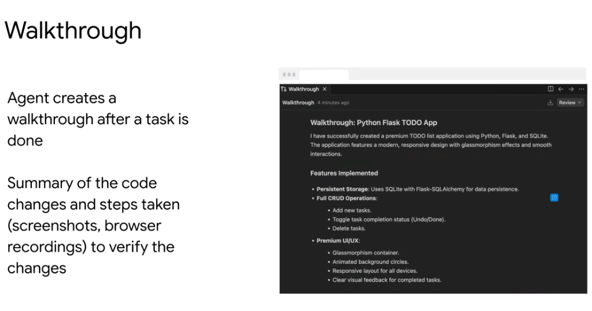
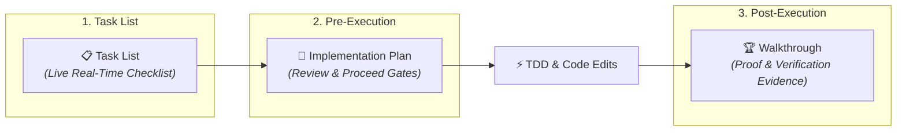

# Antigravity Artifacts: The Walkthrough & Verification Proof



## Overview

In **Google Antigravity**, upon completing an engineering task, the agent automatically authors a **Walkthrough Artifact** (`walkthrough.md`). This artifact serves as the final post-execution report, synthesizing all implemented changes and presenting empirical verification evidence.

> **"The agent creates a walkthrough after a task is done.**  
> **Summary of the code changes and steps taken (screenshots, browser recordings) to verify the changes."**

---

## The Antigravity Three-Artifact Lifecycle



---

## Core Components of a Production Walkthrough

### 1. Executive Accomplishment Summary
* Clear, concise statement confirming that the user's objective was achieved.
* Highlights primary technologies and frameworks utilized (e.g. Python, Flask, SQLite, Glassmorphism UI).

### 2. Feature & Architecture Breakdown
* Bulleted, structured inventory of all newly implemented capabilities:
  * **Persistent Storage**: Database drivers, models, migrations (e.g. Flask-SQLAlchemy).
  * **API & Route Coverage**: Full CRUD endpoints (`GET /`, `POST /add`, `POST /update/<id>`, `POST /delete/<id>`).
  * **UI/UX Design**: Frontend styling, responsiveness, animations, and component interactions.

### 3. Empirical Verification Evidence (Evidence Before Assertions)
* In strict adherence to Google's engineering standards, a task is never marked complete on assertion alone.
* The walkthrough embeds concrete verification artifacts:
  * **Interactive Screenshots & UI Captures**: Visual evidence of the running frontend application.
  * **Browser Recordings / Action Logs**: Proof of user flow execution (e.g. adding a todo, toggling done status).
  * **Automated Test Results**: Clean terminal outputs from `pytest`, `curl` endpoints, or lint suites.

---

## Anatomy of a Canonical Walkthrough Document

```markdown
# Walkthrough: Python Flask TODO App

I have successfully created a premium TODO list application using Python, Flask, and SQLite.
The application features a modern, responsive design with glassmorphism effects and smooth interactions.

## Features Implemented

### Persistent Storage
- Uses SQLite with Flask-SQLAlchemy for data persistence.

### Full CRUD Operations
- **Add new tasks**: Seamless submission via top input form.
- **Toggle completion status**: Interactive checkmarks with instant Undo/Done states.
- **Delete tasks**: Dedicated action buttons for task removal.

### Premium UI/UX
- Glassmorphism container with backdrop blur.
- Animated background gradient circles.
- Fully responsive layout across mobile and desktop viewports.
- Clear visual strikethrough feedback for completed items.

## Verification Evidence
- [x] Ran local development server on port 5000.
- [x] Verified CRUD route responses via curl.
- [x] Captured visual screenshots of active UI interactions.
```

---

## Antigravity Core Artifacts Comparison

| Artifact | Stage | Target Audience | Primary Function |
| :--- | :--- | :--- | :--- |
| **`task.md` / Task List** | Active Execution | Real-time observer | Live step-by-step progress tracking |
| **`implementation_plan.md`** | Pre-Execution | Developer / Approver | Proposed technical contract & Proceed gate |
| **`walkthrough.md`** | Post-Execution | Developer / Stakeholder | Final summary with empirical verification evidence |
