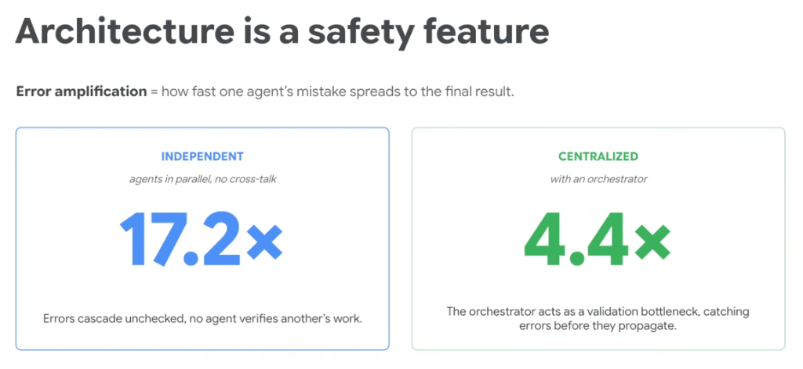
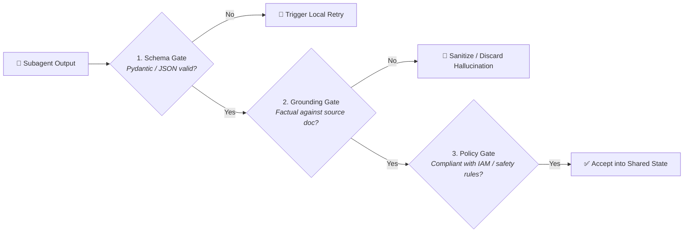

# System Reliability: Architecture is a Safety Feature



## Overview

In multi-agent engineering, architecture is not merely a tool for optimizing latency or distributing compute—**architecture is a primary safety and reliability control mechanism**.

> **"Error amplification = how fast one agent's mistake spreads to the final result."**

When autonomous agents interact, small hallucinations or schema malformations can compound exponentially. Empirical research demonstrates that choosing a **Centralized Orchestrated Architecture** over an unmonitored **Independent Architecture** slashes error amplification from **17.2× down to 4.4×**.

---

## Independent vs. Centralized Error Propagation

```mermaid
graph TD
    subgraph 1. Independent Architecture (17.2x Error Amplification)
        I_In["User Prompt"] --> IA["🤖 Agent A<br/><i>(Hallucinates bad assumption)</i>"] & IB["🤖 Agent B"] & IC["🤖 Agent C"]
        IA & IB & IC --> I_Merge["💥 Unchecked Raw Merge<br/><b>17.2x Cascading Error Spread</b>"]
    end

    subgraph 2. Centralized Orchestrated Architecture (4.4x Error Amplification)
        C_In["User Prompt"] --> Orch["👑 Central Orchestrator<br/><i>(Validation Bottleneck)</i>"]
        Orch --> CA["🤖 Subagent A"] & CB["🤖 Subagent B"]
        CA -->|Schema Validation & Guardrail Check| Orch
        CB -->|Schema Validation & Guardrail Check| Orch
        Orch --> Out["✅ Sanitized, Verified Synthesis<br/><b>4.4x Error Containment</b>"]
    end
```

---

## The Two Architectural Paradigms Detailed

### 1. Independent Architecture (17.2× Error Amplification)
* **Topology**: Subagents operate in parallel or peer mesh with no centralized validation gate or cross-talk verification.
* **The Failure Mode**:
  * If Agent A introduces a subtle hallucination or corrupted database ID, no intermediary catches it.
  * The unverified outputs are dumped directly into the final merger.
  * **Result**: Errors cascade completely unchecked, multiplying the initial mistake by **17.2×** throughout the final report.

### 2. Centralized Architecture (4.4× Error Amplification)
* **Topology**: A supervisor model acts as an active **validation bottleneck** and traffic controller between subagents and the user.
* **The Safety Mechanism**:
  * Every intermediate output is intercepted, audited, and validated against schemas before it can touch sibling agents or user context.
  * The orchestrator can detect inconsistencies, trigger automated single-agent retries, or apply fallback values.
  * **Result**: Error amplification is throttled down to **4.4×** (nearly a 75% reduction in error propagation).

---

## How the Orchestrator Acts as a Validation Bottleneck



1. **Deterministic Schema Gates**: Enforces strict Pydantic/typing boundaries on tool responses, rejecting malformed JSON before execution.
2. **Grounding & Provenance Auditing**: Cross-checks extracted claims against source retrieval chunks to catch hallucinated figures.
3. **Failure Isolation & Local Retries**: If Subagent A fails, the orchestrator re-runs *only* Subagent A with error feedback, rather than failing the entire multi-agent job.
4. **Context Sanitization & Noise Scrubbing**: Strips irrelevant scratchpad tokens and unverified speculative claims before passing clean state to downstream agents.

---

## Empirical Reliability Comparison Matrix

| Architectural Property | Independent / Mesh Architecture | Centralized Orchestrated Architecture |
| :--- | :--- | :--- |
| **Error Amplification Rate** | **17.2× (Extreme Cascade)** | **4.4× (Controlled Containment)** |
| **Verification Gate** | None (Raw peer merge) | Active validation bottleneck at orchestrator |
| **Blast Radius** | Entire system contaminated by 1 mistake | Isolated to the specific faulty subagent |
| **Fault Recovery** | Requires full pipeline restart | Localized retry of individual subagent turns |
| **Auditability & Tracing** | Opaque and distributed across peers | Single centralized trace ledger |

---

## Google ADK Implementation: Building Validation Bottlenecks

In the **Google Agent Development Kit (ADK)**, validation bottlenecks are implemented using structured output schemas and post-turn validation hooks:

```python
from google.adk.agents import LlmAgent
from pydantic import BaseModel, Field, ValidationError

class FinancialMetrics(BaseModel):
    revenue_m: float = Field(description="Revenue in millions USD")
    yoy_growth: float = Field(description="Year-over-year growth percentage")
    confidence_score: float = Field(ge=0.0, le=1.0)

# Specialized Worker Subagent
revenue_worker = LlmAgent(
    name="revenue_auditor",
    model="gemini-2.5-flash",
    instruction="Extract revenue metrics from the quarterly SEC filing.",
    output_schema=FinancialMetrics,
    output_key="raw_revenue",
)

def validate_subagent_output(state):
    """Orchestrator validation bottleneck: Sanitize data before state acceptance."""
    metrics = state.get("raw_revenue")
    if metrics and metrics.confidence_score < 0.85:
        # Prevent low-confidence hallucination from propagating downstream
        state["validation_warning"] = "Low confidence revenue extraction; flagged for review."
        return False
    return True

# Central Orchestrator acting as Validation Bottleneck
central_orchestrator = LlmAgent(
    name="financial_coordinator",
    model="gemini-2.5-pro",
    instruction="Coordinate domain workers, validate intermediate outputs, and synthesize results.",
    subagents=[revenue_worker],
    after_subagent_callback=validate_subagent_output,
)
```

---

## Production Reliability Invariants

1. **Never Accept Raw Unvalidated Strings from Subagents**:
   * Always require typed, validated schemas at every inter-agent communication boundary.
2. **Centralize the Ingress and Egress Gates**:
   * All mutations and final user-facing responses must pass through an orchestrator equipped with safety and policy filters.
3. **Isolate Failures at the Node Level**:
   * Build architectures where an upstream agent's failure triggers a fallback branch rather than poisoning the entire state graph.
