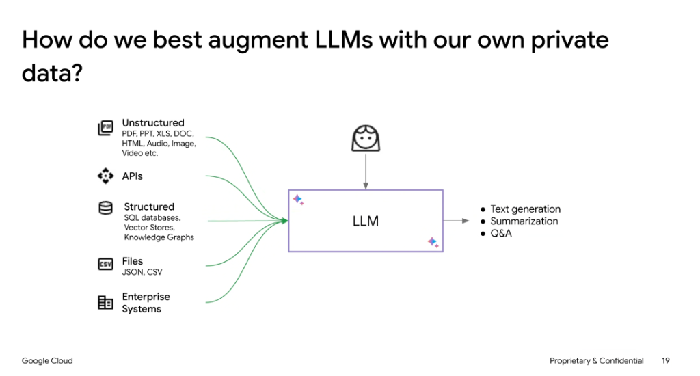
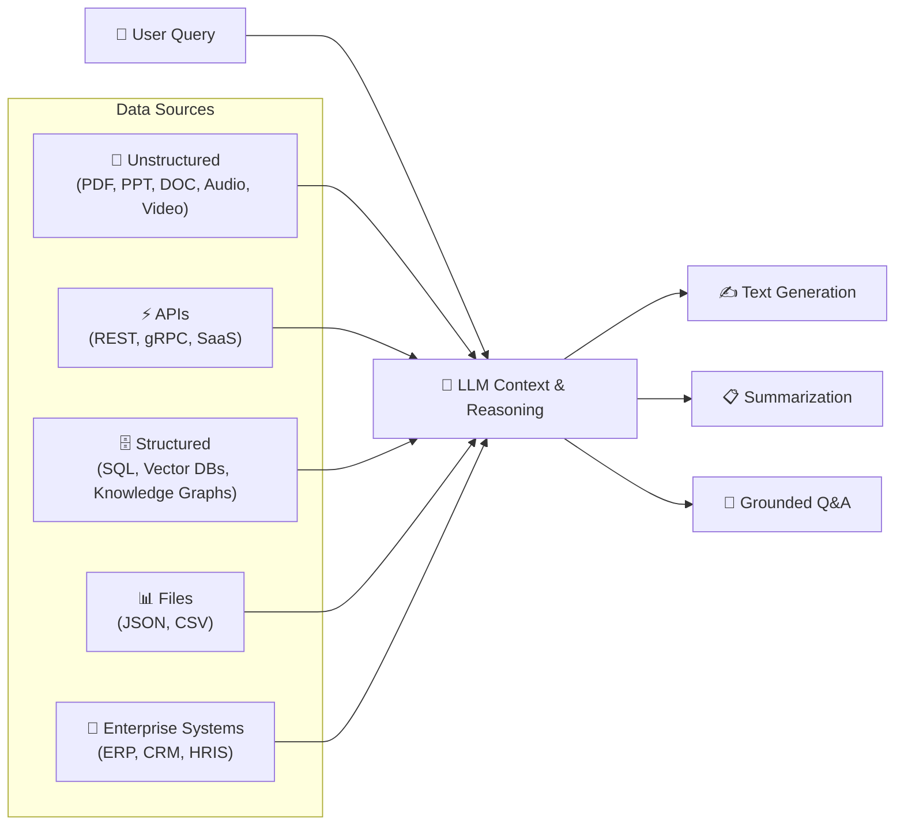

# How Do We Best Augment LLMs with Our Own Private Data?

## Overview

Augmenting foundation models with enterprise proprietary data bridges the gap between general pre-trained reasoning and domain-specific private context. By dynamically injecting multi-modal, structured, and unstructured enterprise assets into LLM inference, systems can deliver highly accurate, grounded outputs without requiring costly continual pre-training.

---

## Data Ingestion & Augmentation Architecture

---

## Enterprise Data Modalities

### 1. Unstructured Content
* **Formats**: PDFs, PowerPoint presentations, Word documents, HTML pages, images, audio, and video assets.
* **Augmentation Method**: Document parsing, semantic chunking, multimodal embedding generation, and vector search retrieval.

### 2. Live APIs
* **Formats**: RESTful endpoints, gRPC microservices, external SaaS APIs.
* **Augmentation Method**: Dynamic tool calling / function calling schemas allowing the model to fetch real-time state.

### 3. Structured Data & Knowledge Stores
* **Formats**: Relational databases (Cloud SQL, AlloyDB, Spanner), Vector Stores (Vertex AI Vector Search), and Graph Databases.
* **Augmentation Method**: Text-to-SQL generation, hybrid vector/keyword search, and knowledge graph entity resolution.

### 4. Semi-Structured Files
* **Formats**: JSON records, CSV logs, YAML configs.
* **Augmentation Method**: Schema filtering, structured parsing, and targeted in-memory aggregation.

### 5. Enterprise Core Systems
* **Formats**: Salesforce, Workday, ServiceNow, SAP, Jira.
* **Augmentation Method**: Enterprise connectors and authenticated API gateways with role-based access control (RBAC).

---

## Core Downstream Capabilities

| Capability | Enterprise Use Case | Grounding Benefit |
| :--- | :--- | :--- |
| **Grounded Q&A** | Employee self-service, policy search, internal support | Eliminates hallucinated facts with verifiable source links |
| **Summarization** | Executive briefs, meeting synthesis, case reviews | Accurately condenses large corpora without losing critical constraints |
| **Text Generation** | Customer correspondence, technical proposals, reports | Matches domain tone while incorporating real-time account data |
