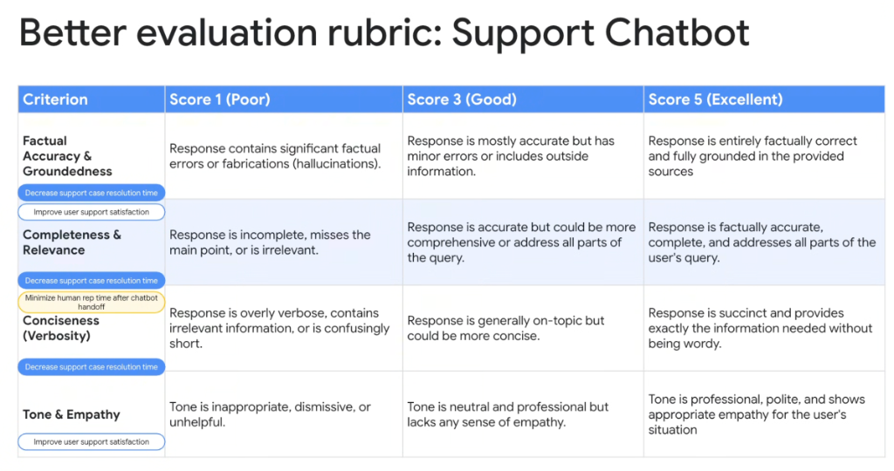
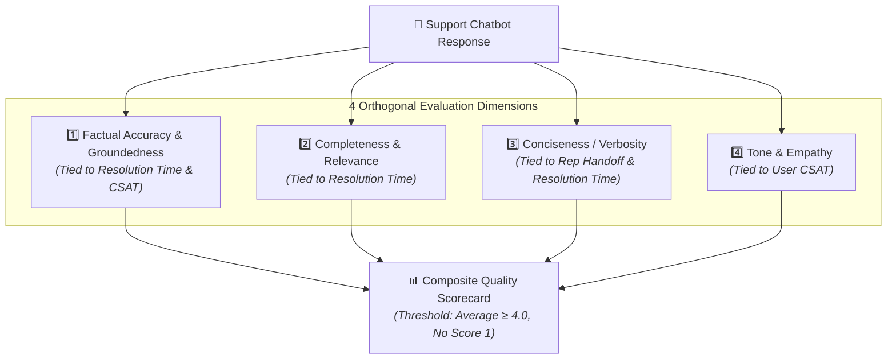

# Evaluation Rubrics: Enterprise Support Chatbot Reference



## Overview

A robust evaluation rubric operationalizes abstract quality goals into concrete, anchored scoring criteria. This reference implementation demonstrates a production-grade **4-Dimensional Evaluation Rubric for Enterprise Support Chatbots**, showing how each rubric dimension directly maps back to organizational business KPIs.

> **"Anchored 1-3-5 scales eliminate evaluator ambiguity across Factual Accuracy, Completeness, Conciseness, and Tone."**

---

## Multi-Dimensional Rubric Architecture



---

## Detailed 1-3-5 Anchored Scoring Rubric

### 1. Factual Accuracy & Groundedness
* **Business KPI Linkage**: 🏷️ *Decrease support case resolution time* | 🏷️ *Improve user support satisfaction*
* **Core Definition**: Degree to which the response is truthful and strictly grounded in retrieved documentation.
* **Scoring Anchors**:
  * **Score 1 (Poor)**: Response contains significant factual errors, unverified claims, or fabrications (hallucinations).
  * **Score 3 (Good)**: Response is mostly accurate but has minor errors or includes outside ungrounded assumptions.
  * **Score 5 (Excellent)**: Response is entirely factually correct and fully grounded in the provided reference sources.

---

### 2. Completeness & Relevance
* **Business KPI Linkage**: 🏷️ *Decrease support case resolution time*
* **Core Definition**: Extent to which the response directly addresses every part of the user's multi-part inquiry.
* **Scoring Anchors**:
  * **Score 1 (Poor)**: Response is incomplete, misses the main point, or is completely irrelevant to the user's request.
  * **Score 3 (Good)**: Response is accurate but could be more comprehensive or fails to address secondary questions.
  * **Score 5 (Excellent)**: Response is factually accurate, comprehensive, and thoroughly addresses all parts of the user's query.

---

### 3. Conciseness (Verbosity)
* **Business KPI Linkage**: 🏷️ *Minimize human rep time after chatbot handoff* | 🏷️ *Decrease support case resolution time*
* **Core Definition**: Efficiency of information delivery without unnecessary filler or cognitive drag.
* **Scoring Anchors**:
  * **Score 1 (Poor)**: Response is overly verbose, contains irrelevant padding, or is confusingly cryptic/short.
  * **Score 3 (Good)**: Response is generally on-topic but contains unnecessary boilerplate and could be more concise.
  * **Score 5 (Excellent)**: Response is succinct, direct, and provides exactly the information needed without being wordy.

---

### 4. Tone & Empathy
* **Business KPI Linkage**: 🏷️ *Improve user support satisfaction (CSAT)*
* **Core Definition**: Professionalism, active listening, and brand-aligned emotional calibration.
* **Scoring Anchors**:
  * **Score 1 (Poor)**: Tone is inappropriate, robotic, dismissive, passive-aggressive, or unhelpful.
  * **Score 3 (Good)**: Tone is neutral and professional but cold and lacks any sense of human empathy.
  * **Score 5 (Excellent)**: Tone is warm, polite, highly professional, and shows appropriate empathy for the user's situation.

---

## Rubric Summary Matrix

| Criterion | Business KPI Alignment | Score 1 (Poor) | Score 3 (Good) | Score 5 (Excellent) |
| :--- | :--- | :--- | :--- | :--- |
| **Factual Accuracy & Groundedness** | • Decrease resolution time<br/>• Improve user satisfaction | Significant factual errors or hallucinations. | Mostly accurate but has minor errors or outside info. | Entirely factually correct and fully grounded in sources. |
| **Completeness & Relevance** | • Decrease resolution time | Incomplete, misses main point, or irrelevant. | Accurate but misses secondary parts of the query. | Comprehensive and addresses all parts of the query. |
| **Conciseness (Verbosity)** | • Minimize rep handoff time<br/>• Decrease resolution time | Overly verbose essay, fluff, or confusingly short. | Generally on-topic but contains boilerplate. | Succinct and provides exact information needed. |
| **Tone & Empathy** | • Improve user satisfaction | Inappropriate, dismissive, or unhelpful. | Neutral/professional but cold and robotic. | Professional, polite, and shows appropriate empathy. |

---

## Google ADK Implementation: Multi-Rubric Evaluator

```python
from google.adk.eval import EvaluationSuite, RubricJudge

# Define the 4 discrete Rubric Judges
accuracy_judge = RubricJudge(
    name="factual_accuracy",
    criteria="""
    1: Significant factual errors or hallucinations.
    3: Mostly accurate with minor errors or outside info.
    5: Entirely factually correct and 100% grounded in sources.
    """,
    passing_threshold=4.5,
)

completeness_judge = RubricJudge(
    name="completeness_relevance",
    criteria="""
    1: Incomplete, misses main point, or irrelevant.
    3: Accurate but misses secondary parts of query.
    5: Fully addresses all parts of user query.
    """,
    passing_threshold=4.0,
)

conciseness_judge = RubricJudge(
    name="conciseness_verbosity",
    criteria="""
    1: Overly verbose essay, padding, or cryptic.
    3: On-topic but contains boilerplate padding.
    5: Succinct and provides exact info needed.
    """,
    passing_threshold=4.0,
)

tone_judge = RubricJudge(
    name="tone_empathy",
    criteria="""
    1: Inappropriate, dismissive, or unhelpful.
    3: Neutral/professional but cold and robotic.
    5: Polite, highly professional, and appropriately empathetic.
    """,
    passing_threshold=4.5,
)

# Compose into a single automated Evaluation Suite
support_eval_suite = EvaluationSuite(
    name="customer_support_eval_v1",
    judges=[accuracy_judge, completeness_judge, conciseness_judge, tone_judge],
    global_rules=[
        "REJECT if any individual score is 1 (Hard Block)",
        "PASS only if average composite score >= 4.2",
    ]
)
```

---

## Diagnostic Remediation Guide

| Failed Criterion | Diagnostic Root Cause | Engineering Remediation |
| :--- | :--- | :--- |
| **Low Accuracy (Score $\le 2$)** | Model hallucinating missing facts | Improve RAG chunk retrieval similarity threshold; add negative prompt constraints. |
| **Low Completeness (Score $\le 2$)** | Agent truncating multi-part inquiries | Update prompt to decompose user prompts into an explicit sub-question checklist. |
| **Low Conciseness (Score $\le 2$)** | System prompt encourages conversational filler | Add strict output token budgets and conciseness few-shot demonstrations. |
| **Low Tone/Empathy (Score $\le 2$)** | Cold, robotic boilerplate | Refine persona instructions and provide examples of empathetic de-escalation. |
