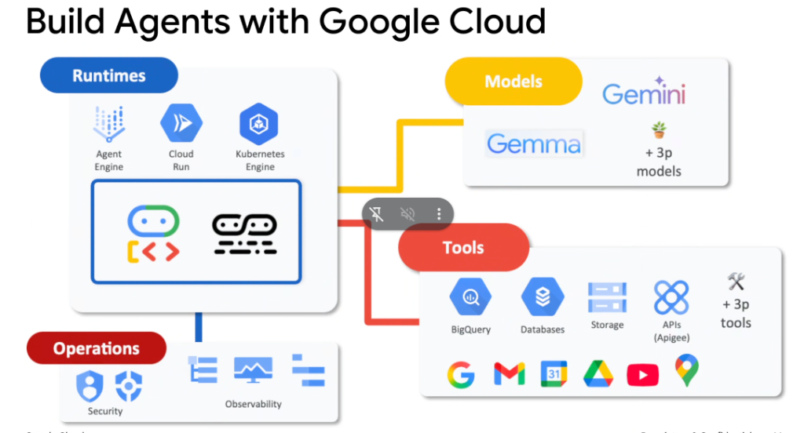
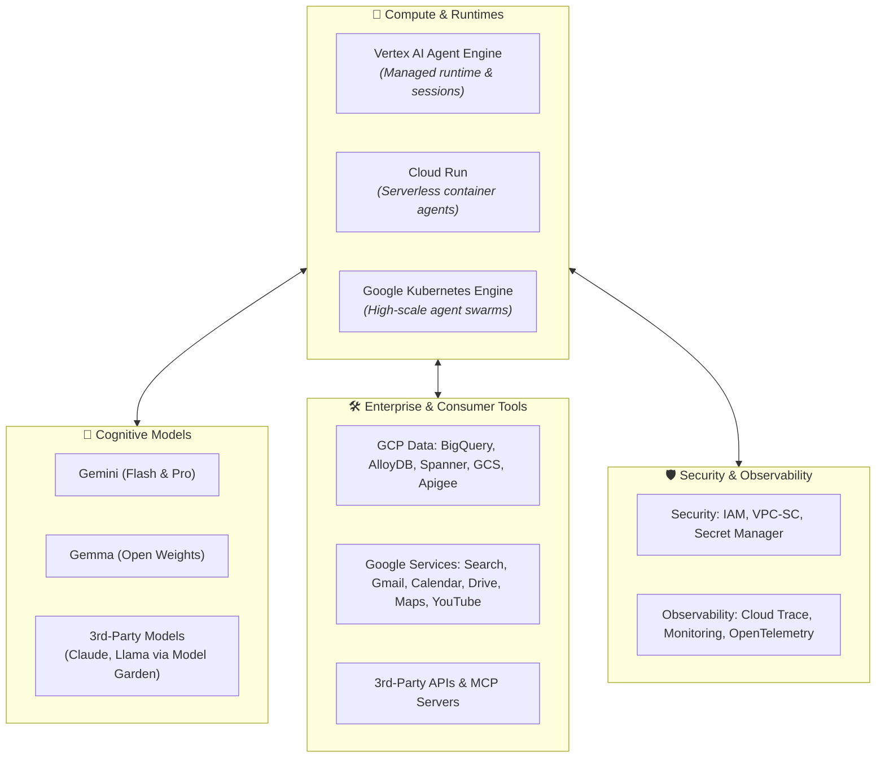

# Build Agents with Google Cloud: Full Platform Ecosystem

## Overview

Deploying enterprise agents into production requires a cohesive cloud foundation spanning compute runtimes, foundation models, rich tool integrations, enterprise security boundaries, and deep observability. Google Cloud provides a comprehensive full-stack ecosystem for building, hosting, and operating intelligent agent swarms.

---

## Google Cloud Agent Ecosystem Architecture

---

## The Four Ecosystem Pillars

### 1. Runtimes (Compute & Hosting)
* **Vertex AI Agent Engine**: Fully managed serverless execution runtime designed specifically for hosting ADK agents, managing state persistence, and orchestrating multi-agent loops.
* **Cloud Run**: Serverless container platform for fast auto-scaling, event-driven agents with scale-to-zero economics.
* **Google Kubernetes Engine (GKE)**: Production-grade container orchestration for massive parallel agent swarms, heavy compute workloads, and customized network service meshes.

### 2. Models (Cognitive Reasoning Engines)
* **Gemini (Flash / Pro)**: Frontier multimodal models powering complex reasoning, long-context understanding, and function calling.
* **Gemma**: Lightweight, state-of-the-art open-weights models fine-tunable on private enterprise hardware.
* **Vertex AI Model Garden**: Seamless access to partner foundation models (Anthropic Claude, Meta Llama, Mistral) within the same Google Cloud security boundary.

### 3. Tools (Enterprise & Consumer Integrations)
* **Google Cloud Data Platforms**:
  * **BigQuery**: Real-time analytical querying and semantic text-to-SQL.
  * **Cloud Databases**: Spanner, AlloyDB for PostgreSQL, Cloud SQL, and Firestore.
  * **Storage & APIs**: Cloud Storage (GCS) and Apigee API Management.
* **Google Services & Workspaces**: Direct integration with Google Search grounding, Gmail, Calendar, Drive, Maps, and YouTube.
* **Third-Party Ecosystem**: Extensible via Model Context Protocol (MCP), custom REST/gRPC endpoints, and enterprise connectors.

### 4. Operations (Security & Observability)
* **Enterprise Security**:
  * **Identity & Access Management (IAM)**: Fine-grained, role-based execution permissions.
  * **VPC Service Controls (VPC-SC)**: Isolates agent communications within trusted network perimeters to prevent data exfiltration.
  * **Secret Manager**: Secure credential and API key injection.
* **Full-Stack Observability**:
  * **Cloud Trace**: End-to-end distributed tracing across agent reasoning steps and downstream tool latency.
  * **Cloud Monitoring & Logging**: Real-time dashboards, token throughput counters, and SLO alert triggers.

---

## Google Cloud Services Mapping Matrix

| Category | Service Name | Role in Agent Lifecycle |
| :--- | :--- | :--- |
| **Runtime** | Vertex AI Agent Engine | Turnkey managed runtime for ADK agents with session persistence |
| **Runtime** | Cloud Run | Scalable microservices hosting custom containerized agent workers |
| **Runtime** | GKE | Orchestrates high-throughput, distributed multi-agent clusters |
| **Models** | Gemini 2.0 Flash / Pro | Multimodal reasoning, planning, and structured tool calling |
| **Models** | Gemma / Model Garden | Private fine-tuned and open-weights models |
| **Tools** | BigQuery & Cloud Databases | Grounding, text-to-SQL, and vector retrieval backends |
| **Tools** | Google Workspace / Search | Productivity automation and real-time live search grounding |
| **Operations** | Cloud Trace / OpenTelemetry | Step-by-step latency profiling and reasoning bottleneck discovery |
| **Operations** | IAM & VPC-SC | Zero-trust security, encryption, and data boundary protection |
