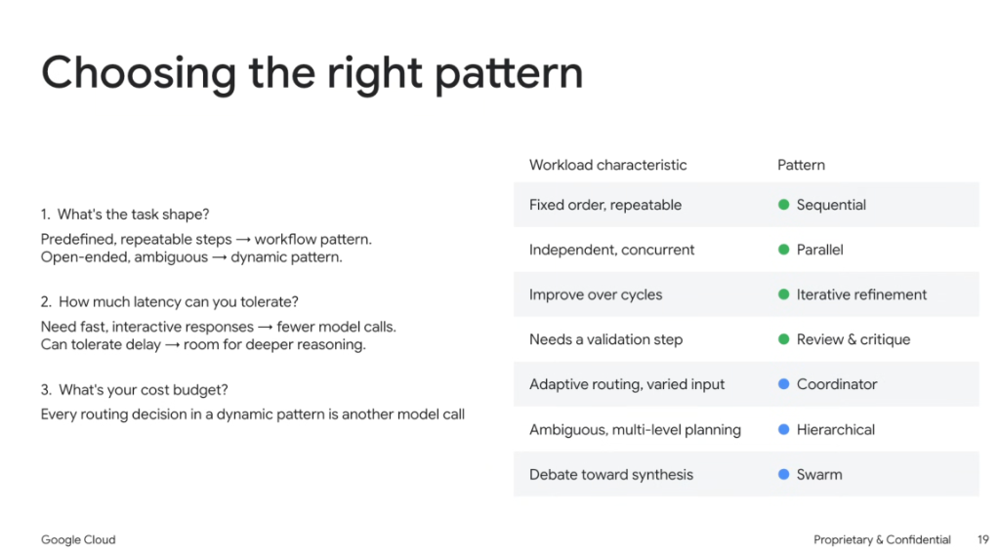
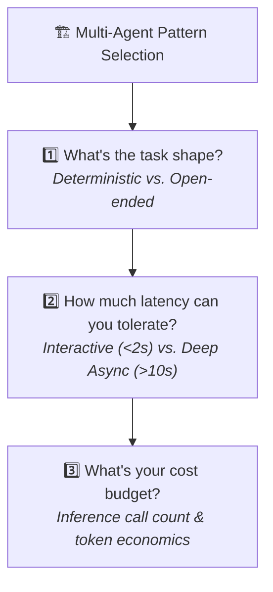
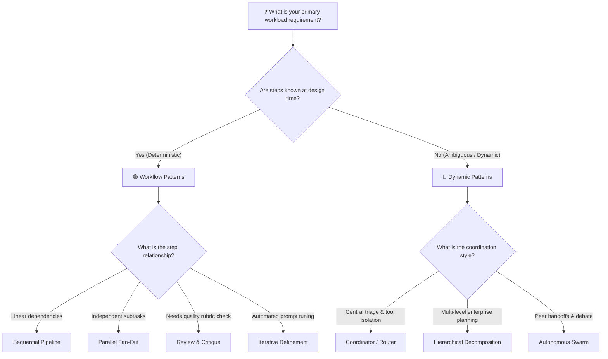
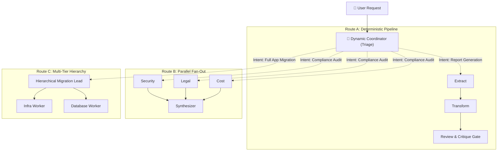

# Multi-Agent Architectures: Choosing the Right Pattern

## Overview

Selecting the optimal multi-agent design pattern is an engineering decision governed by three core constraints: **Task Shape**, **Latency Tolerance**, and **Cost Budget**.

> **"Predefined, repeatable steps belong in workflow patterns. Open-ended, ambiguous goals belong in dynamic patterns."**

---

## The 3 Critical Selection Questions

### 1. What's the task shape?
* **Predefined, repeatable steps $\rightarrow$ Workflow Patterns**: When the business logic, transformation steps, or validation checkpoints are known at design time, encode them as deterministic code workflows.
* **Open-ended, ambiguous goals $\rightarrow$ Dynamic Patterns**: When the path to resolution depends entirely on the unstructured input query, empower the AI model to triage, decompose, and route at runtime.

### 2. How much latency can you tolerate?
* **Fast, interactive user-facing responses**: Minimize model hops ($1 \text{ or } 2 \text{ calls max}$). Use **Parallel** fan-outs or single-stage **Coordinators** powered by lightweight models (e.g. Gemini 2.5 Flash).
* **Asynchronous deep-thinking / batch workloads**: High latency tolerance permits multi-stage **Hierarchical Decomposition**, **Iterative Refinement** loops, and multi-round **Swarms**.

### 3. What's your cost budget?
* **Every dynamic routing decision is another model invocation**: A 3-tier hierarchical swarm can easily consume 10–25 LLM calls per user prompt.
* **Cost Optimization Strategy**: Use deterministic workflow gates where possible, and use asymmetric model sizing (Flash for routing/workers, Pro for complex synthesis).

---

## Workload Characteristic to Pattern Mapping

| Workload Characteristic | Pattern Family | Recommended Pattern | Architectural Rationale |
| :--- | :--- | :--- | :--- |
| **Fixed order, repeatable** | 🟢 Workflow | **Sequential** | Strict linear dependency chain ($A \rightarrow B \rightarrow C$) with deterministic transitions. |
| **Independent, concurrent** | 🟢 Workflow | **Parallel** | Concurrent worker fan-out bounded by the slowest task ($\max_i(T_i)$). |
| **Improve over cycles** | 🟢 Workflow | **Iterative Refinement** | 3-agent closed loop (Generator $\rightarrow$ Evaluator $\rightarrow$ Prompt Enhancer) for quality convergence. |
| **Needs a validation step** | 🟢 Workflow | **Review & Critique** | Decoupled 2-agent actor-critic evaluation against explicit objective rubrics. |
| **Adaptive routing, varied input** | 🔵 Dynamic | **Coordinator** | Central supervisor model dynamically classifies intent and delegates to specialized subagents. |
| **Ambiguous, multi-level planning** | 🔵 Dynamic | **Hierarchical** | Multi-tier executive lead $\rightarrow$ domain lead $\rightarrow$ leaf worker recursive decomposition. |
| **Debate toward synthesis** | 🔵 Dynamic | **Swarm** | Decentralized peer-to-peer handoffs and lateral negotiation without a coordinator bottleneck. |

---

## Architectural Decision Tree

---

## Production Hybrid Architectures

In enterprise software engineering, real-world systems combine workflow and dynamic patterns into powerful **hybrid compositions**:

### Hybrid Engineering Principles:
1. **Dynamic at Ingress, Deterministic in Core**: Use a dynamic **Coordinator** at the front door to interpret user intent, then route into deterministic **Sequential** or **Parallel** workflows.
2. **Deterministic Quality Gates in Dynamic Swarms**: Embed deterministic validation checks (unit tests, schema linters) at each handoff boundary within dynamic swarms.
3. **Budget & Timeout Envelopes**: Always wrap dynamic multi-agent loops in global deadline timers and token ceiling circuit breakers.
