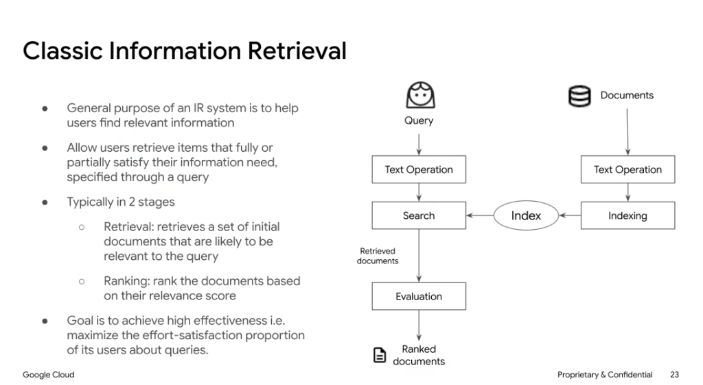
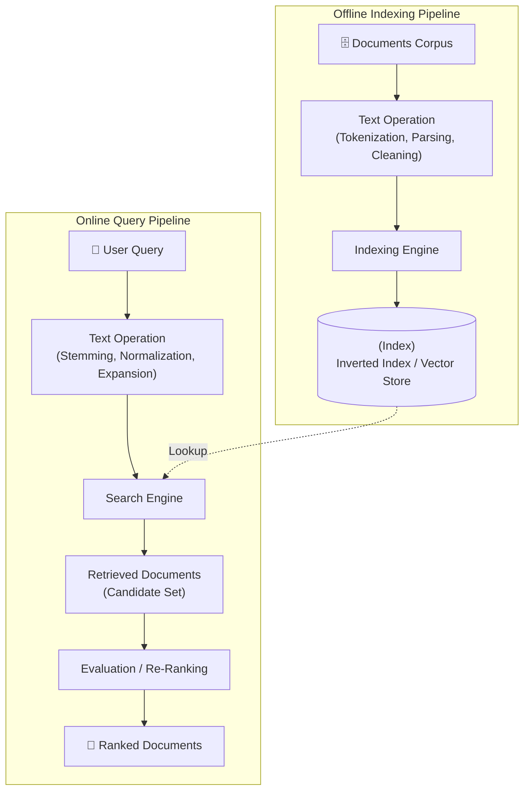

# Classic Information Retrieval (IR)

## Overview

The primary purpose of an **Information Retrieval (IR)** system is to satisfy a user's information need by efficiently finding and ranking relevant items from a large corpus of unstructured or semi-structured documents.

The overarching engineering goal is to achieve **high effectiveness**—maximizing user satisfaction while minimizing the effort required to locate authoritative answers.

---

## Architecture: Dual-Pipeline Topology

---

## The 2 Core Stages of IR

### Stage 1: Candidate Retrieval (Recall-Oriented)
* **Objective**: Retrieve an initial candidate set of documents ($k = 100 	ext{ to } 1000$) likely to contain relevant information.
* **Characteristics**: Highly optimized for low latency and high throughput across millions of documents.
* **Techniques**: Inverted index lookups, BM25 / TF-IDF scoring, ANN (Approximate Nearest Neighbor) vector searches.

### Stage 2: Ranking & Evaluation (Precision-Oriented)
* **Objective**: Re-score and order the candidate documents by precise semantic relevance ($k = 3 	ext{ to } 10$).
* **Characteristics**: Computationally richer evaluation of passage relevance.
* **Techniques**: Cross-encoders, learning-to-rank (LTR) models, dense semantic similarity, relevance scoring functions.

---

## Key Pipeline Operations

| Component | Stage | Description |
| :--- | :--- | :--- |
| **Document Text Operation** | Offline | Parsing, stop-word removal, stemming/lemmatization, chunking, and tokenization. |
| **Indexing Engine** | Offline | Builds inverted indices (term-to-document postings) or dense vector representations. |
| **Query Text Operation** | Online | Normalizes user query, expands synonyms, extracts intents and keywords. |
| **Search Engine** | Online | Performs fast candidate matching against the indexed corpus. |
| **Evaluation / Ranking** | Online | Scores relevance, applies business filters, and returns top-ranked results. |
