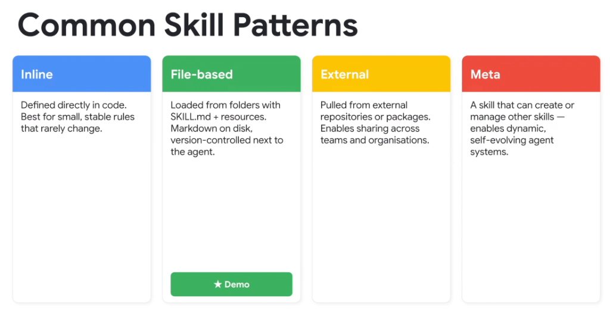
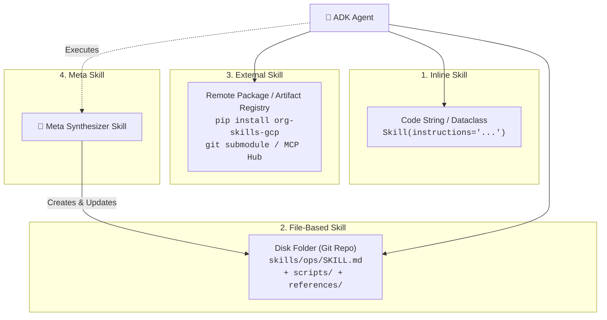

# Google ADK: Common Skill Patterns (Inline, File-Based, External, Meta)

## Overview

In the Google Agent Development Kit (ADK), skills can be packaged, authored, and resolved across four primary architectural patterns: **Inline**, **File-Based**, **External**, and **Meta Skills**. The choice of pattern dictates how skills are versioned, shared, and dynamically generated across an enterprise.

---

## The Four Skill Architectural Patterns

---

## Pattern-by-Pattern Breakdown

### 1. Inline Skills
* **Definition**: Skills declared directly as strings or data structures within application source code.
* **Storage**: In-memory Python/TypeScript source files.
* **Key Characteristics**:
  * Zero filesystem overhead; tightly coupled to the host agent binary.
  * Fast to author for simple prototypes.
* **Best For**: Small, immutable, deterministic guidelines and formatting rules that rarely change.

### 2. File-Based Skills
* **Definition**: Skills structured as directory bundles on local disk containing a canonical `SKILL.md` along with local scripts, templates, and reference runbooks.
* **Storage**: Local filesystem, co-located and version-controlled with the repository in Git.
* **Key Characteristics**:
  * Clean progressive disclosure (L1 metadata, L2 instructions, L3 resources).
  * Highly human-readable and editable in standard IDEs.
* **Best For**: Core domain workflows, project-specific capabilities, and local development testing.

### 3. External Skills
* **Definition**: Standardized capability bundles distributed via external package managers (PyPI, npm), centralized Git submodules, or enterprise skill registries.
* **Storage**: Remote artifact repositories / Cloud Storage buckets.
* **Key Characteristics**:
  * Cross-organization sharing; decoupled release cycles.
  * Versioned dependencies (e.g., `skill_version = ">=2.1.0"`).
* **Best For**: Shared infrastructure tools (BigQuery, Spanner, Slack, Jira) and enterprise-wide legal/compliance policies.

### 4. Meta Skills
* **Definition**: Specialized higher-order skills equipped with tools to synthesize, evaluate, optimize, or register other skills dynamically at runtime.
* **Mechanism**: The agent observes user interactions, analyzes failed execution traces, and automatically writes or refines new `SKILL.md` capability files.
* **Key Characteristics**:
  * Enables self-evolving and continuous-learning agent architectures.
* **Best For**: Automated knowledge capture, continuous reflection loops, and dynamic agent self-configuration.

---

## Pattern Comparison Matrix

| Pattern | Location | Versioning / Lifecycle | Sharing Scope | Ideal Use Case |
| :--- | :--- | :--- | :--- | :--- |
| **Inline** | Directly in code | Tied to application binary release | Single script / agent | Minor immutable formatting rules |
| **File-Based** | Local folder (`SKILL.md`) | Git repository commits | Single project / repository | Core domain tasks & team workflows |
| **External** | Remote registry / Package | Semantic versioning (`v1.2.0`) | Cross-organization / Global | Shared enterprise platform integrations |
| **Meta** | Dynamically synthesized | Runtime generated & refined | Dynamic / Autonomous | Self-evolving swarms & continuous learning |
