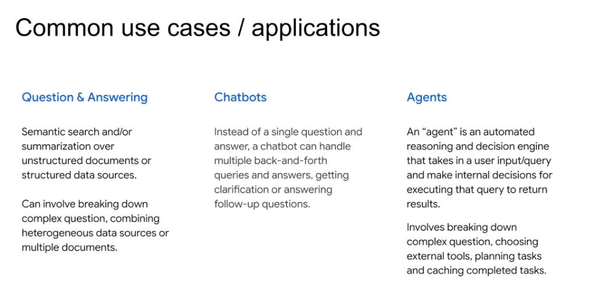

# Common Use Cases & Applications: QA vs. Chatbots vs. Agents

## Overview

Generative AI applications exist on an evolutionary spectrum of autonomy, interactivity, and operational complexity—progressing from **Question & Answering (QA)** systems to **Multi-turn Chatbots**, and ultimately to **Autonomous Agents**.

---

## The Three Application Paradigms

### 1. Question & Answering (QA)
* **Core Definition**: Semantic search and/or summarization over unstructured documents (PDFs, docs) or structured databases.
* **Capabilities**:
  * Deconstructs complex questions into searchable sub-queries.
  * Ingests and combines heterogeneous data sources across multiple documents.
  * Returns single-turn grounded answers with source citations.
* **Typical Latency**: Low to moderate (1 retrieval roundtrip + 1 LLM generation).

### 2. Conversational Chatbots
* **Core Definition**: Handles multi-turn conversational dialogue rather than isolated single question-and-answer pairs.
* **Capabilities**:
  * Preserves short-term conversational context across user turns.
  * Solicits user clarifications when queries are ambiguous.
  * Answers sequential follow-up questions while maintaining coherence.
* **Typical Latency**: Moderate (session state tracking + multi-turn history).

### 3. Autonomous Agents
* **Core Definition**: An automated reasoning and decision engine that takes a user goal, makes autonomous internal decisions, selects external tools, and plans sequential execution.
* **Capabilities**:
  * Decomposes open-ended goals into structured multi-step plans.
  * Dynamically selects, parameterizes, and invokes external APIs and tools.
  * Employs persistent memory, intermediate caching of completed sub-tasks, and error self-correction loops.
* **Typical Latency**: Higher (multi-step ReAct loops, tool API execution, verification checks).

---

## Evolutionary Comparison Matrix

| Dimension | Question & Answering (QA) | Chatbots | Autonomous Agents |
| :--- | :--- | :--- | :--- |
| **Interaction Model** | Single-turn request $\rightarrow$ response | Multi-turn back-and-forth dialogue | Goal-driven multi-step execution |
| **Tool Calling** | Read-only search / retrieval index | Read-only search + dialogue state | Read/write APIs, code execution, tools |
| **State & Memory** | Stateless per query | Conversational session history | Short-term scratchpad + long-term memory |
| **Planning & Reasoning** | Prompt-level synthesis | Conversational contextualization | Multi-step task planning & self-reflection |
| **Decision Autonomy** | Minimal (fixed retrieve $\rightarrow$ generate) | Low (conversational routing) | High (dynamic tool selection & loop control) |
