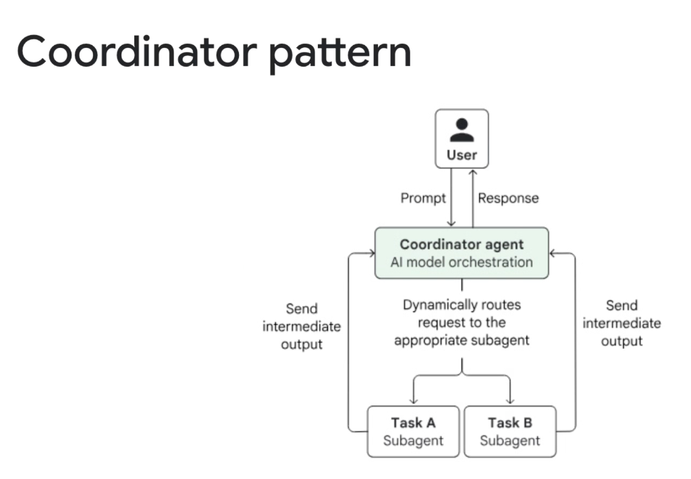
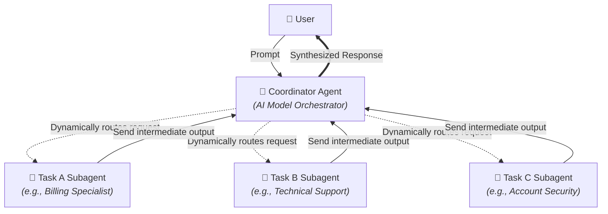

# Multi-Agent Dynamic Pattern: Coordinator Pattern



## Overview

The **Coordinator Pattern** is a foundational dynamic multi-agent architecture where a centralized supervisor model leverages runtime AI reasoning to triage, route, and orchestrate specialized subagents.

> **"Dynamically routes request to the appropriate subagent based on runtime AI orchestration."**

Unlike deterministic workflow patterns (such as Sequential or Parallel pipelines where routing is fixed in code), the Coordinator Pattern uses the model's natural language understanding to classify user intent, select the best domain specialist, delegate subtasks, and synthesize intermediate outputs into a unified response.

---

## Architectural Execution Flow



---

## How AI Model Orchestration Works

1. **Ingress & Intent Analysis**: The user sends a high-level, potentially ambiguous query to the `CoordinatorAgent`.
2. **Dynamic Routing & Subagent Selection**: The Coordinator inspects its registry of subagent descriptions (metadata and capabilities) and decides which specialist is best equipped to handle the task.
3. **Task Parameterization & Dispatch**: The Coordinator formulates a targeted sub-prompt and dispatches execution to the selected subagent.
4. **Intermediate Output Processing**: The subagent executes domain tools in its isolated context and returns its structured findings to the Coordinator.
5. **Adaptive Multi-Step Delegation (Optional)**: If the user request spans multiple domains, the Coordinator can dynamically invoke additional subagents based on intermediate findings.
6. **Synthesis & Egress**: The Coordinator integrates all subagent responses into a single, cohesive answer and returns it to the user.

---

## Solving the "Decision Space Bloat" Problem

When all tools are loaded into a single monolithic prompt, LLMs suffer from tool-selection confusion, increased latency, and high token costs. The Coordinator Pattern eliminates this bottleneck through hierarchical abstraction:

```mermaid
graph LR
    subgraph Monolithic Agent (50+ Tools)
        Mono["🤖 Monolithic Brain<br/><i>50+ Tools in single prompt</i>"] --> Congestion["❌ High Error Rate & High Latency"]
    end

    subgraph Coordinator Architecture (Scoped Toolsets)
        C_Brain["👑 Coordinator<br/><i>Sees 3 Subagent Descriptions</i>"]
        C_Brain --> S1["🤖 Billing (3 Tools)"]
        C_Brain --> S2["🤖 Tech (4 Tools)"]
        C_Brain --> S3["🤖 Infra (2 Tools)"]
    end
```

* **The Coordinator sees only subagent roles**, not their internal underlying tools or complex API schemas.
* **Each Subagent sees only its 2–4 domain-specific tools**, maximizing accuracy and minimizing context size.

---

## Google ADK Implementation Example

In the **Google Agent Development Kit (ADK)**, the Coordinator Pattern is implemented by attaching specialized `subagents` to a parent `LlmAgent`:

```python
from google.adk.agents import LlmAgent
from google.adk.tools import Tool

# 1. Specialized Billing Subagent
billing_agent = LlmAgent(
    name="billing_specialist",
    model="gemini-2.5-flash",
    description="Handles invoice lookups, subscription upgrades, payment refunds, and tax queries.",
    instruction="You are a billing specialist. Look up user invoices and process billing adjustments.",
    tools=[lookup_invoice_tool, process_refund_tool],
)

# 2. Specialized Technical Support Subagent
tech_support_agent = LlmAgent(
    name="tech_support_specialist",
    model="gemini-2.5-flash",
    description="Diagnoses API error codes, infrastructure outages, latency spikes, and system logs.",
    instruction="You are a technical support engineer. Query error logs and telemetry metrics.",
    tools=[query_cloud_logging_tool, check_service_health_tool],
)

# 3. Top-Level Coordinator / Orchestrator Agent
coordinator_agent = LlmAgent(
    name="enterprise_support_coordinator",
    model="gemini-2.5-pro",
    instruction=(
        "You are the central enterprise support coordinator. "
        "Classify the user's intent, route to the appropriate specialist subagent, "
        "and synthesize their findings into a professional, empathetic response."
    ),
    subagents=[billing_agent, tech_support_agent],  # Dynamic AI routing
)
```

---

## Production Failure Modes & Engineering Mitigations

| Failure Mode | Root Cause | Production Mitigation |
| :--- | :--- | :--- |
| **Routing Misclassification** | Vague user query or overlapping subagent descriptions | Write distinct, non-overlapping `description` fields; prompt user for clarification on ambiguity |
| **Coordinator Bottleneck** | Coordinator passes full multi-turn history to subagents | Enforce structured Pydantic input/output schemas for clean inter-agent handoffs |
| **Double Latency Penalty** | Coordinator LLM call + Subagent LLM call + Synthesis LLM call | Use ultra-fast models (e.g. Gemini 2.5 Flash) for the coordinator routing and worker tiers |
| **Subagent Hallucination** | Subagent attempts to answer out-of-domain questions | Instruct subagents to return an explicit "out_of_scope" status to prompt re-routing |

---

## Deterministic Router vs. LLM Coordinator vs. Hierarchical Decomposition

| Architectural Dimension | Deterministic Regex / Classifier Router | LLM Coordinator Pattern | Hierarchical Decomposition |
| :--- | :--- | :--- | :--- |
| **Routing Intelligence** | Hardcoded intent rules / embeddings | Zero-shot / Few-shot LLM reasoning | Multi-tier recursive planning |
| **Handling Ambiguity** | Brittle; fails on novel phrasings | Excellent; asks clarifying questions | High; breaks down open-ended goals |
| **Latency Overhead** | Sub-millisecond ($< 5\text{ms}$) | Moderate ($1 \text{ LLM turn}$) | Higher ($N \text{ planning turns}$) |
| **Domain Scope** | Single fixed intent per query | Multi-domain delegation & synthesis | Deep multi-level task trees |
