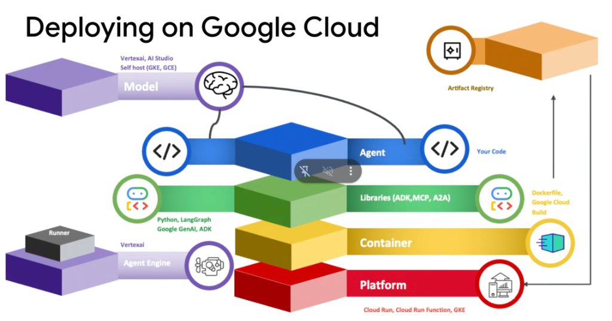

# Google Cloud: The Agent Deployment Stack



## Overview

Deploying enterprise agents on Google Cloud involves a **5-layer architectural stack** spanning foundation models, agent business logic, runtime libraries, container packaging, and hosting platforms. 

Google Cloud offers two primary deployment paradigms: **The Managed Agent Runtime Path** (direct deployment without container management) and **The Containerized Platform Path** (building OCI images via Cloud Build and Artifact Registry for Cloud Run or GKE).

> **"From Model to Platform: Understanding the full Google Cloud deployment stack across Model, Agent Code, Libraries, Containers, and Hosting Compute."**

---

## The 5 Architectural Layers & Deployment Paths

```mermaid
graph TD
    subgraph Layer 1: Model (The Brain)
        M1["🧠 Model Layer<br/><i>Vertex AI, AI Studio, Self-hosted (GKE/GCE)</i>"]
    end

    subgraph Layer 2 & 3: Agent Code & Libraries
        A1["💻 Agent Layer (Your Code)<br/><i>Prompts, orchestration, routing logic</i>"]
        L1["🤖 Libraries Layer<br/><i>ADK, MCP, A2A, Google GenAI SDK, LangGraph</i>"]
    end

    M1 --- A1
    A1 --- L1

    subgraph Path A: Managed PaaS Path
        L1 ==>|Direct Runner| AE["⚙️ Vertex AI Agent Engine / Agent Runtime<br/><i>(Managed serverless execution, zero container ops)</i>"]
    end

    subgraph Path B: Containerized Infrastructure Path
        L1 ==>|Dockerfile & Cloud Build| C1["📦 Container Layer<br/><i>Google Cloud Build → Artifact Registry</i>"]
        C1 ==>|Deploy Image| P1["🖥️ Platform Layer<br/><i>Cloud Run, Cloud Run Functions, GKE</i>"]
    end
```

---

## Deep Breakdown of the 5 Layers

### 1. Model Layer (The Brain)
* **Role**: Provides foundational natural language understanding, multimodal perception, tool-calling reasoning, and code generation.
* **Google Cloud Implementations**:
  * **Vertex AI**: Enterprise-grade Gemini models (Gemini 2.5 Pro, Flash, Flash-Lite) with data governance and IAM integration.
  * **Google AI Studio**: Fast prototyping and direct API access.
  * **Self-Hosted (GKE / GCE)**: Open weights models (Gemma 2, Llama 3, Mistral) served via vLLM or TGI on NVIDIA H100/L4 GPU instances.

---

### 2. Agent Layer (Your Code)
* **Role**: Defines the core identity, business logic, system prompts, workflows, and task decompositions of your agent.
* **Key Components**: Custom Python code, tool registries, multi-agent topologies (Sequential, Parallel, Loop, Swarm), and state memory schemas.

---

### 3. Libraries Layer (Frameworks & Protocols)
* **Role**: Provides the execution abstractions, runtime protocols, and client SDKs.
* **Core Frameworks & Protocols**:
  * **Google ADK (Agent Development Kit)**: Native multi-agent orchestration, evaluation harness, and memory primitives.
  * **Model Context Protocol (MCP)**: Universal standardized interface for external tools, databases, and APIs.
  * **Agent-to-Agent (A2A)**: Decentralized peer-to-peer inter-agent communication protocol.
  * **Google GenAI SDK**: Low-level official SDK for direct model interaction.
  * **LangGraph / LangChain**: Graph-based state machine alternatives.

---

### 4. Container Layer (Packaging & Registry)
* **Role**: Packages agent code, Python dependencies, system binaries, and configurations into standardized OCI container images.
* **Key Technologies**:
  * **Dockerfile / Buildpacks**: Defining the container environment and Python virtual environment.
  * **Google Cloud Build**: Serverless CI/CD build engine for compiling and testing container images.
  * **Google Artifact Registry (`pkg.dev`)**: Secure, high-throughput container registry storing version-controlled agent images.

---

### 5. Platform Layer (Compute Infrastructure)
* **Role**: The runtime compute hosting environment executing containerized agents.
* **Google Cloud Hosting Options**:
  * **Cloud Run**: Serverless container runtime with automatic HTTPS endpoints, scale-to-zero economics, and fast request scaling.
  * **Cloud Run Functions**: Lightweight event-driven serverless functions triggered by Cloud Storage, Pub/Sub, or webhooks.
  * **Google Kubernetes Engine (GKE)**: Full-control enterprise Kubernetes clusters for large-scale multi-agent fleets, custom GPU nodes, and strict VPC Service Controls.

---

## Managed Agent Runtime vs. Containerized Platform

| Architectural Dimension | ⚙️ Path A: Vertex AI Agent Runtime | 📦 Path B: Containerized (Cloud Run / GKE) |
| :--- | :--- | :--- |
| **Container Management** | **None (Zero Dockerfiles)** | Developer manages Dockerfiles & build scripts. |
| **Image Storage** | Managed internally | **Artifact Registry (`*.pkg.dev`)** |
| **Build System** | Automated direct push | **Google Cloud Build** |
| **Session & Memory** | **Managed out-of-the-box** | Externalized (Firestore, Cloud SQL, Memorystore) |
| **Compute Target** | Dedicated Vertex AI Agent Runner | **Cloud Run / Cloud Run Functions / GKE** |
| **Deployment Speed** | Instant deployment via `agents-cli` | Image build $\rightarrow$ push $\rightarrow$ container startup |
| **Custom Binaries / OS** | Standard Python runtime | **Full root access to install C libraries, OCR, ffmpeg** |

---

## Production CI/CD Build & Deploy Pipeline (`cloudbuild.yaml`)

When using **Path B (Containerized Deployment)**, Google Cloud Build automates the progression from Git commit to Artifact Registry and Cloud Run:

```yaml
# cloudbuild.yaml
steps:
  # 1. Run ADK Evaluations & Unit Tests
  - name: 'python:3.11'
    entrypoint: 'bash'
    args:
      - '-c'
      - |
        pip install uv
        uv run pytest customer_service_agent/test_agent_eval.py

  # 2. Build Container Image via Cloud Build
  - name: 'gcr.io/cloud-builders/docker'
    args:
      - 'build'
      - '-t'
      - 'us-central1-docker.pkg.dev/$PROJECT_ID/agent-repo/customer-agent:$COMMIT_SHA'
      - '.'

  # 3. Push Image to Google Artifact Registry
  - name: 'gcr.io/cloud-builders/docker'
    args:
      - 'push'
      - 'us-central1-docker.pkg.dev/$PROJECT_ID/agent-repo/customer-agent:$COMMIT_SHA'

  # 4. Deploy to Cloud Run
  - name: 'gcr.io/google.com/cloudsdktool/cloud-sdk'
    entrypoint: 'gcloud'
    args:
      - 'run'
      - 'deploy'
      - 'customer-service-agent'
      - '--image=us-central1-docker.pkg.dev/$PROJECT_ID/agent-repo/customer-agent:$COMMIT_SHA'
      - '--region=us-central1'
      - '--platform=managed'
      - '--allow-unauthenticated'

images:
  - 'us-central1-docker.pkg.dev/$PROJECT_ID/agent-repo/customer-agent:$COMMIT_SHA'
```

---

## Architectural Summary

1. **Model Decoupling**: Agents can switch models (Gemini Pro, Flash, self-hosted Gemma on GKE) without changing agent logic or tool definitions.
2. **Standardized Protocols**: Standardize on ADK, MCP, and A2A to ensure interoperability across heterogeneous enterprise systems.
3. **Choose Path A for Velocity, Path B for Control**: Use Vertex AI Agent Runtime for instant deployment with managed memory; use Cloud Run / GKE with Artifact Registry when you need custom containers, private VPC networks, or dedicated GPUs.
