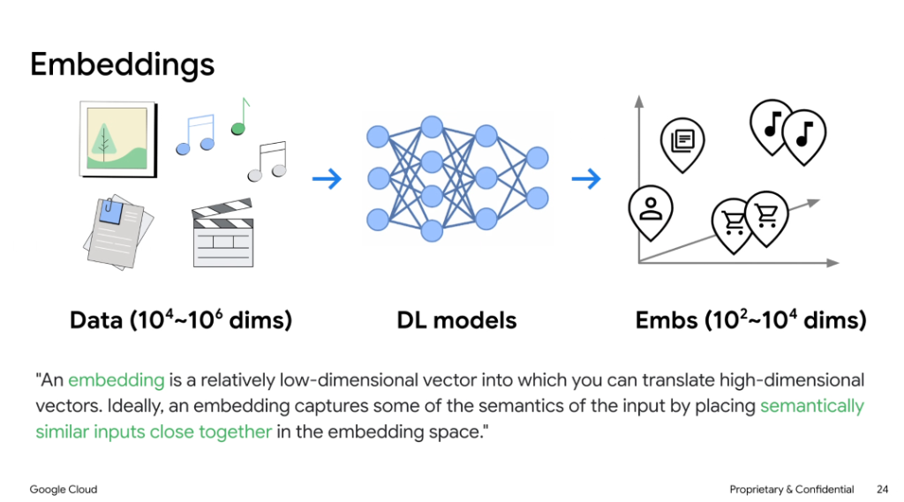
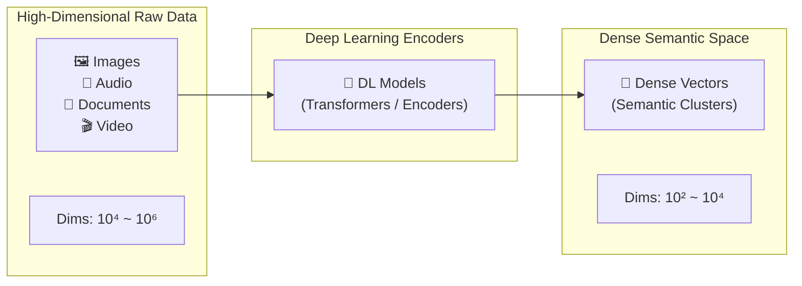

# Embeddings: Vector Representations of Semantics

## Definition

> **An embedding is a relatively low-dimensional vector into which you can translate high-dimensional vectors. Ideally, an embedding captures some of the semantics of the input by placing semantically similar inputs close together in the embedding space.**

---

## The Embedding Transformation Pipeline

---

## Key Principles of Embeddings

### 1. Dimensionality Compression
* **Raw Input Representation**: Sparse, high-dimensional spaces ($10^4 \text{ to } 10^6$ dimensions like one-hot vocabularies or raw pixel arrays).
* **Dense Vector Translation**: Deep neural encoders project input data into compact, continuous dense vector spaces ($10^2 \text{ to } 10^4$ floating-point dimensions, typically 768, 1536, or 3072 dims).

### 2. Semantic Proximity
* Concepts with similar meanings, context, or visual features map to nearby coordinates in vector space.
* Examples:
  * Document passages discussing related business policies cluster together.
  * Audio tracks with similar genre/acoustic properties form dense clusters.
  * User profiles map near items matching their behavioral preferences.

### 3. Multimodal Alignment
* Modern multimodal embedding models project disparate modalities (text, audio, images, video) into a **shared unified semantic embedding space**, enabling cross-modal search (e.g., finding relevant video frames using natural language text queries).

---

## Vector Similarity & Distance Metrics

| Metric | Mathematical Formula | Ideal Usage |
| :--- | :--- | :--- |
| **Cosine Similarity** | $\cos(\theta) = \frac{\mathbf{u} \cdot \mathbf{v}}{\|\mathbf{u}\| \|\mathbf{v}\|}$ | Best for normalized text embeddings where angle denotes semantic alignment |
| **Dot Product (Inner Product)** | $\mathbf{u} \cdot \mathbf{v} = \sum u_i v_i$ | Highly optimized for unit-normalized vectors (hardware accelerated) |
| **Euclidean Distance ($L_2$)** | $d(\mathbf{u}, \mathbf{v}) = \sqrt{\sum (u_i - v_i)^2}$ | Measures absolute geometric distance between points in dense space |
