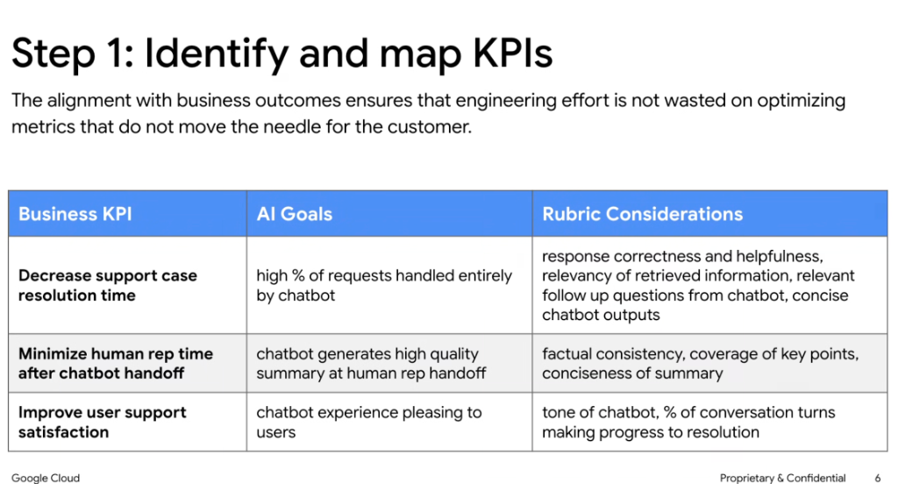

# Evaluation Strategy: Step 1 — Identify and Map KPIs



## Overview

The first and most critical stage of the evaluation lifecycle is **identifying and mapping business KPIs** to concrete AI goals and rubric dimensions.

> **"The alignment with business outcomes ensures that engineering effort is not wasted on optimizing metrics that do not move the needle for the customer."**

Without strict alignment, engineering teams risk falling into the **Vanity Metric Trap**—spending weeks optimizing prompt tokens, MMLU scores, or perplexity while failing to improve customer resolution times or operational costs.

---

## The KPI-to-Rubric Alignment Framework

```mermaid
graph TD
    subgraph Business Outcome (Executive Level)
        KPI["🎯 Business KPI<br/><i>(e.g., Reduce Resolution Time)</i>"]
    end

    subgraph AI Operational Goal (System Level)
        Goal["🤖 AI Operational Goal<br/><i>(e.g., Maximize Autonomous Deflection)</i>"]
    end

    subgraph Evaluation Rubrics (Model Level)
        R1["Correctness & Helpfulness"]
        R2["Retrieval Relevancy"]
        R3["Clarifying Follow-ups"]
        R4["Output Conciseness"]
    end

    KPI ==>|Defines| Goal
    Goal ==>|Operationalizes into| R1 & R2 & R3 & R4
```

---

## Deep Breakdown of Core KPI Mappings

### 1. Business KPI: Decrease Support Case Resolution Time
* **AI Operational Goal**: Maximize the percentage of incoming customer requests handled entirely and accurately by the chatbot from start to finish (autonomous deflection).
* **Rubric Considerations**:
  * **Response Correctness & Helpfulness**: Does the answer directly solve the problem without hallucination or fluff?
  * **Relevancy of Retrieved Information**: Does the RAG pipeline retrieve high-precision documentation chunks without noise?
  * **Relevant Follow-up Questions**: Does the agent ask smart, targeted disambiguation questions rather than generic pleasantries?
  * **Concise Outputs**: Are explanations tight and scannable so the user can take action immediately?

---

### 2. Business KPI: Minimize Human Rep Time After Handoff
* **AI Operational Goal**: When escalation is necessary, the agent generates an executive-level, structured handoff summary for the human Tier-2 engineer.
* **Rubric Considerations**:
  * **Factual Consistency**: Is every claim in the summary strictly grounded in the conversation history?
  * **Coverage of Key Points**: Does the summary capture the customer's intent, account identifier, error codes, and troubleshooting steps already attempted?
  * **Conciseness of Summary**: Can the human engineer digest the entire situation in under 15 seconds without reading the raw multi-turn transcript?

---

### 3. Business KPI: Improve User Support Satisfaction (CSAT)
* **AI Operational Goal**: Deliver a frictionless, pleasing, and respectful support experience that leaves the customer confident and satisfied.
* **Rubric Considerations**:
  * **Tone & Brand Alignment**: Professional, empathetic, calm under frustration, and non-condescending.
  * **% of Conversation Turns Making Progress**: Measuring conversational forward velocity—every turn must advance toward resolution rather than stalling or repeating.

---

## The KPI-to-Rubric Mapping Matrix

| Business KPI | AI Operational Goal | Model-Level Rubric Considerations | Automated Eval Metric |
| :--- | :--- | :--- | :--- |
| **Decrease support case resolution time** | High % of requests handled entirely by chatbot | • Response correctness & helpfulness<br/>• Relevancy of retrieved information<br/>• Relevant follow-up questions<br/>• Concise chatbot outputs | • End-to-end resolution rate ($\ge 75\%$)<br/>• Answer Relevance score ($\ge 4.5/5.0$)<br/>• Turn count ($\le 3.5$ turns) |
| **Minimize human rep time after handoff** | Chatbot generates high-quality summary at human rep handoff | • Factual consistency<br/>• Coverage of key points<br/>• Conciseness of summary | • Summary Hallucination Rate ($0\%$)<br/>• Key entity recall ($\ge 98\%$)<br/>• Summary word count ($< 120$ words) |
| **Improve user support satisfaction** | Chatbot experience pleasing to users | • Tone of chatbot<br/>• % of conversation turns making progress to resolution | • Empathy & Tone score ($\ge 4.8/5.0$)<br/>• Stalled turn rate ($< 5\%$) |

---

## Implementing Rubric Judges in Google ADK

```python
from google.adk.eval import RubricJudge

# 1. Rubric for KPI: Decrease Resolution Time (Correctness & Conciseness)
resolution_rubric = RubricJudge(
    name="resolution_efficiency",
    criteria="""
    Score 1-5:
    5: The answer directly solves the user's issue concisely with zero fluff.
    3: The answer solves the issue but contains unnecessary boilerplate.
    1: The answer is incorrect, unhelpful, or overly verbose.
    """,
    passing_threshold=4.0,
)

# 2. Rubric for KPI: Minimize Human Rep Time (Handoff Summary Quality)
handoff_summary_rubric = RubricJudge(
    name="handoff_summary_fidelity",
    criteria="""
    Score 1-5:
    5: Factually consistent, contains user intent, error codes, attempted steps, and <100 words.
    3: Factually accurate but missing attempted steps or exceeds 200 words.
    1: Contains factual hallucinations or fails to capture core user problem.
    """,
    passing_threshold=4.5,
)

# 3. Rubric for KPI: Improve CSAT (Tone & Conversational Forward Velocity)
satisfaction_rubric = RubricJudge(
    name="user_satisfaction_tone",
    criteria="""
    Score 1-5:
    5: Empathetic, highly professional, advances resolution on every single turn.
    3: Polite but repeats boilerplate instructions or stalls for 1+ turns.
    1: Condescending, unhelpful, or caught in repetitive loops.
    """,
    passing_threshold=4.5,
)
```

---

## Production Anti-Patterns to Avoid

1. **The "Verbose Essay" Anti-Pattern**:
   * *Trap*: Chatbot outputs 6 paragraphs of text to seem comprehensive.
   * *Impact*: Slows down user reading time, increases token costs, and degrades CSAT.
   * *Mitigation*: Enforce strict conciseness rubrics and output token budgets.
2. **The "Cold Handoff" Anti-Pattern**:
   * *Trap*: Chatbot dumps a 25-message raw transcript to a human representative.
   * *Impact*: Human rep spends 5 minutes re-reading or asks the customer to repeat themselves.
   * *Mitigation*: Implement automated structured handoff synthesis with 100% factual consistency rubrics.
3. **The "Circular Questioning" Anti-Pattern**:
   * *Trap*: Chatbot repeatedly asks clarifying questions without advancing the state.
   * *Impact*: Customer frustration and abandoned sessions.
   * *Mitigation*: Track the `% of turns making progress to resolution` metric.
