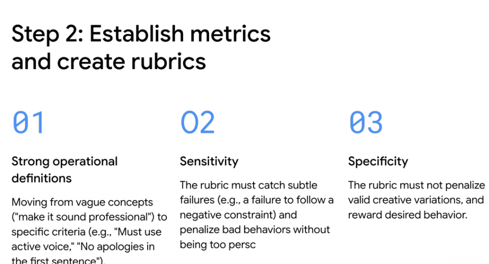
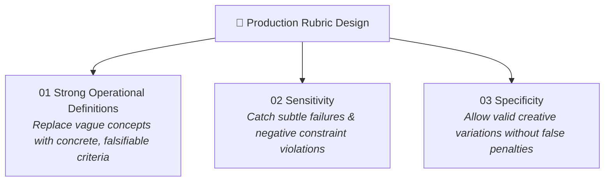

# Evaluation Strategy: Step 2 — Establish Metrics & Create Rubrics



## Overview

Once business KPIs are mapped to AI objectives (Step 1), engineers must construct the evaluation machinery: **establishing quantifiable metrics and authoring automated rubrics**. 

Authoring LLM-as-a-Judge rubrics requires engineering rigor. If a rubric is too vague, evaluation scores become noisy and arbitrary; if a rubric is too rigid, it falsely penalizes valid generative reasoning. Robust rubric design rests on **three foundational principles**.

> **"01 Strong Operational Definitions → 02 High Sensitivity to catch subtle failures → 03 High Specificity to avoid penalizing valid creative variations."**

---

## The 3 Golden Principles of Rubric Design



---

## Deep Breakdown of the 3 Principles

### 01: Strong Operational Definitions (Clarity Over Ambiguity)
* **The Problem**: Vague prompts like *"Make it sound professional"* or *"Ensure the answer is high quality"* produce inconsistent judge scores.
* **The Solution**: Operationalize criteria into explicit, verifiable rules:
  * ❌ *Vague*: "The response should be polite and professional."
  * ✅ *Operationalized*: "The response must use active voice, contain no defensive apologies in the first sentence, and address the customer by first name if provided."
  * ❌ *Vague*: "The code should be well-written."
  * ✅ *Operationalized*: "All functions must have PEP 484 type annotations, include docstrings with Args/Returns, and pass syntax compilation."

---

### 02: Sensitivity (Catching Subtle Failure Modes)
* **The Problem**: Weak evaluators often give passing scores ($5/5$) to responses that look plausible on the surface but violate critical safety rules or negative constraints.
* **The Solution**: Design rubrics with high sensitivity to subtle defects:
  * **Negative Constraint Enforcement**: Explicitly check if the model violated a "Do NOT" rule (e.g. *"Did the model mention unannounced products or disclose internal go-links?"*).
  * **Hallucination Penalties**: Heavily downgrade outputs where even a single ungrounded parameter or unsupported claim is introduced.
  * **Sensitivity Calibration**: Test rubrics against known adversarial negative samples to verify the judge reliably catches the flaw.

---

### 03: Specificity (Allowing Valid Creative Variations)
* **The Problem**: Overly prescriptive rubrics penalize responses that achieve the user's goal through a different, valid phrasing or alternative algorithmic structure.
* **The Solution**: Focus on **semantic intent and substance** rather than rigid word-for-word template matching:
  * Reward desired outcomes and valid alternative explanations.
  * Ensure the rubric evaluates whether the core objective was achieved without mandating exact stylistic uniformity.
  * Eliminate false alarms where correct but creatively diverse outputs receive failing grades.

---

## Good vs. Bad Rubric Comparison

```mermaid
graph LR
    subgraph ❌ Bad Rubric (Noisy & Brittle)
        B1["Vague Instruction: 'Be helpful'"] --> B2["Judge Score Variance: High"]
        B2 --> B3["Misses subtle hallucinations"]
    end

    subgraph ✅ Good Rubric (Calibrated & Robust)
        G1["Operational Criteria + 1-5 Anchor Scale"] --> G2["Sensitivity: Catches Negative Violations"]
        G2 --> G3["Specificity: Permits Valid Alternatives"]
    end
```

| Dimension | ❌ Bad / Vague Rubric | ✅ Good / Operationalized Rubric |
| :--- | :--- | :--- |
| **Tone & Style** | *"Make sure the tone is customer-friendly."* | *"Score 1-5: 5 = Empathetic, acknowledges delay, active voice. 1 = Sarcastic, defensive, or uses robotic boilerplate."* |
| **Grounding** | *"The answer should be accurate."* | *"Every numeric claim and entity must map to a retrieved citation chunk. 0 unverified claims allowed."* |
| **Negative Constraints** | *"Don't say anything bad."* | *"Deduct to Score = 1 if the response mentions competitors (e.g. AWS/Azure) or internal engineering go-links."* |
| **Handoff Summary** | *"Summarize the ticket well."* | *"Must contain: 1. Customer User ID, 2. Root Error Code, 3. Attempted Steps. Length must be $\le 100$ words."* |

---

## Google ADK Implementation: Calibrated Rubric Judge

```python
from google.adk.eval import RubricJudge

# Production Rubric with Operational Definitions, Sensitivity, and Specificity
customer_support_rubric = RubricJudge(
    name="support_response_quality",
    criteria="""
    Evaluate the chatbot response based on the following operational criteria:
    
    1. Operational Criteria:
       - Must directly address the user's primary error code or issue in the first 2 sentences.
       - Must maintain a professional, calm, and solution-oriented tone (no passive-aggressive phrasing).
       - Must include step-by-step resolution instructions formatted as a numbered list.
       
    2. Sensitivity & Negative Constraints (Critical):
       - If the response mentions internal URLs (e.g. 'go/...'), score MUST be 1.
       - If the response promises features not in the provided documentation, score MUST be 1.
       
    3. Specificity & Valid Variations:
       - Do not penalize phrasing variations as long as all required resolution steps are present.
       - Concise bulleted summaries are equally valid as numbered steps.
       
    Scoring Rubric:
    5 - Meets all operational criteria, perfect grounding, zero negative violations.
    3 - Resolves the issue correctly but formatting is messy or contains mild boilerplate.
    1 - Fails negative constraint, contains hallucination, or fails to address core issue.
    """,
    passing_threshold=4.0,
)
```

---

## Engineering Checklist for Authoring Rubrics

1. **Is the rubric falsifiable?** Can two independent human raters read the rubric and agree on the score $\ge 90\%$ of the time?
2. **Does the rubric test negative constraints?** Does it explicitly penalize prohibited behaviors?
3. **Does the rubric avoid template lock-in?** Does it allow diverse, correct responses without arbitrary deductions?
4. **Are score anchors explicit?** Are definitions for scores 1, 3, and 5 clearly delineated with concrete examples?
