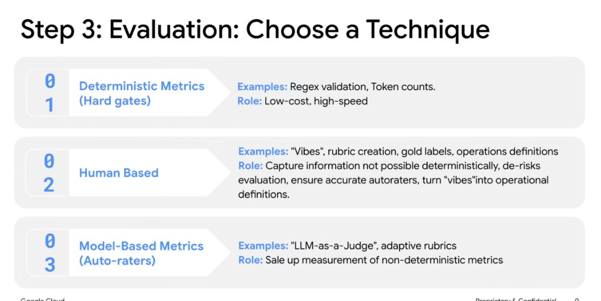
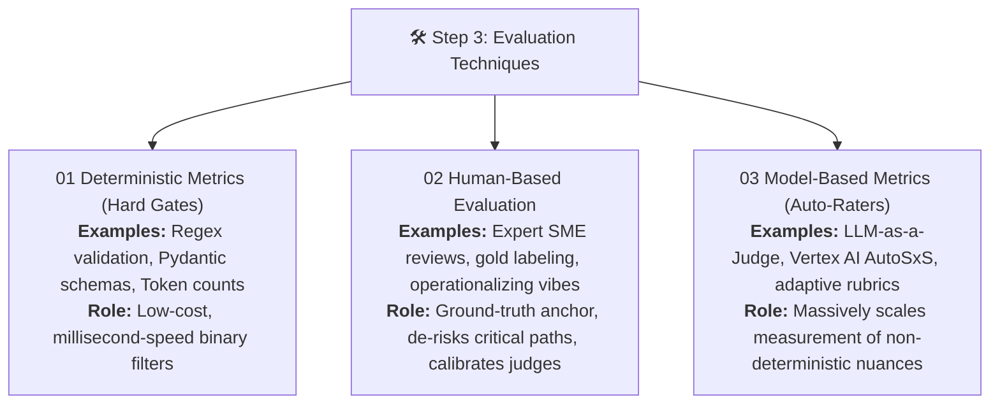
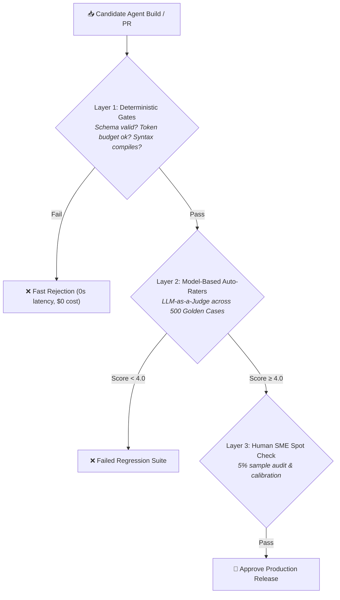

# Evaluation Strategy: Step 3 — Choose a Technique



## Overview

After mapping business KPIs (Step 1) and authoring operational rubrics (Step 2), engineers must select the appropriate **evaluation technique** to execute Step 3. No single evaluation modality solves all testing challenges; production systems combine **Deterministic Metrics**, **Human-Based Evaluation**, and **Model-Based Auto-Raters** into a layered quality funnel.

> **"01 Deterministic Hard Gates for speed and low cost → 02 Human Evaluation for ground-truth calibration → 03 Model-Based Auto-Raters to scale non-deterministic measurement."**

---

## The 3 Core Evaluation Techniques



---

## Deep Breakdown of the 3 Modalities

### 01: Deterministic Metrics (Hard Gates)
* **Role**: High-speed, zero-model-cost binary assertions.
* **Techniques & Examples**:
  * **Regex & Pattern Assertions**: Validating formatting (e.g., ticket IDs match `^[A-Z]{3}-[0-9]{5}$`).
  * **Typed Schema Validation**: Pydantic / JSON Schema validation on tool calls and structured outputs.
  * **Resource Boundaries**: Asserting token count budgets ($< 1,500\text{ tokens}$) and latency thresholds ($< 3.0\text{s}$).
  * **Code & Syntax Compilation**: Asserting that generated SQL or Python code compiles cleanly without syntax errors.
* **Strengths**: 100% reproducible, instant execution, runs locally on developer machines and in pre-commit git hooks.
* **Limitations**: Incapable of judging semantic correctness, tone, empathy, or reasoning quality.

---

### 02: Human-Based Evaluation (The Grounding Anchor)
* **Role**: Captures subjective and high-judgment nuances impossible to detect deterministically; serves as the baseline ground truth that calibrates automated systems.
* **Techniques & Examples**:
  * **Translating "Vibes" to Operational Definitions**: Turning fuzzy user feedback into concrete scoring rubrics.
  * **Gold Dataset Labeling**: Domain SMEs authoring ground-truth answers for benchmark suites.
  * **Adversarial Red-Teaming**: Human security researchers probing for edge-case jailbreaks and privilege escalations.
  * **Auto-Rater Calibration**: Auditing LLM judge outputs to ensure automated graders agree with human expert consensus.
* **Strengths**: Unmatched domain intuition, cultural context, and nuanced ethical judgment.
* **Limitations**: Extremely expensive, slow, unscalable, and subject to human fatigue.

---

### 03: Model-Based Metrics (Auto-Raters / LLM-as-a-Judge)
* **Role**: Massively scales up the measurement of non-deterministic, semantic, and generative qualities across thousands of test runs.
* **Techniques & Examples**:
  * **LLM-as-a-Judge (`RubricJudge`)**: Calibrated frontier models (e.g. Gemini 2.5 Pro) evaluating responses against 1-3-5 anchored rubrics.
  * **Automated Side-by-Side (Vertex AI AutoSxS)**: Blind pairwise comparisons between model versions to calculate statistical win rates.
  * **RAG Triad Metrics**: Automated scoring of *Context Relevance*, *Groundedness (Faithfulness)*, and *Answer Relevance*.
* **Strengths**: Highly scalable (thousands of evals in minutes), cost-effective relative to human raters, evaluates complex reasoning.
* **Limitations**: Can inherit model biases (self-preference bias, verbosity bias) if not strictly calibrated against human gold labels.

---

## Production Layered Evaluation Pipeline

In enterprise CI/CD, the three techniques are organized into a sequential funnel:



---

## Evaluation Technique Comparison Matrix

| Evaluation Technique | Execution Speed | Cost per Sample | Scalability | Cognitive Nuance | Primary CI/CD Role |
| :--- | :--- | :--- | :--- | :--- | :--- |
| **01 Deterministic Metrics** | **Milliseconds** | **$0.00** | Infinite | None (Binary/Syntax only) | Pre-commit & build sanity gates |
| **02 Human-Based** | Days / Weeks | High ($10–$50/hr) | Very Low | **Maximum (Ground Truth)** | Gold set curation & rater calibration |
| **03 Model-Based (Auto-Raters)** | **Seconds** | Low ($0.001–$0.02) | **High (10k+ samples)** | High (Semantic reasoning & tone) | Automated regression test suites |

---

## Google ADK Implementation: Hybrid Multi-Stage Eval

```python
from google.adk.eval import EvaluationSuite, DeterministicGate, RubricJudge

# 1. Layer 1: Deterministic Hard Gate
schema_gate = DeterministicGate(
    name="strict_json_schema",
    validator=lambda output: isinstance(output, dict) and "ticket_id" in output,
    error_message="Output failed JSON schema requirement",
)

token_budget_gate = DeterministicGate(
    name="token_ceiling",
    validator=lambda trace: trace.total_tokens <= 2000,
    error_message="Exceeded max token budget of 2000 tokens",
)

# 2. Layer 2: Model-Based Auto-Rater
grounding_judge = RubricJudge(
    name="factual_grounding",
    criteria="Score 1-5 on factual consistency against retrieved documentation.",
    passing_threshold=4.5,
)

# 3. Hybrid Pipeline Execution
hybrid_eval = EvaluationSuite(
    name="production_delivery_eval",
    hard_gates=[schema_gate, token_budget_gate],
    auto_raters=[grounding_judge],
)
```

---

## Engineering Rules of Thumb

1. **Fail Fast with Deterministic Gates**: Never spend model inference budget on an evaluation if the output already failed basic JSON schema validation or exceeded token limits.
2. **Never Deploy Without Calibrated Auto-Raters**: Human evaluation cannot scale to daily deployments; use human review to create golden baselines, then let auto-raters run CI/CD regression tests.
3. **Audit Auto-Raters Continuously**: Run a periodic 5% human audit on auto-rater decisions to detect LLM judge drift.
