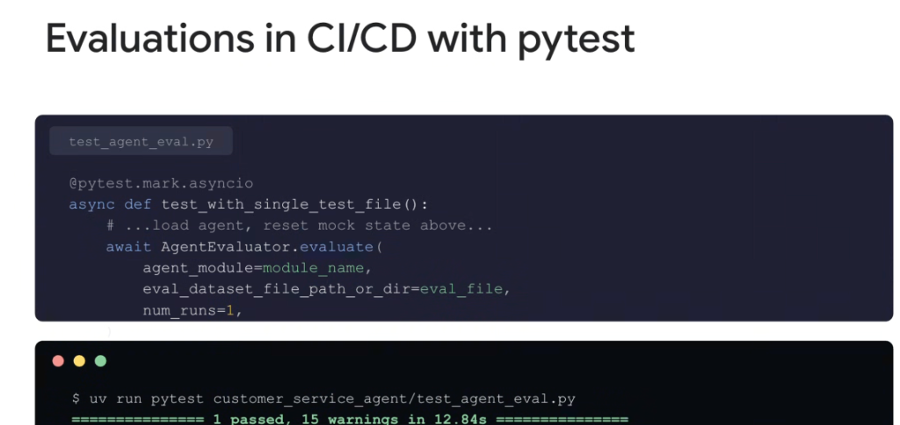
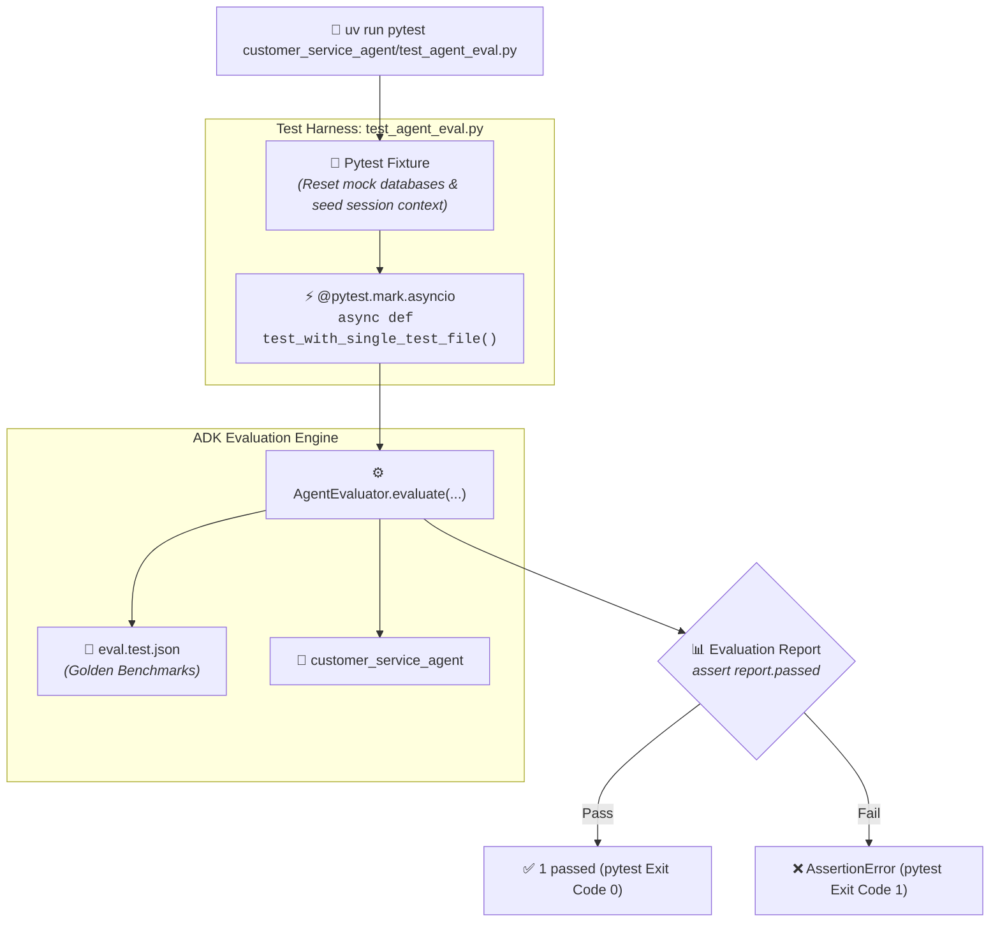

# Google ADK: Evaluations in CI/CD with pytest



## Overview

While the `adk eval` CLI is ideal for standalone runs, Google ADK enables first-class integration with **`pytest`**. By wrapping agent evaluations in standard `pytest` test suites, engineering teams can run agent regression tests directly alongside existing unit and integration test harnesses in CI/CD pipelines.

> **"Seamlessly execute ADK evaluations inside pytest test suites using AgentEvaluator.evaluate with full async support and native CI test reporting."**

---

## The Pytest Evaluation Architecture



---

## Pytest Test File Implementation (`test_agent_eval.py`)

Below is the standard, production-ready implementation of an ADK evaluation test case using `pytest`:

```python
import os
import pytest
from google.adk.eval import AgentEvaluator

# Directory configurations
MODULE_NAME = "customer_service_agent"
EVAL_FILE = os.path.join(os.path.dirname(__file__), "eval.test.json")
CONFIG_FILE = os.path.join(os.path.dirname(__file__), "test_config.json")

@pytest.fixture(autouse=True)
def setup_mock_environment():
    """Reset backend database states and mock credentials before evaluation."""
    os.environ["AGENT_ENV"] = "test"
    # Reset mock database/CRM states here
    yield
    # Teardown / cleanup

@pytest.mark.asyncio
async def test_with_single_test_file():
    """Execute evaluation against the golden benchmark suite."""
    report = await AgentEvaluator.evaluate(
        agent_module=MODULE_NAME,
        eval_dataset_file_path_or_dir=EVAL_FILE,
        config_file_path=CONFIG_FILE,
        num_runs=1,
    )
    
    # Assert evaluation criteria passed
    assert report.passed, (
        f"Agent evaluation failed!\n"
        f"Trajectory Score: {report.mean_trajectory_score} (Expected >= 0.8)\n"
        f"Response Score:   {report.mean_response_score} (Expected >= 0.5)\n"
        f"Failure Details:  {report.failures}"
    )
```

---

## Executing the Test Suite

Run the evaluation test using `uv` and `pytest`:

```bash
# Execute specific evaluation test file
uv run pytest customer_service_agent/test_agent_eval.py

# Execute with verbose output and test durations
uv run pytest customer_service_agent/test_agent_eval.py -v --durations=5

# Generate JUnit XML for CI/CD test dashboards
uv run pytest customer_service_agent/test_agent_eval.py --junitxml=reports/eval_results.xml
```

### Sample Terminal Output
```text
$ uv run pytest customer_service_agent/test_agent_eval.py
============================== test session starts ==============================
platform darwin -- Python 3.11.8, pytest-8.2.0, pluggy-1.5.0
rootdir: /workspace/customer_service_agent
plugins: asyncio-0.23.6, anyio-4.3.0
collected 1 item

customer_service_agent/test_agent_eval.py .                               [100%]

====================== 1 passed, 15 warnings in 12.84s =======================
```

---

## `AgentEvaluator.evaluate()` Parameter Reference

| Parameter | Type | Required | Description |
| :--- | :--- | :--- | :--- |
| `agent_module` | `str` / `Agent` | **Yes** | Python import path or instance of the candidate agent. |
| `eval_dataset_file_path_or_dir` | `str` | **Yes** | Path to the golden dataset file (`.json`) or directory containing test files. |
| `config_file_path` | `str` | Optional | Path to `test_config.json` defining metric thresholds (`trajectory: 0.8`, `response: 0.5`). |
| `num_runs` | `int` | Optional | Number of runs per test case (default: `1`). Set to `3` to compute statistical confidence. |
| `print_results` | `bool` | Optional | If `True`, prints verbose console breakdown of test runs. |

---

## Advanced Pytest Patterns for ADK

### 1. Dataset Parametrization
Evaluate across multiple golden dataset categories (e.g. Billing, Technical Support, Safety):

```python
@pytest.mark.asyncio
@pytest.mark.parametrize("dataset_filename", [
    "eval_billing.json",
    "eval_technical_support.json",
    "eval_safety_adversarial.json",
])
async def test_agent_across_datasets(dataset_filename):
    dataset_path = os.path.join("tests/eval_datasets", dataset_filename)
    report = await AgentEvaluator.evaluate(
        agent_module=MODULE_NAME,
        eval_dataset_file_path_or_dir=dataset_path,
        config_file_path=CONFIG_FILE,
        num_runs=1,
    )
    assert report.passed, f"Failed evaluation on dataset: {dataset_filename}"
```

### 2. Multi-Run Statistical Confidence (`num_runs > 1`)
Because LLMs exhibit mild non-deterministic variance, critical release gates can run each test case 3–5 times to ensure consistency:

```python
@pytest.mark.asyncio
async def test_release_candidate_statistical_eval():
    report = await AgentEvaluator.evaluate(
        agent_module=MODULE_NAME,
        eval_dataset_file_path_or_dir=EVAL_FILE,
        config_file_path=CONFIG_FILE,
        num_runs=3,  # Run 3 times to measure pass rate consistency
    )
    # Require 100% pass rate across all repetitions
    assert report.pass_rate >= 0.95, f"Inconsistent pass rate: {report.pass_rate}"
```

---

## CI/CD Pipeline Integration (GitHub Actions)

```yaml
# .github/workflows/pytest_agent_eval.yml
name: Agent Pytest CI/CD Regression Suite
on: [push, pull_request]

jobs:
  agent_eval:
    runs-on: ubuntu-latest
    steps:
      - uses: actions/checkout@v4
      - name: Install uv
        uses: astral-sh/setup-uv@v2
      - name: Set up Python
        run: uv python install 3.11
      - name: Run Pytest Agent Evaluations
        run: |
          uv run pytest customer_service_agent/test_agent_eval.py \
            --junitxml=reports/junit-report.xml
      - name: Publish Test Summary
        uses: EnricoMi/publish-unit-test-result-action@v2
        if: always()
        with:
          files: reports/junit-report.xml
```

---

## Key Benefits of Pytest ADK Integration

1. **Unified Test Suite**: Unifies standard software unit tests and agent evaluations under a single `pytest` test runner.
2. **Native Fixture Support**: Leverage pytest fixtures for setting up mock servers, test database migrations, and cleaning up state.
3. **Familiar Developer Experience**: Developers run `uv run pytest` locally with existing IDE test explorers (VS Code, JetBrains, Cloud Workstations).
4. **Standard CI Reporting**: Generates native JUnit XML test reports, test timing breakdowns, and integration with GitHub/GitLab PR checks.
