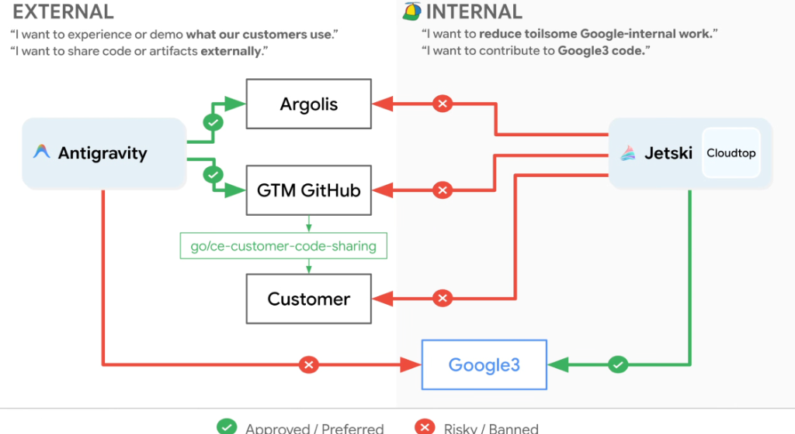
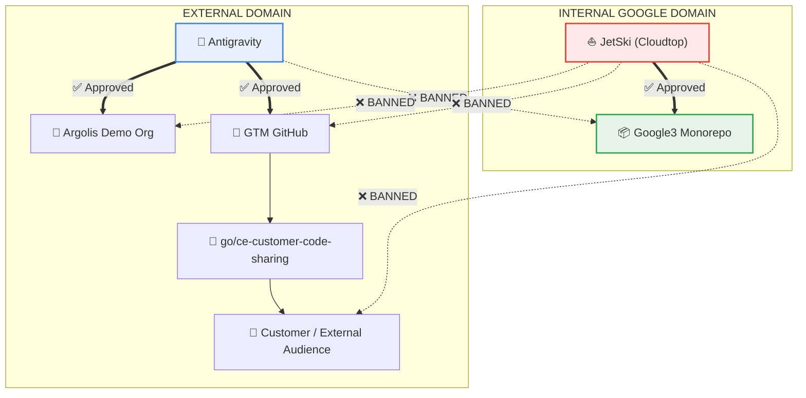

# Architecture Policy: External (Antigravity) vs. Internal (JetSki) Code Sharing

## Overview

To protect Google proprietary intellectual property (IP) and ensure safe customer demonstrations, Google enforces a strict data flow boundary between **External (Antigravity)** and **Internal (JetSki)** development pathways.

---

## The Core Intent Rule

| Path | Primary Engineer Intent | Approved Tooling |
| :--- | :--- | :--- |
| **EXTERNAL** | • *"I want to experience or demo what our customers use."* • *"I want to share code or artifacts externally."* | **Antigravity** (Desktop & CLI) |
| **INTERNAL** | • *"I want to reduce toilsome Google-internal work."* • *"I want to contribute to Google3 code."* | **JetSki** (Cloudtop / gLinux) |

---

## Approved vs. Banned Data Flows

---

## Strict Policy Guardrails

### 1. External Code Sharing Workflow (Green Path ✅)
When developing customer-facing code, demos, or partner solutions:
1. **Engine**: Use **Antigravity** (Desktop app or CLI).
2. **Environment**: Deploy into **Argolis** demo organizations.
3. **Repository**: Push code exclusively to **GTM GitHub** repositories.
4. **Governance**: Ensure all code shared externally complies with the review rules at [`go/ce-customer-code-sharing`](https://go/ce-customer-code-sharing).

### 2. Internal Engineering Workflow (Green Path ✅)
When developing internal tooling or reducing operational toil:
1. **Engine**: Use **JetSki** hosted remotely on your **Cloudtop** (`gLinux`) workstation.
2. **Repository**: Read and write directly to `google3` via Piper, CitC, and Fig.
3. **Internal Tools**: Integrate with Critique, Buganizer, and Moma.

### 3. Banned & Risky Cross-Border Interactions (Red Path ❌)
* **Never use JetSki to push code to GitHub or send files directly to customers.**
* **Never point JetSki at Argolis demo environments.**
* **Never point Antigravity directly at the internal `google3` codebase.**

---

## Policy Compliance Matrix

| Surface / Flow | Allowed Target | Prohibited Target | Compliance Link |
| :--- | :--- | :--- | :--- |
| **Antigravity** | • Argolis demo tenants • GTM GitHub • Local test projects | • `google3` • Internal Piper workspaces | `go/antigravity` |
| **JetSki (Cloudtop)** | • `google3` • Internal Piper/CitC • Buganizer / Critique | • Customers • Public GitHub • Argolis | `go/jetski` |
| **Customer Code Sharing** | • GTM GitHub repositories vetted via compliance | • Direct unvetted script transfers from Cloudtop | [`go/ce-customer-code-sharing`](https://go/ce-customer-code-sharing) |
