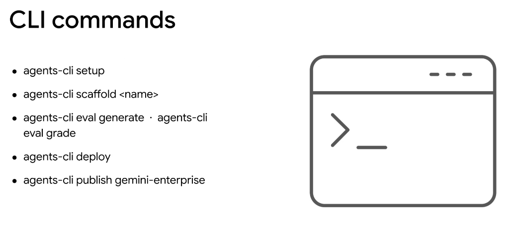
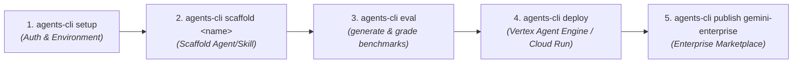

# Google Agents CLI: Core Command Reference & Lifecycle

## Overview

The **`agents-cli`** provides an end-to-end command-line workflow for the full lifecycle of an intelligent agent—from initial environment configuration and scaffolding to automated evaluation, cloud deployment, and enterprise publication.

---

## The End-to-End CLI Lifecycle

---

## Detailed Command Reference

### 1. `agents-cli setup`
* **Purpose**: Initializes the local development workstation, configures Google Cloud authentication (ADC), and verifies tool dependencies.
* **Key Actions**:
  * Authenticates user/service account credentials.
  * Validates access to Gemini APIs, Vertex AI Vector Search, and required Cloud projects.
  * Configures local telemetry and logging targets.

### 2. `agents-cli scaffold <name>`
* **Purpose**: Generates a standardized, production-ready directory structure for an agent or skill bundle.
* **Key Actions**:
  * Scaffolds `agent.py`, `SKILL.md`, `scripts/`, `references/`, and `tests/`.
  * Pre-populates JSON schemas, docstrings, and typing definitions.

### 3. `agents-cli eval generate` & `agents-cli eval grade`
* **Purpose**: Automates testing, benchmark generation, and evaluation scoring before production release.
* **Subcommands**:
  * **`agents-cli eval generate`**: Automatically synthesizes synthetic test queries and adversarial edge cases based on the agent's instructions and tool definitions.
  * **`agents-cli eval grade`**: Executes test suites against the agent, using **LLM-as-a-Judge** and deterministic assertion rules to measure accuracy, tool invocation correctness, and latency.

### 4. `agents-cli deploy`
* **Purpose**: Builds, packages, and deploys the agent application into managed Google Cloud infrastructure.
* **Key Actions**:
  * Bundles code, skills, and configuration manifests into secure container images.
  * Deploys directly to **Vertex AI Agent Engine** or **Cloud Run** with auto-configured IAM roles and VPC perimeters.

### 5. `agents-cli publish gemini-enterprise`
* **Purpose**: Publishes approved agents and domain skills to the centralized **Gemini Enterprise** corporate catalog.
* **Key Actions**:
  * Registers agent metadata and capabilities for discovery across Google Workspace (Gmail, Docs, Chat).
  * Enables organization-wide sharing with fine-grained access control.

---

## Lifecycle Command Summary Matrix

| Command | Lifecycle Phase | Primary Artifact / Outcome |
| :--- | :--- | :--- |
| **`agents-cli setup`** | Environment Config | Verified ADC credentials & active GCP project tenancy |
| **`agents-cli scaffold <name>`** | Project Creation | Standardized directory tree, `SKILL.md` templates & test skeletons |
| **`agents-cli eval generate`** | Test Generation | Synthetic evaluation dataset (`eval_cases.json`) |
| **`agents-cli eval grade`** | CI/CD Quality Gate | Regression report with accuracy scores and latency metrics |
| **`agents-cli deploy`** | Infrastructure Release | Live production endpoint on Vertex AI Agent Engine / Cloud Run |
| **`agents-cli publish gemini-enterprise`** | Distribution | Searchable organizational capability in Gemini Enterprise workspace |
