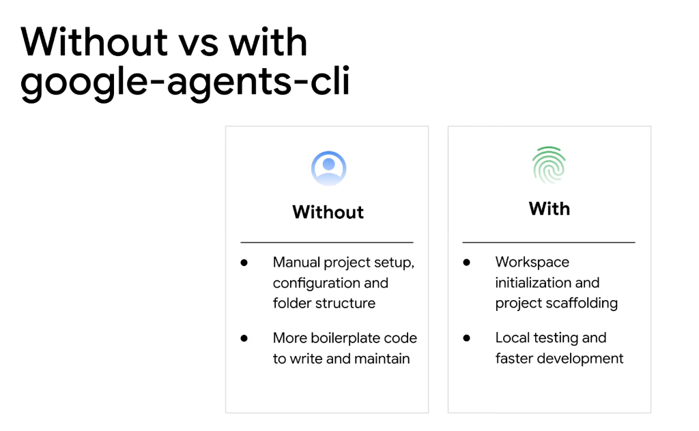

# Developer Tooling: Without vs. With `google-agents-cli`



## Overview

The **`google-agents-cli`** is the developer command-line interface for scaffolding, building, testing, and deploying Google ADK agents and skills. It bridges the gap between raw Python libraries and a streamlined, automated developer experience.

---

## Developer Journey Comparison

```mermaid
graph TD
    subgraph Without google-agents-cli (Manual & Fragile)
        M1["Manual mkdir / config editing"] --> M2["Write 200+ lines of agent boilerplate"]
        M2 --> M3["Manual mock harnesses & custom print debugging"]
        M3 --> M4["Slow iteration cycle & high setup friction"]
    end

    subgraph With google-agents-cli (Automated & Standardized)
        C1["agents init <project>"] --> C2["Automatic standard scaffolding (Skills, Tools, Tests)"]
        C2 --> C3["agents test / agents chat (Local interactive REPL)"]
        C3 --> C4["Instant validation & rapid production deployment"]
    end
```

---

## Direct Architectural Breakdown

### 1. Project Scaffolding & Setup
* **Without CLI**:
  * Engineers must manually create directory trees (`skills/`, `tools/`, `tests/`), write configuration manifests, and configure environment variables.
  * Every team adopts different folder naming conventions, creating organizational silos.
* **With CLI**:
  * Single-command workspace initialization: `agents init my-agent`.
  * Generates production-ready directory hierarchies, baseline `SKILL.md` templates, and linting configurations.

### 2. Boilerplate Reduction
* **Without CLI**:
  * Developers write hundreds of lines of glue code for model authentication, tool registration, error boundaries, and telemetry hooks.
* **With CLI**:
  * Standardized agent templates bundle authentication, telemetry, and MCP server bridges automatically.

### 3. Local Testing & Developer Velocity
* **Without CLI**:
  * Testing an agent requires deploying to cloud runtimes or writing bespoke interactive console loops.
* **With CLI**:
  * Native local CLI testing commands (`agents chat`, `agents eval`) allow engineers to simulate agent reasoning, inspect tool payloads, and run automated regression suites directly in terminal.

---

## Developer Experience Matrix

| Dimension | Without `google-agents-cli` | With `google-agents-cli` |
| :--- | :--- | :--- |
| **Project Setup** | Manual folder creation & config crafting | One-line turnkey scaffolding (`agents init`) |
| **Skill Generation** | Hand-writing YAML schemas & directories | Automated skill generators (`agents new skill <name>`) |
| **Boilerplate Burden** | Heavy custom wiring per agent | Minimal declarative configuration |
| **Local Debugging** | Ad-hoc `print()` loops & manual API calls | Built-in interactive REPL & step tracer |
| **Test Automation** | Custom bespoke test scripts | Integrated eval suites and regression harnesses |
| **Deployment Readiness** | Manual Dockerfile & cloud config setup | Standardized packaging for Vertex AI Agent Engine & Cloud Run |

---

## Essential CLI Workflow Commands

```bash
# Initialize a new standardized ADK project
agents init customer-copilot

# Scaffold a new file-based skill bundle
agents new skill bigquery-optimizer

# Launch local interactive chat testing session
agents chat --agent=customer-copilot

# Run automated regression eval benchmarks
agents test --eval-set=tests/golden_evals.json
```
