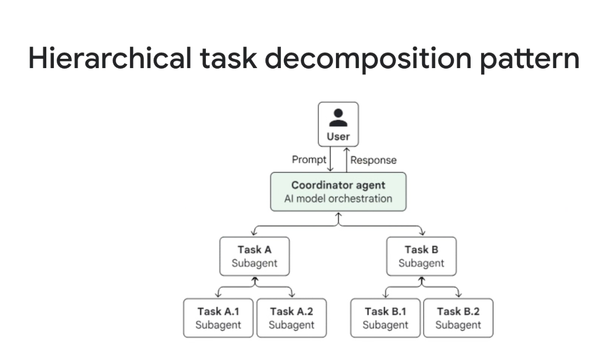
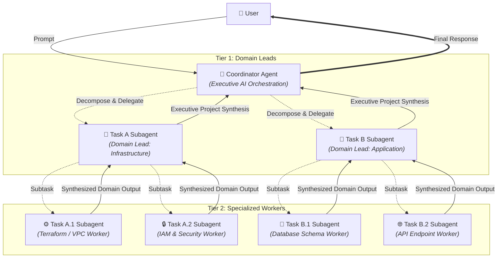

# Multi-Agent Dynamic Pattern: Hierarchical Task Decomposition Pattern



## Overview

The **Hierarchical Task Decomposition Pattern** is a multi-tiered dynamic multi-agent architecture that solves complex, open-ended enterprise objectives through recursive divide-and-conquer delegation.

> **"Deconstruct high-level enterprise goals into domain initiatives, and further decompose them into specialized atomic worker tasks."**

While a flat Coordinator manages a single level of subagents, the Hierarchical Task Decomposition pattern establishes a multi-level organizational tree: a top-level **Coordinator Agent** delegates to **Domain Lead Subagents** (Tier 1), which further break down and supervise specialized **Worker Subagents** (Tier 2).

---

## Architectural Execution Flow



---

## How Hierarchical Decomposition Operates

1. **Executive Ingress**: The user submits a large, multi-faceted request (e.g., *"Design and deploy an enterprise e-commerce backend on GCP with strict SOC2 compliance"*).
2. **Level 1 Goal Decomposition**: The top-level Coordinator splits the objective into primary domain scopes (e.g. Infrastructure Domain vs. Application Domain) and instantiates the Domain Leads.
3. **Level 2 Subtask Decomposition**:
   * The Infrastructure Lead decomposes its scope into *VPC/Network Provisioning* and *IAM/Firewall Rules*.
   * The Application Lead decomposes its scope into *Database Migration* and *Microservice APIs*.
4. **Isolated Leaf Worker Execution**: Leaf workers execute their targeted tools (e.g., executing Terraform CLI, querying Spanner schemas, checking IAM policies) in isolated contexts.
5. **Bottom-Up Aggregation (Fan-In)**:
   * Leaf workers return structured results to their respective Domain Leads.
   * Domain Leads validate, synthesize, and report integrated summaries up to the Coordinator.
6. **Final Executive Synthesis**: The Coordinator combines all domain reports into a cohesive deliverable for the user.

---

## Why Flat Coordinators Fail on Large Tasks (The Abstraction Layer)

```mermaid
graph TD
    subgraph Flat Hierarchy (Overloaded)
        F_Coord["👑 Flat Coordinator"] --> W1["Worker 1"] & W2["Worker 2"] & W3["Worker 3"] & W4["Worker 4"] & W5["Worker 5"] & W6["Worker 6"]
        F_Coord --- Bottleneck["❌ Context Congestion & Planning Breakdown"]
    end

    subgraph Multi-Tier Hierarchy (Clean Separation)
        H_Coord["👑 Executive Coordinator<br/><i>(High-level Milestones)</i>"]
        H_Coord --> L1["🤖 Lead A (Architecture)"] & L2["🤖 Lead B (Code)"]
        L1 --> L1_1["Worker 1"] & L1_2["Worker 2"]
        L2 --> L2_1["Worker 3"] & L2_2["Worker 4"]
    end
```

* **Cognitive Encapsulation**: The top-level Coordinator does not need to know the specific parameter schemas of low-level tools; it operates at the strategic milestone level.
* **Blast Radius Containment**: If a leaf worker (e.g. Task A.1) encounters an error, its Domain Lead (Task A) can handle retries or fallback logic locally without disrupting Task B.
* **Token Budget Isolation**: Intermediate tool outputs (such as massive JSON payloads or terminal logs) are consumed and condensed at Tier 2, preventing token explosion at the Coordinator level.

---

## Google ADK Implementation Example

In the **Google Agent Development Kit (ADK)**, hierarchical decomposition is implemented by nesting `LlmAgent` instances within parent subagent lists:

```python
from google.adk.agents import LlmAgent

# ==========================================
# Tier 2: Leaf Workers
# ==========================================
terraform_worker = LlmAgent(
    name="terraform_worker",
    model="gemini-2.5-flash",
    instruction="Generate Terraform scripts for VPC, Cloud SQL, and GKE clusters.",
    tools=[run_terraform_validator],
)

iam_worker = LlmAgent(
    name="iam_worker",
    model="gemini-2.5-flash",
    instruction="Audit and generate least-privilege IAM roles and service accounts.",
    tools=[check_iam_policy_tool],
)

db_worker = LlmAgent(
    name="database_worker",
    model="gemini-2.5-flash",
    instruction="Design PostgreSQL relational schemas and migration scripts.",
    tools=[validate_sql_schema_tool],
)

# ==========================================
# Tier 1: Domain Leads
# ==========================================
infra_lead = LlmAgent(
    name="infrastructure_lead",
    model="gemini-2.5-pro",
    instruction=(
        "You lead the Infrastructure domain. Deconstruct infrastructure requirements, "
        "delegate to terraform_worker and iam_worker, and synthesize a verified infra plan."
    ),
    subagents=[terraform_worker, iam_worker],
)

app_lead = LlmAgent(
    name="application_lead",
    model="gemini-2.5-pro",
    instruction=(
        "You lead the Application domain. Deconstruct backend requirements, "
        "delegate to database_worker, and synthesize application architecture."
    ),
    subagents=[db_worker],
)

# ==========================================
# Executive Coordinator
# ==========================================
engineering_director = LlmAgent(
    name="engineering_director_coordinator",
    model="gemini-2.5-pro",
    instruction=(
        "You are the Executive Engineering Director. Analyze enterprise initiatives, "
        "delegate domain execution to infrastructure_lead and application_lead, "
        "and produce a comprehensive technical specification."
    ),
    subagents=[infra_lead, app_lead],
)
```

---

## Production Failure Modes & Engineering Mitigations

| Failure Mode | Root Cause | Production Mitigation |
| :--- | :--- | :--- |
| **Cascading Tree Latency** | Sequential deep evaluation across multiple layers | Parallelize sibling worker executions within each tier |
| **"Telephone Game" Information Loss** | Context lost across multiple abstraction hops | Use typed Pydantic models for inputs/outputs across all tiers |
| **Runaway Tree Recursion** | Agents spawning subagents indefinitely | Enforce a strict tree depth limit ($\text{depth} \le 3$) and global token ceiling |
| **Redundant Work Across Leaves** | Worker A.2 duplicates research done by Worker B.1 | Maintain a shared Blackboard Session State accessible across branches |

---

## Flat Coordinator vs. Hierarchical Decomposition vs. Swarm

| Feature | Flat Coordinator Pattern | Hierarchical Decomposition | Swarm Pattern (A2A) |
| :--- | :--- | :--- | :--- |
| **Structure** | 1 Tier (Parent $\rightarrow$ Children) | Multi-Tier Tree (Parent $\rightarrow$ Leads $\rightarrow$ Leaves) | Decentralized Mesh |
| **Task Complexity** | Single-domain or moderate multi-domain | Massive, multi-faceted enterprise systems | Peer-to-peer emergent collaboration |
| **Context Isolation** | High at worker level, lower at coordinator | Maximum (Encapsulation at every tier) | Distributed across peers |
| **Failure Isolation** | Moderate | High (Contained within domain subtrees) | Variable |
| **Execution Latency** | Low to Moderate | Moderate to High | Non-deterministic |
