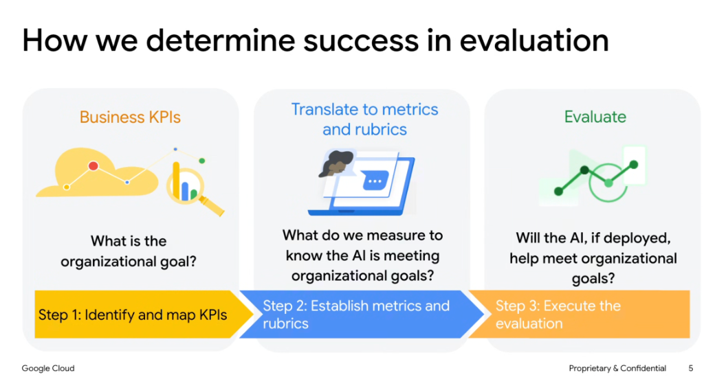
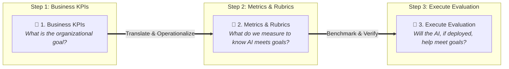
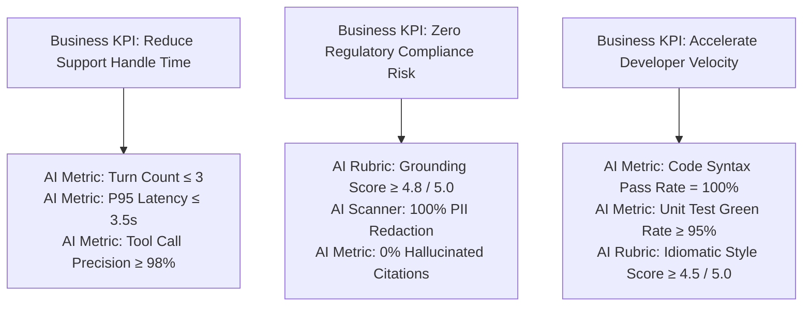
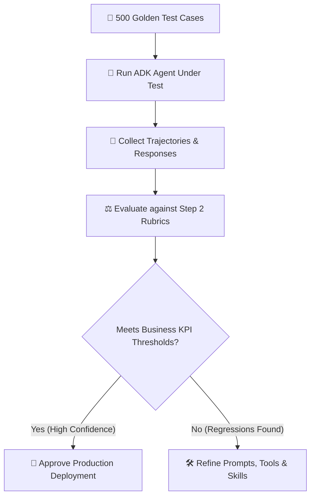

# Evaluation Strategy: How We Determine Success in Evaluation

## Overview

In enterprise AI engineering, evaluation is not an isolated academic exercise. Technical metrics (e.g. cosine similarity, perplexity, or raw token throughput) are meaningless if they are disconnected from business value. Determining success requires an explicit **3-step translation funnel** that bridges organizational objectives to automated technical rubrics and verified deployment decisions.

> **"Step 1: Identify Business KPIs → Step 2: Establish Metrics & Rubrics → Step 3: Execute Evaluation to verify organizational goal attainment."**

---

## The 3-Step Evaluation Success Framework

---

## Detailed Step-by-Step Breakdown

### Step 1: Identify and Map Business KPIs
* **Core Question**: *What is the organizational goal?*
* **Focus**: Defining the high-level business impact, financial return on investment (ROI), efficiency targets, or customer satisfaction bars.
* **Key Questions for Architects**:
  * What business bottleneck is this agent automating or augmenting?
  * What is the current human baseline for time, cost, and error rate?
  * What is the acceptable risk tolerance and cost of an AI hallucination?
* **Typical Enterprise KPIs**:
  * *Support*: Reduce average handle time (AHT) from 12 mins to 3 mins; deflect 60% of Tier-1 tickets; maintain CSAT $\ge 92\%$.
  * *Engineering*: Accelerate pull request cycle time from 4 hours to 20 minutes; zero regression bugs.
  * *Finance/Legal*: 100% compliance with audit regulations; zero PII leakage.

---

### Step 2: Establish Metrics and Rubrics (The Translation Bridge)
* **Core Question**: *What do we measure to know the AI is meeting organizational goals?*
* **Focus**: Translating qualitative business KPIs into concrete, machine-verifiable evaluation metrics and LLM-as-a-judge rubrics.
* **The KPI-to-Rubric Translation Map**:

---

### Step 3: Execute the Evaluation
* **Core Question**: *Will the AI, if deployed, help meet organizational goals?*
* **Focus**: Running the agent against golden test datasets, scoring execution traces with deterministic matchers and calibrated LLM judges, and producing an objective Go / No-Go deployment decision.
* **Evaluation Pipeline**:

---

## Enterprise KPI-to-Rubric Translation Matrix

| Business Domain | Organizational KPI (Step 1) | Translated Technical Metrics & Rubrics (Step 2) | Target Threshold (Step 3) |
| :--- | :--- | :--- | :--- |
| **Customer Support Concierge** | Deflect Tier-1 tickets while maintaining $\ge 90\%$ CSAT | • Tool Call Accuracy (correct CRM lookup) • Tone & Empathy Rubric • Turn Count to Resolution | • Tool Accuracy $\ge 98\%$ • Tone Score $\ge 4.5/5.0$ • $\le 3$ conversational turns |
| **Enterprise Legal & Compliance** | Zero regulatory fines & strict policy adherence | • Factual Grounding (faithfulness to policy doc) • Safety Scanner (PII redaction) • Hallucination Rate | • Grounding $\ge 4.9/5.0$ • $100\%$ PII Redaction • $0\%$ Uncited Claims |
| **Autonomous DevOps SRE** | Reduce MTTR (Mean Time to Resolution) during SEVs | • Metric Query Precision • RCA Diagnostic Accuracy • Step Efficiency (No infinite loops) | • Query Precision $\ge 95\%$ • RCA Match Rate $\ge 90\%$ • Max 6 tool calls |

---

## Architectural Rules for Evaluation Success

1. **Never Ship on Vibe Checks Alone**:
   * An agent that "feels smart" during manual testing can cause severe organizational damage if not verified against objective KPI rubrics.
2. **Every Technical Metric Must Tie to a Business Outcome**:
   * If you are measuring a metric that does not impact cost, latency, safety, or quality, remove it from your eval pipeline.
3. **Automate Step 3 in CI/CD**:
   * Evaluation is not a one-time pre-launch audit; it is a continuous automated quality gate on every prompt, tool, or model change.
