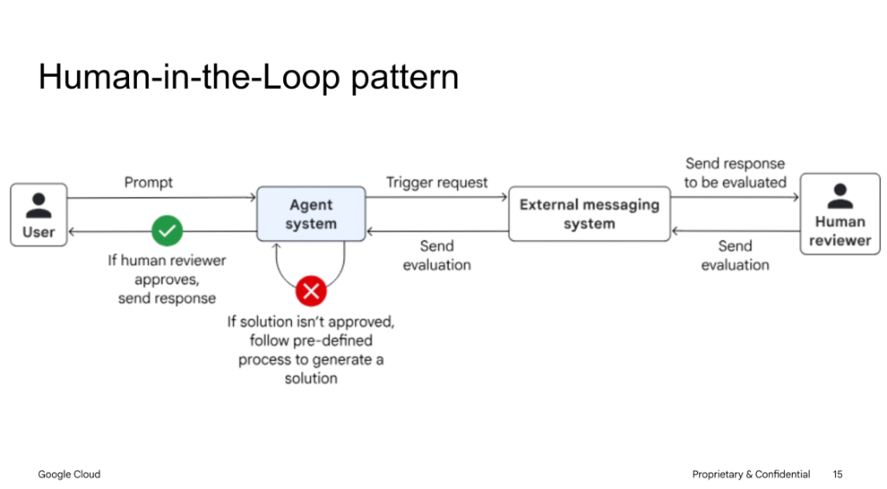
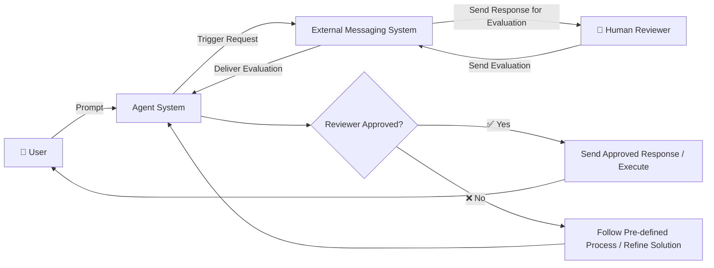

# Human-in-the-Loop (HITL) Pattern: Architectural Deep Dive

## Architecture Overview

The **Human-in-the-Loop (HITL)** architecture integrates human judgment into agentic workflows. It routes generated plans, proposals, or intermediate outputs to human reviewers via external communication systems (e.g., Slack, Google Chat, email, or ticketing systems) and halts execution until explicit evaluation is received.

---

## Architectural Workflow Diagram

---

## The HITL Lifecycle

### 1. Request Ingestion & Generation
* The **User** issues a prompt to the **Agent System**.
* The agent generates a proposed solution, draft response, or planned mutation (e.g. database change, sensitive email draft, code deployment).

### 2. External Messaging Routing
* Instead of auto-executing, the agent triggers an asynchronous review request.
* The request is dispatched to an **External Messaging System** (e.g. Slack interactive buttons, Google Chat cards, webhooks, or approval dashboards).

### 3. Human Reviewer Evaluation
* The **Human Reviewer** inspects the proposed output, supporting context, and risk score.
* The reviewer submits an evaluation decision (Approve, Reject, or Edit/Comment) back through the messaging platform.

### 4. Conditional Branching
* **Approved (✅)**: The Agent System finalizes the action and delivers the verified response to the end user.
* **Not Approved (❌)**: The system follows a pre-defined remediation workflow (e.g., incorporating human feedback into prompt context, adjusting parameters, or falling back to a deterministic manual workflow).

---

## Key Enterprise Benefits

| Capability | Architectural Benefit |
| :--- | :--- |
| **Risk Mitigation** | Prevents unintended destructive mutations, financial liability, and compliance breaches. |
| **Auditing & Traceability** | Creates a deterministic audit trail linking human approvals to specific agent actions. |
| **Asynchronous Handoff** | Allows long-running reviews without locking agent server threads. |
| **Feedback Loop Learning** | Captures reviewer rejection rationales to continuously refine system prompts and few-shot datasets. |
