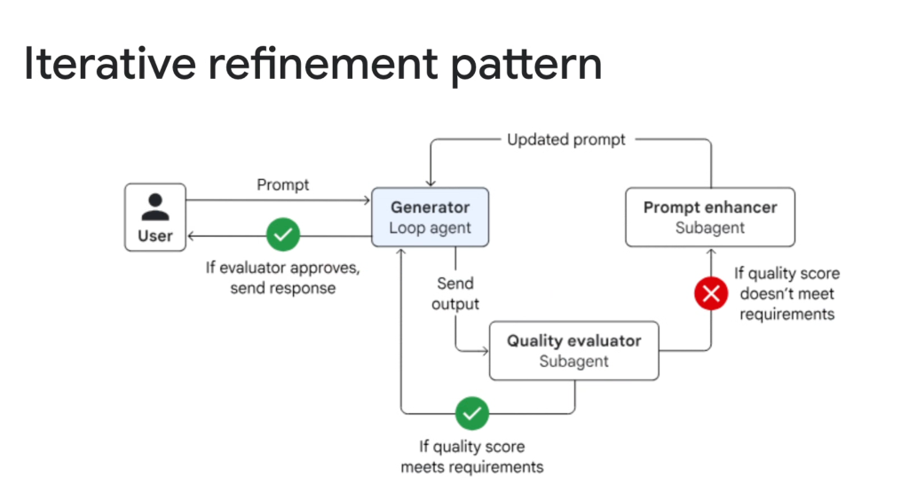
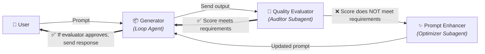
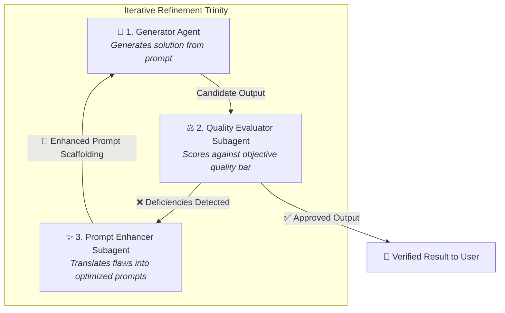
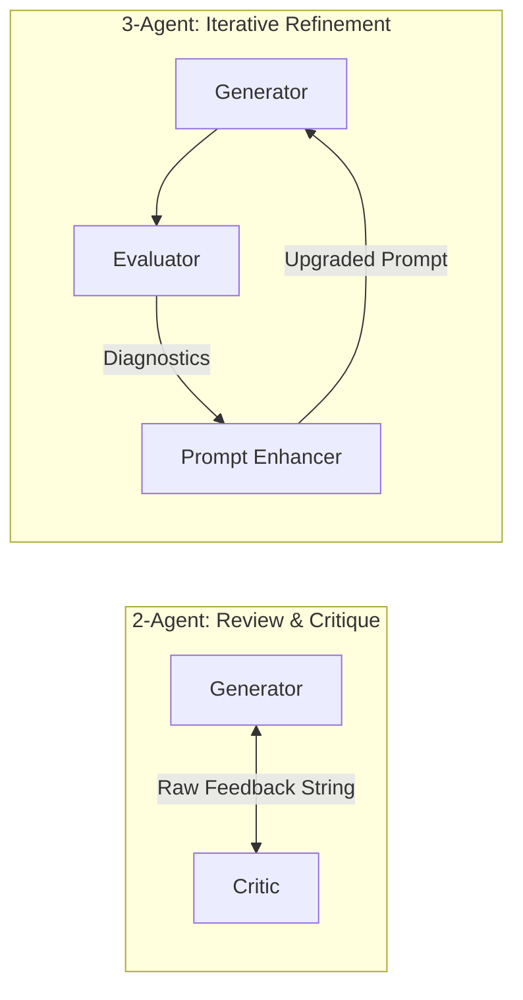

# Multi-Agent Workflow: Iterative Refinement Pattern



## Overview

The **Iterative Refinement Pattern** is a three-agent closed-loop optimization architecture designed to systematically elevate output quality through automated prompt metaprogramming.

> **"Automated prompt enhancement and quality evaluation in a closed self-correcting loop."**

Unlike basic 2-agent review loops where the generator receives raw critique comments, the Iterative Refinement Pattern introduces an intermediate **Prompt Enhancer Subagent**. When a draft fails to meet quality standards, the Prompt Enhancer translates the evaluator's critique into an upgraded, structured prompt—scaffolding new constraints, few-shot hints, and reasoning steps for the Generator.

---

## Architectural Execution Flow



---

## The 3-Agent Collaborative Trinity



### 1. Generator (Loop Agent)
* **Role**: Executes domain reasoning, synthesis, and tool calling based on the active prompt.
* **Characteristics**: Focuses purely on task execution without needing complex self-correction logic.

### 2. Quality Evaluator Subagent
* **Role**: Inspects the candidate output against deterministic criteria (test suites, linters) and qualitative rubrics (accuracy, style, compliance).
* **Characteristics**: Produces a binary pass/fail decision, numerical score, and explicit failure diagnostics.

### 3. Prompt Enhancer Subagent
* **Role**: **The "Prompt Compiler"**. Takes the original user prompt + previous output + evaluator critique and engineers a superior prompt for the next generation pass.
* **Capabilities**:
  * Injects missing domain constraints.
  * Adds explicit reasoning scaffolds (Chain-of-Thought guides).
  * Embeds negative constraints ("Do NOT make mistake X").
  * Protects against prompt drift by anchoring the user's original intent.

---

## Review & Critique vs. Iterative Refinement



| Dimension | Review & Critique Pattern (2-Agent) | Iterative Refinement Pattern (3-Agent) |
| :--- | :--- | :--- |
| **Feedback Mechanism** | Raw unstructured or semi-structured critique | Evaluator diagnoses $\rightarrow$ Enhancer rewrites prompt |
| **Cognitive Load on Generator**| High (Generator must parse critique and self-correct) | Low (Generator simply executes the enhanced prompt) |
| **Convergence Speed** | Moderate (Generator may misunderstand critique) | High (Prompt is explicitly engineered for the fix) |
| **Prompt Drift Risk** | Moderate (Context window gets cluttered with critiques) | Low (Prompt Enhancer preserves clean prompt structure) |
| **Token Efficiency** | Higher turn context bloat | Clean single-prompt execution per turn |

---

## Google ADK Implementation Example

In the **Google Agent Development Kit (ADK)**, this pattern is constructed using a `LoopAgent` coordinating the generator, evaluator, and enhancer:

```python
from google.adk.agents import LlmAgent, LoopAgent
from pydantic import BaseModel, Field

class EvaluationResult(BaseModel):
    score: float = Field(description="Quality score 0.0 - 10.0")
    passed: bool = Field(description="True if score >= 9.0 and all constraints met")
    diagnostics: list[str] = Field(description="Specific missing elements or flaws")

# 1. Quality Evaluator Subagent
evaluator_agent = LlmAgent(
    name="quality_evaluator",
    model="gemini-2.5-pro",
    instruction="Evaluate the candidate artifact strictly. Output EvaluationResult schema.",
    output_schema=EvaluationResult,
    output_key="eval_result",
)

# 2. Prompt Enhancer Subagent
enhancer_agent = LlmAgent(
    name="prompt_enhancer",
    model="gemini-2.5-pro",
    instruction=(
        "You are an expert prompt engineer. Analyze the original user intent, "
        "the previous output, and the evaluation diagnostics in state. "
        "Generate an improved, highly structured prompt with explicit constraints and examples."
    ),
    output_key="active_prompt",
)

# 3. Generator Subagent
generator_agent = LlmAgent(
    name="solution_generator",
    model="gemini-2.5-flash",
    instruction="Generate the required artifact using state['active_prompt'].",
    output_key="candidate_output",
)

# 4. Top-level Iterative Refinement Loop
refinement_loop = LoopAgent(
    name="iterative_refinement_pipeline",
    subagents=[generator_agent, evaluator_agent, enhancer_agent],
    exit_condition=lambda state: (
        state.get("eval_result") is not None and 
        state["eval_result"].passed is True
    ),
    max_iterations=4,  # Circuit breaker preventing infinite loop
)
```

---

## Production Failure Modes & Engineering Mitigations

| Failure Mode | Root Cause | Production Mitigation |
| :--- | :--- | :--- |
| **Prompt Bloat Explosion** | Enhancer keeps appending paragraphs each turn | Enforce strict length budgets and structural templates for the enhanced prompt |
| **Constraint Amnesia** | Enhancer focuses only on fixing the last flaw and forgets initial requirements | Pass the original immutable user prompt as a pinned reference in every enhancer call |
| **Over-Optimization / Gaming** | Enhancer modifies prompt to satisfy evaluator rubrics while degrading actual utility | Incorporate deterministic test harnesses alongside LLM evaluation rubrics |
| **Infinite Flaw Cycling** | Fixing Flaw A introduces Flaw B; fixing Flaw B re-introduces Flaw A | Maintain a historical flaw ledger in state and terminate if cyclical patterns appear |

---

## Ideal Problem Space

* **Complex Code Generation**: Writing multi-file Python modules where compiler and type-checker feedback requires prompt restructuring.
* **High-Precision Document Drafting**: Legal contracts, regulatory filings, and RFP responses where compliance rubrics are strict.
* **SQL Query Generation**: Translating ambiguous business questions into complex GoogleSQL queries where schema constraints must be systematically injected.
